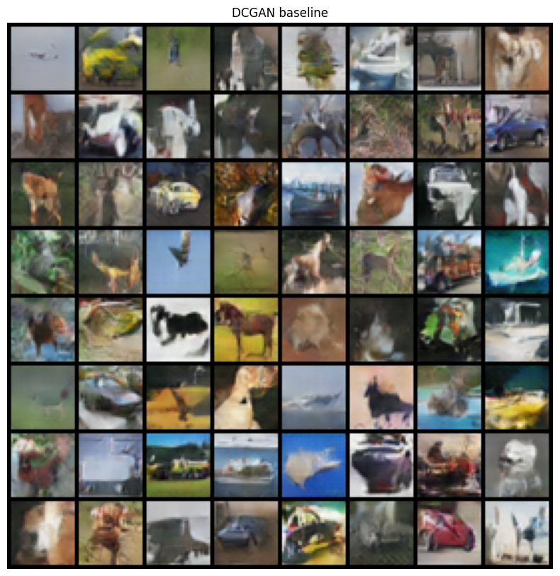
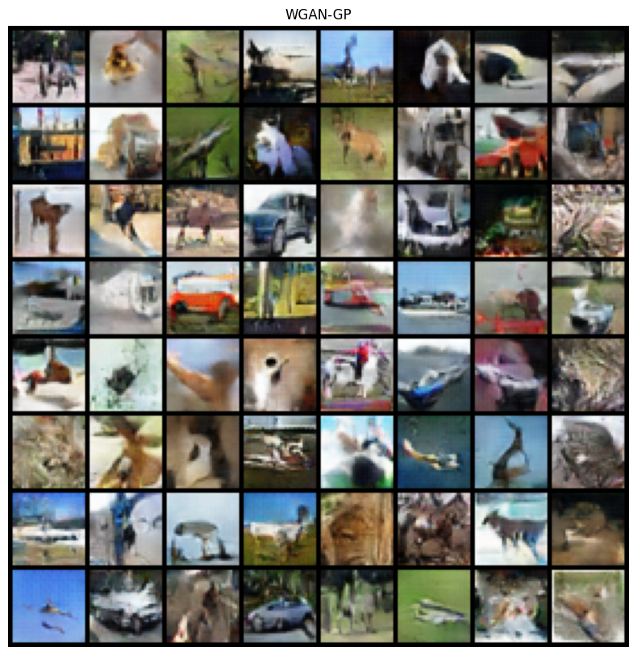
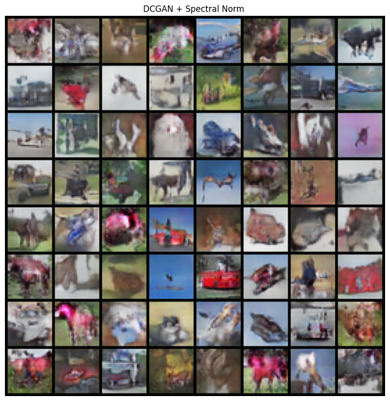
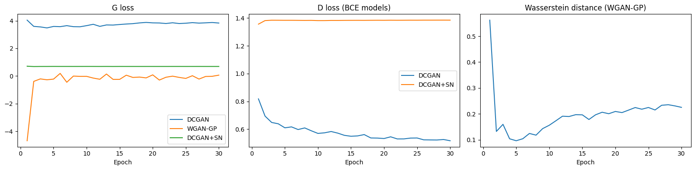
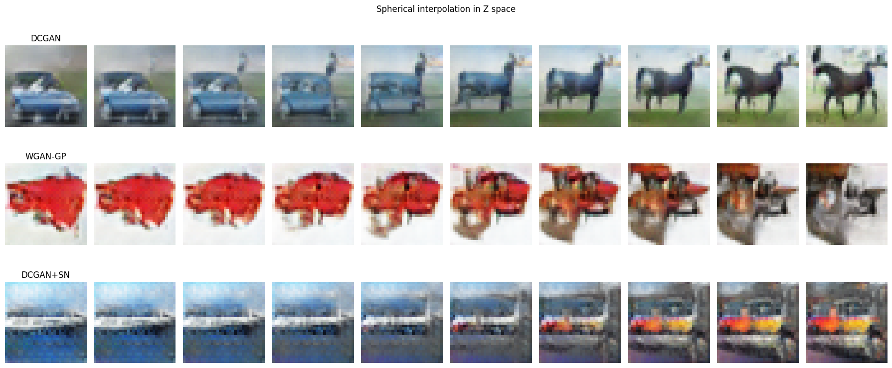

# GAN-Based Image Generation on CIFAR-10

## 1. Task Definition

Given CIFAR-10 - 50,000 32x32 RGB images across 10 classes - train a generative model to produce samples from the same distribution. The task is unconditional: no class labels, the model has to approximate $p_{data}(x)$ directly.

The generator never sees real images - it only receives gradient feedback through the discriminator. If the discriminator learns too fast its gradients vanish; too slow and it provides no useful signal.

## 2. Dataset

50,000 training and 10,000 test images, 5,000 per class. The uniform class split matters because a skewed real distribution would bias the discriminator's gradient toward the over-represented classes and push the generator to over-produce them.

Preprocessing: `RandomHorizontalFlip` on train, normalize to $[-1, 1]$ with `mean=std=0.5`. The generator outputs through `Tanh` so its range is $[-1, 1]$; normalizing real images to the same range means the discriminator sees both distributions on the same scale.

## 3. Evaluation

### 3.1 FID

FID measures the distance between real and generated distributions in the feature space of Inception v3 pretrained on ImageNet:

$\text{FID} = \|\mu_r - \mu_g\|^2 + \text{Tr}\left(\Sigma_r + \Sigma_g - 2(\Sigma_r \Sigma_g)^{1/2}\right)$

The Inception 2nd last layer (2048-dim, before the classification head) encodes different features like texture, shapes, colors etc. FID requires both quality and diversity to be low: a collapsed generator that produces one sharp image or a diverse but blurry would give low score. Real features are generated from all the samples and cached at start. Images are upsampled from 32x32 to 299x299 via bilinear interpolation to match Inception's input.

### 3.2 Diversity Score

Mean L2 on 256 randomly drawn generated samples as a secondary mode-collapse check. Doesnt measure quality - random noise scores high - just whether the generator is producing varied outputs.

* These metrics are not absolute and are there to identify clear failure modes as they cant directly quantfy huamn judgement over generated images.

## 4. Models

### 4.0 Pretrained Weights

Weights from [csinva/gan-vae-pretrained-pytorch](https://github.com/csinva/gan-vae-pretrained-pytorch): DCGAN trained 200 epochs on CIFAR-10, `nz=100, ngf=ndf=64`. The geneartor pretrained weights are loaded for DCGAN and WGAN-GP, and discriminator weights are loaded for DCGAN only. Critic for WGAN-GP is trained from random init which still works likely because WGAN uses linear feedback than BCE and uses 5:1 training step ratio. DCGAN-SN is fully trained from random-init for 60 epochs. 

### 4.1 DCGAN

Generator transposes convolves from $(B, nz, 1, 1)$ up through four stride-2 steps to $(B, ngf, 32, 32)$, then a final $1\times1$ conv maps to RGB without changing spatial size. BatchNorm after each ConvTranspose (except final) normalizes activations before the next layer. Tanh at the output.

The discriminator mirrors this with strided Conv2d layers (stride-2 each), LeakyReLU (slope 0.2) throughout to avoid dead neurons, BatchNorm on all except the first layer. Final Sigmoid outputs a real/fake probability.

Training uses label smoothing (real=0.9 instead of 1.0). Hard binary targets push the discriminator into saturation - when $D(x) \approx 1$, the BCE gradient through sigmoid is near zero, which kills the gradient signal to the generator. Smoothing keeps the discriminator from becoming overconfident.

### 4.2 WGAN-GP

Critic removes the Sigmoid and all BatchNorm layers and outputs an unbounded real value. Loss:

$L = \mathbb{E}[C(\tilde{x})] - \mathbb{E}[C(x)] + \lambda \mathbb{E}\left[(\|\nabla_{\hat{x}} C(\hat{x})\|_2 - 1)^2\right]$

The gradient penalty enforces 1-Lipschitz by penalizing the gradient norm on interpolated samples $\hat{x} = \alpha x + (1-\alpha)\tilde{x}$. BatchNorm is removed because it introduces batch-level statistics - the output for any single sample depends on what else is in the batch, so the gradient of $C$ w.r.t. the input is not the true local gradient at that point, corrupting the penalty. $\lambda=10$ and $n_{crit}=5$ follow the paper. The 5:1 critic-to-generator ratio is needed because the Wasserstein gradient estimate is only meaningful when the critic is near its optimum.

Adam with betas $(0, 0.9)$ - zero first-moment decay removes momentum, appropriate since the critic is retrained aggressively between generator updates so gradient directions are less correlated step-to-step.

### 4.3 DCGAN + Spectral Normalization

SN constrains the spectral norm of each weight matrix to $\leq 1$ via power iteration, enforcing a global 1-Lipschitz constraint on the discriminator. This prevents the discriminator from making arbitrarily large updates to the generator, which is the root cause of gradient explosion and mode collapse in normal GANs. Pretrained D cant load because SN reparametrizes `weight` into `weight_orig`, `weight_u`, `weight_v`.

## 5. Results

| Model | FID |
|---|---|
| DCGAN | 30.61 |
| WGAN-GP | 29.97 |
| DCGAN + SN | 38.30 |

DCGAN and WGAN-GP are close (30.61 vs 29.97), the Wasserstein loss gives no clear quality advantage at this scale. DCGAN+SN at 38.30 is trained for 60 epochs vs 30 for the other two so the comparison isnt direct but scores dont vary too much.

  
### Training Curves

## 6. Ablations and Analysis

### 6.1 Critic ratio ablation (WGAN-GP)

| n_crit | FID |
|---|---|
| 5 |29.97 |
| 2 | 34.93 |

With n_crit=2 the critic gets fewer updates per generator step so its Wasserstein estimate is further from optimum when the generator update happens, giving the generator weaker signal.

### 6.2 Latent dimension ablation

Generators evaluated with truncated z at inference - first 50 or 70 dimensions active, remainder zeroed:

| z_dim | DCGAN | WGAN-GP | DCGAN+SN |
|---|---|---|---|
| 100 | 30.61 |29.97 | 38.30 |
| 70 | 201.31 |240.20 | 293.69 |
| 50 | 97.09 |109.69 | 165.02 |

FID degrades sharply with reduced z_dim. Both truncated values are off-distribution relative to what the generator was trained on - at z_dim=100 all dimensions are active Gaussian noise, at z_dim=50/70 the remaining are zeroed, which the generator never saw during training.

### 6.3 Diversity

| Model | Mean pairwise L2 |
|---|---|
| DCGAN |31.6683 |
| WGAN-GP | 38.1527|
| DCGAN+SN | 28.0668 |

WGAN-GP has the highest diversity, consistent with the Wasserstein loss providing gradient even when the generator has already found high-reward modes.

### 6.4 Latent Traversal

