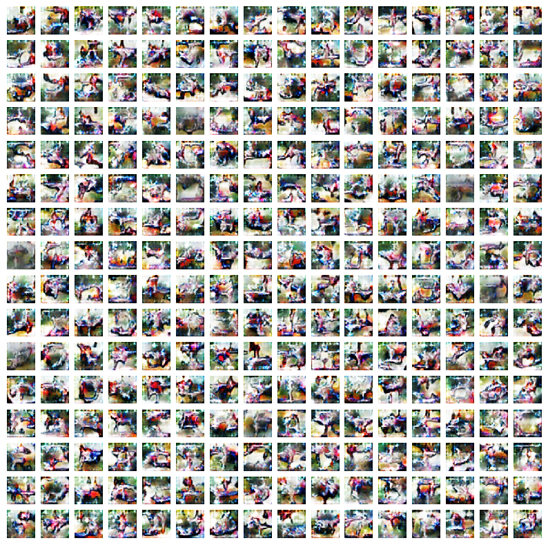
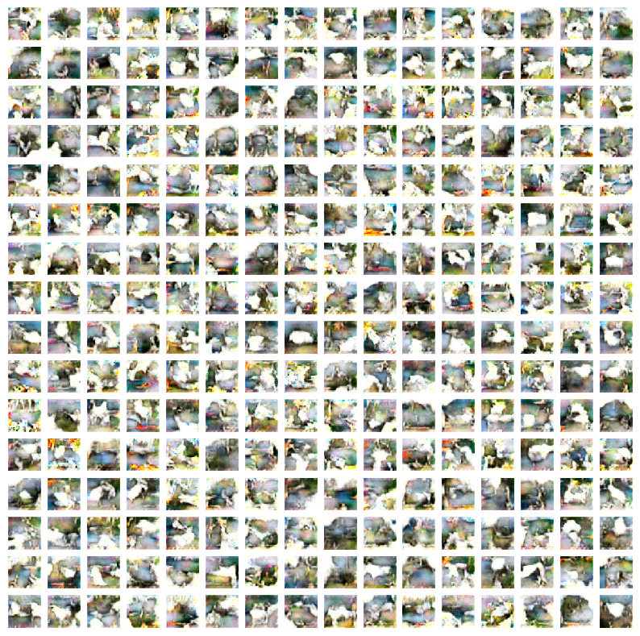
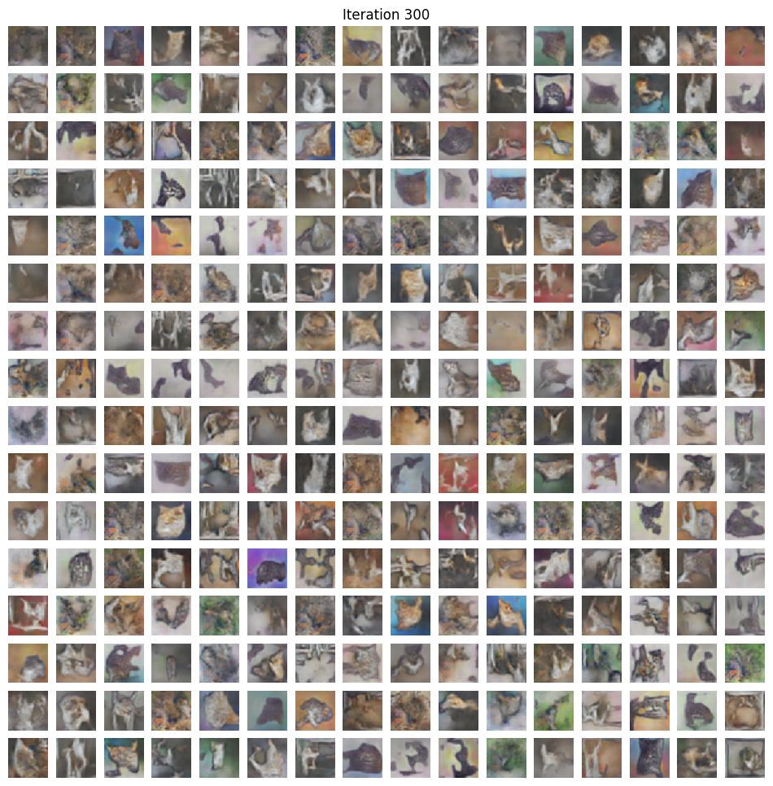
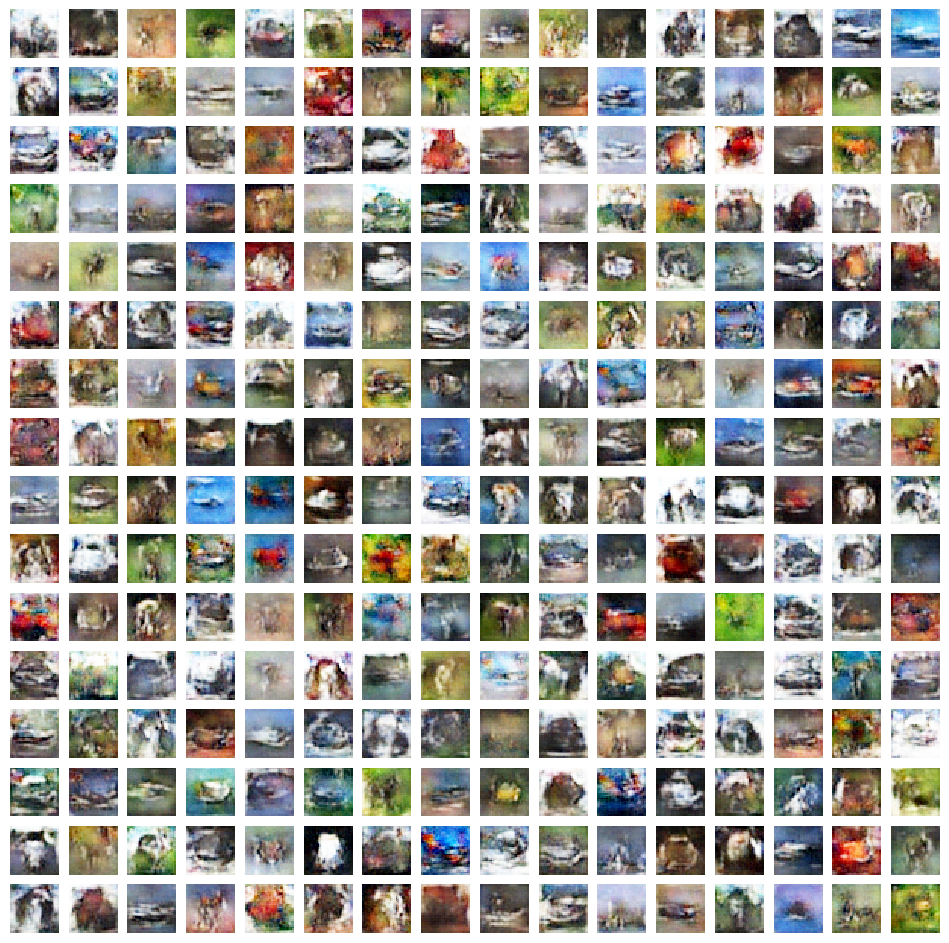
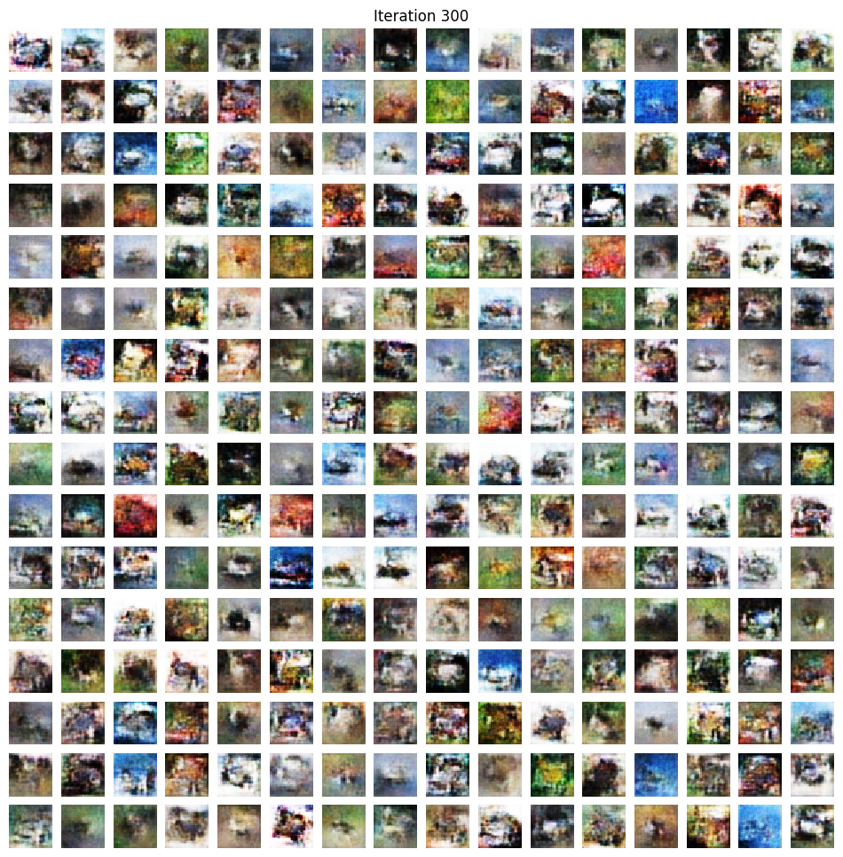

# Making GAN with CIFAR-10

In this task, I had to make a deep learning architecture to mask the road on a given image.

# Dataset

The data set is a collection of different classes of images and have size (32,32).

The data analysis is done in data_visualisation.ipynb.

# Model Architecture and Training

I have tried there different variant of GAN, mainly DCGAN.

## Finetuning 

First, I have tried to finetune a pretrained gan. It worked good enough but had severe issues:
I) The original dataset had a small range of colours and thus model stuck to the small palatee.
II) The model though converged very quickly, it converged to a small subset of images.
III) The model took mainly epochs and increasing the learning rate would lead to same image.
IV) The batch size also effect the model performance.
V) The generator was not able to keep up with the discriminator showing that the gradient made very small increaments.

As you can see the images, not very different but detailed. (Note the images seemed to share the same colour pallate as the original generator was trained for a small range of colours.)

Moreover the images are of similar group.

I tried to make the generator better by changing the normalisation technique and it solved some but introduced new, like the discriminator not able to perform better as it was pretrained for \[-1,1\].

## Finetuning on a subset of images (cats)
This introduced more artifacts like:
i) Though the images were of some like cats there was a lot of errors
ii) not much detailed

This may be due to lack of data.

## Training Specialised GAN for The dataset

Training specialised GAN improved performance alot:
i) more variety of images are generated
ii) lesser training time as the model is smaller
iii) more detailed images
iv) The difference in choice of normalisation of image is not very much

But still similar problem exist like:
i) generator is not performing as well as the disriminator
ii) generator is not able to surpass the discriminator
iii) though detailed but some don't belong to a particular task

## Spectral normallisation

As in the paper in which it was introduced, it preform really we at keeping the gradient stable thus able to train the generator very well.

It also has properties of Lipschitz continuous making it ideal for keeping the gradient capped making training more stable.

To see the full images, look in the notebook spetral_norm_1.ipynb and spetral_norm_6.ipynb

## WGAN 

I also tried to implement EM distance and generator and critic model but it failed.

I tried to use spectral normalisation but it still failed. So I haven't presented it here.

## Inference
As the output of the model is in range of \[-1,1\], it makes more sense to normalise image in this range.

Spectral normalisation helped alot as it not only normalised but also keep the gradients stable and effective.

Batch normalisation though effective requires alot of epochs and small learning rates but still more prone to output a subset of images.

Batch size, optimiser and learning rate should be managed such that it should good enough to be fast and learn from the dataset otherwise same output will be shown.

Overall dataset size and variety effects the performance deeply and thus should be taken care of.

Large no of epochs are required to get legible images.
  
