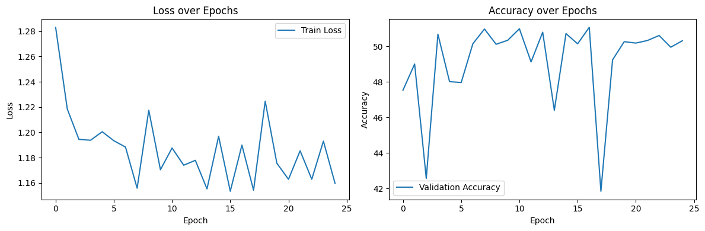
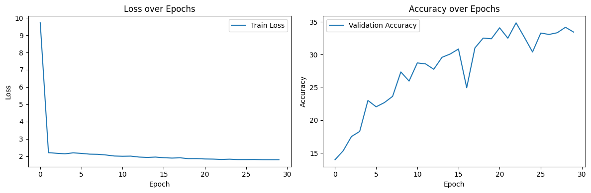
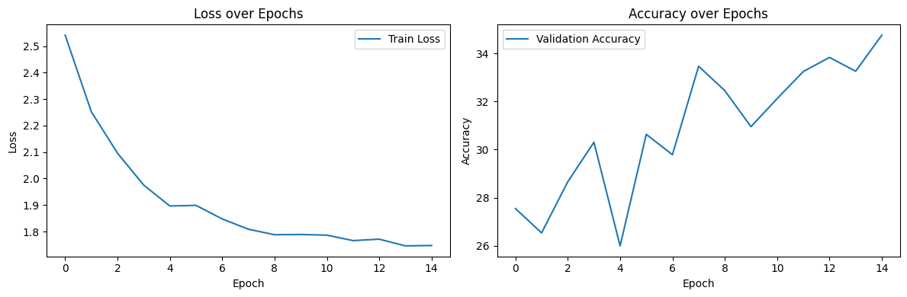
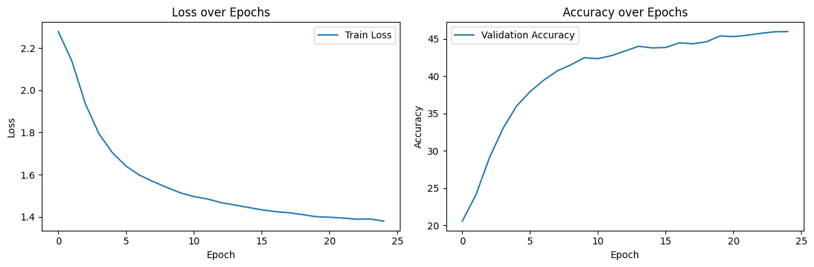

# Subtask-1: Ranking Models --> Encoder-only Transformer

## Overview

This repository contains experiments for learning to predict rankings over 10 items from tabular input. The work includes baseline models (MLP / RNN / LSTM) and a Transformer-style encoder-only model implemented in TensorFlow.

## Contents

- **Notebooks:**
  - [Downloads/Encoder_Only (1).ipynb](Downloads/Encoder_Only%20(1).ipynb) — encoder-only Transformer implementation, training loop, and evaluation.
  - [Downloads/BaselineModels_1 (1).ipynb](Downloads/BaselineModels_1%20(1).ipynb) — baseline MLP, SimpleRNN, and LSTM experiments.
- **Dataset:** `ranking_dataset.csv` — CSV with 20 columns per row: first 10 columns are input values, next 10 columns are target permutations/ranks.

## Goals

- Train models to predict a ranking/permutation of 10 items given a 10-value input vector.
- Compare baseline architectures (MLP / RNN / LSTM) with an encoder-only Transformer.

## Notebooks summary

- Encoder_Only: defines `PositionalEncoding`, `MultiHeadAttention`, and `Encoder` layers in plain TensorFlow Keras, builds a `Transformer` model, and trains using `SparseCategoricalCrossentropy` with an `evaluate`-based accuracy metric. Hyperparameters visible in the notebook: `d_model=128`, `num_heads=8`, `f_dim=256`, `batchsize=100`, `EPOCHS=25`.

- BaselineModels_1: implements and trains:
  - an MLP (`d_model=256`, EPOCHS=30),
  - a SimpleRNN (`d_model=128`, EPOCHS=15),
  - an LSTM (`d_model=128`, EPOCHS=25).

Each notebook logs training loss and validation accuracy and plots results using `matplotlib`.

## Data format

Each row in `ranking_dataset.csv` is expected to have 20 columns: first 10 are integer inputs (or indices), next 10 are target class indices (one per input position). The notebooks transform rows into `(inputs, targets)` pairs and split into `train`, `eval`, and `test` slices.

## Training & Validation (plots and interpretation)

Both notebooks record training loss and validation accuracy during training and display them with `matplotlib` (see the plotting cells in each notebook). Key implementation notes:

- Metric containers: both notebooks append per-epoch values to `losstrack` and `acctrack` lists during training and validation.

**Encoder_Only (Transformer):**

- Training loop stores `train_loss/steps` in `losstrack` and computes `val_acc` using the `evaluate` accuracy metric into `acctrack`.
- Typical plots to check:
  - A steadily decreasing training loss indicates learning; a flat or increasing loss suggests learning has stalled or the learning rate may be too high.
  - Validation accuracy that increases then plateaus suggests convergence; if validation accuracy drops while training loss keeps decreasing, the model is overfitting.

**Baselines (MLP / RNN / LSTM):**

- Each baseline follows a similar pattern: accumulate loss per epoch and compute validation accuracy with `evaluate` in the validation loop. The notebooks include plotting cells that mirror the Transformer plots so you can compare curves across architectures.

## Visual representation (figures)

- Transformer (Encoder_Only):
  - 

- Baselines (BaselineModels_1):
  - MLP: 
  - SimpleRNN: 
  - LSTM: 

## Overall Analysis
Q1: **How quickly do these models converge?**

A1: The MLP converges the quickest at 15 epochs, and the RNN and LSTM converge around 20-25 epochs.

Q2: **Do sequential models struggle with global comparisons?**

A2: Yes, sequential models like SimpleRNN and LSTM are naturally better at local temporal patterns than at comparing every pair of items globally. In ranking tasks, global structure matters a lot, so the encoder-only Transformer is usually a better fit because it can attend across all positions and compare items more directly.

Q3: **Does performance degrade with longer sequences?**

A3: Yes, performance significantly degrades with longer sequences for sequential models since as the sequence length increases and they propagate the information step-by-step, they lose long-range relationships.

Q4: **Can the models generalize to unseen patterns?**

A4: 

MLP: Learns a direct mapping from 10 input values to 10 output positions. It can generalize to similar examples, but it tends to memorize local feature combinations rather than learn global ranking structure. For truly unseen ranking patterns like patterns with the same number repeated multiple times or a sequence of different length, the MLP is least likely to generalize well.

RNN / LSTM: Can learn sequential dependencies and some ordering patterns. But because they process the input step-by-step, they are still relatively weak at global comparisons across all 10 items. They may generalize better than the MLP when the unseen patterns are still sequential in nature, but struggle if the pattern requires comparing far-apart items globally.

## LLM Usage
- Used to help to make code reproducible (seed generation, checkpointing, saving weights)
- Used to understand math behind positional encoding
- Used to understand working of Gradient Tape

