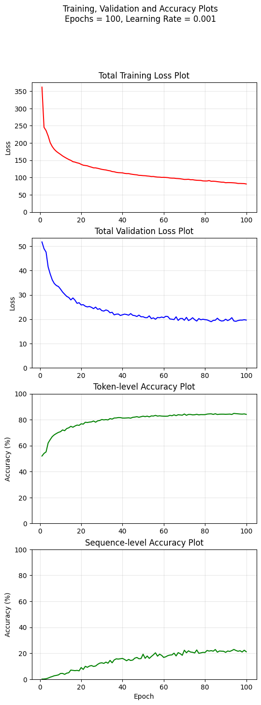
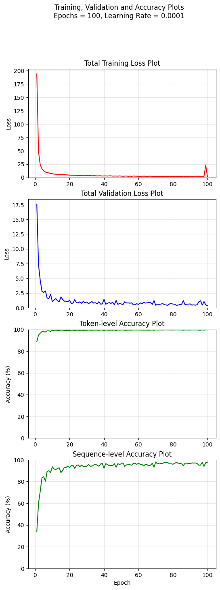
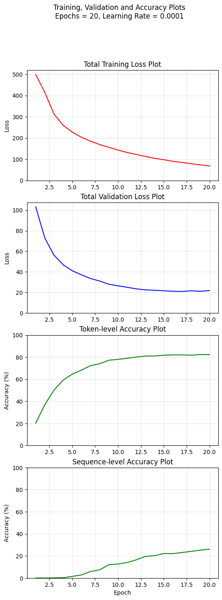
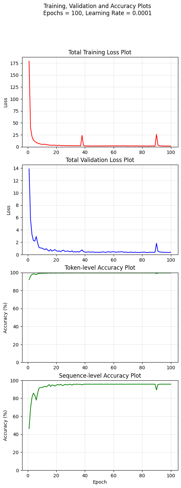
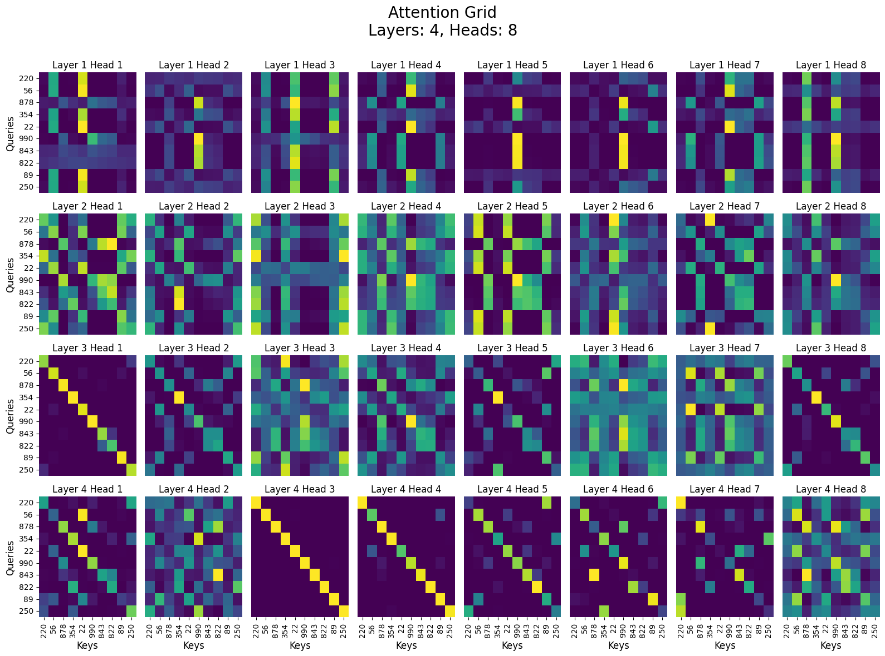
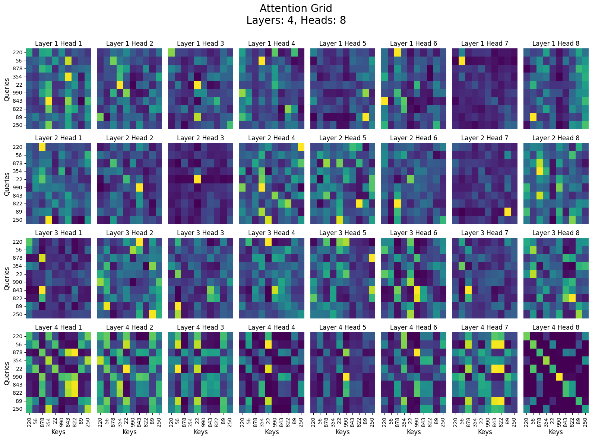
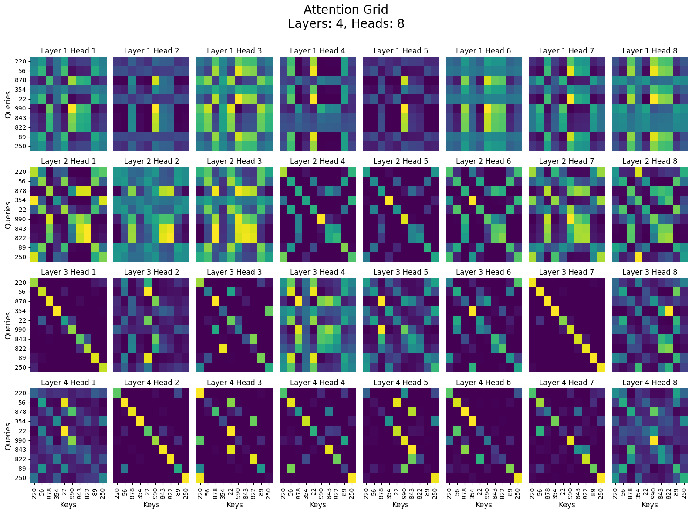

# Methodology:
The array element ranking task has been explored using
1. A Bidirectional LSTM (A Baseline Model)

Training and Validation Loss and Accuracy Plots for the LSTM:

2. An Encoder-Only Transformer with two separate architectures for data representation using:
   
   A. Continuous Representations
   
   B. Categorical Embeddings
3. An Encoder-Only Transformer without any Positional Encodings, following the continuous representation architecture

For the LSTM, as well as the transformer architectures with continuous data representation, the integer sequences have first been normalized using z-score normalization (in a sequence-wise manner), providing float inputs to the models. For the categorical embeddings architecture, the sequences have not been normalized and have only been input as the long datatype (integers).

All the models have been trained using the PyTorch framework with the Adam optimizer, and using the Cross-Entropy Loss.
After training and validating the models, their training and validation losses have been plotted, along with two types of validation accuracy metrics:
1. Token-wise Accuracy
   
2. Sequence-wise Accuracy

These metrics have also been reported for testing the models. After this, the attention weights for all the transformer models have been extracted and visualized as heatmaps.

# Architectural Choices:
## LSTM
A bidirectional LSTM has been used with a dropout of 0.3 within its fully-connected layer and with ReLU activation functions. The number of hidden dimensions are 64, decided after training with different numbers of hidden dimensions.
## Encoder-Only Transformer
The encoder architecture has been implemented exactly in accordance with the "Attention Is All You Need" paper, including the positional encodings calculation, the Q/K/V abstraction, the multi-head self-attention, the residual connections as well as the feed-forward networks. After experimenting with various values, the final hyperparameters of a 4-layer, 8-head, 128-dimensional transformer were determined.
## Transformer with Categorical Embeddings
Apart from the differences in the projection layers, (linear vs embeddings), the architecture of the transformer with categorical embeddings is identical to that of the original encoder architecture. However, in the feed-forward netwirk of each layer, a dropout of 0.3 has been incorporated to help with better generalization. It is a 4-layer, 8-head, 128-dimensional transformer.
## Transformer without Positional Encodings
Apart from the absence of positional encodings, the architecture of this transformer is identical to the original encoder architecture. It is a 4-layer, 8-head, 128-dimensional transformer.

# Numerical Representation Strategies:
A. Continuous Representation:

Training and Validation Loss and Accuracy Plots for the Encoder-Only Transformer:

In this representation, the sequences were first normalized using z-score normalization and then input to the model as floats, where the model then used a linear layer to project the floats to the hidden-dimensional space. It allowed the LSTM as well as transformer architectures to converge smoothly. However, it also took more epochs for the models with this representation type to converge, because the model had to learn the ranking dependencies based off of the information within a single linear projection. However, as can be seen in the evaluation metrics section, this representation also led to the most accurate transformer models.

B. Categorical Embeddings:

Training and Validation Loss and Accuracy Plots for the Transformer with Categorical Embeddings:

In this representation, the sequences were not normalized. Instead, they were directly input as integers (specifically, the long datatype) to the transformer. Each token was then assigned its own unique embedding in the embedding table, which was then learnt as the training progressed. It can be seen from the loss plot of the transformer with categorical embeddings that it onverged much faster than the other transformer architectures, as well as the LSTM, since the embeddings were all separate and the model did not need to spend time figuring out the dependencies along a single linear projection. However, as a consequence of this, the model also became much less accurate, since it over-specialized the embeddings to the point where it is difficult for the model to infer the ranking relationship of that particular token in a sequencce upon which it has not been trained. Another major disadvantage of using this representation is the fact that the model cannot handle any out-of-distribution sequences, i.e., it does not have any embeddings for tokens (integers) that were not in its original dataset. This is not an issue seen in the continuous numerical representation strategy.

# Ablations and Experiments:
## 1. Using Categorical Embeddings:
The transformer model with categorical embeddings, as mentioned earlier, converged much faster than the other models (20 epochs, as compared to 100 epochs for the other models), but lacked the accuracy that they had. It was unable to generalize its global relational reasoning the same way the other transformers were able to. This shows that it is very important for the model to be able to learn the general patterns in the sequence data that decide the relative ranks, something which this model could not do with its linearly unrelated embeddings. This model does not treat consecutive numbers as necessarily mathematically ordered, since it is not a linear projection (as in the case of the continuous representation strategy), but rather as independent symbols. This is why it was unable to perform as well as the other models.

## 2. Removing Positional Encodings:

Training and Validation Loss Plots for the Transformer without Positional Encodings:

It can be seen from the plots that, without the information provided by the positional encodings, the model initially tries to infer the positional and global relationships by itself. The validation loss and the sequence-level accuracry initially remain volatile, as the model tries to learn the positional information. However, interestingly, after this is done, the remaining part of the training remains quite smooth, with the validation loss as well as accuracy plots being much less volatile than the ones for the model with the positional encodings present. Finally, the model without the positional encodings was able to achieve accuracies almost as same as those of the model with them.

This shows that, for long-term training, the presence of positional encodings is not as important for this particular task. The exact sequential information is certainly lost by removing positional encodings, however, logically, the relative ranks of the elements in the sequence, once the sequence has been defined, do not depend on the exact permutation that the sequence is in.

## 3. Depth Experiments:

After training the regular transformer model on different numbers of layers, it was noticed that the reasoning ability improved significantly with an increase in the number of layers from 1 to 2 to 4. While the 1-layer model was only as good as the LSTM in terms of its accuracies, the 4-layer model massively outperformed it. This emphasises that the power of transformers lies largely in the abstractions inferred by their layers, one after the other. This is something that LSTM's and other recurrent architectures are unable to do.

# Evaluation Metrics:
| Model | Test Token-level Accuracy | Test Sequence-level Accuracy |
| :--- | :--- | :--- |
| LSTM | 84.14 % | 22.53 % |
| Transformer | 99.58 % | 97.00 % |
| Transformer with Categorical Embeddings | 81.38 % | 23.33 % |
| Transformer without Positional Encodings | 99.46 % | 94.73 % |

# Attention Visualizations:
For all the transformers, the input sequence of 220, 56, 878, 354, 22, 990, 843, 822, 89, 250 was used.

Attention weights for the Encoder-Only Transformer:

Here, the first layer appears to be aiming to capture the extreme ends of the sequence. It can be seen that the largest scores are for those corresponding to the numbers 990 and 22, which are the maximum and minimum elements in the sequence, respectively. Then, the second layer appears to be attempting to group closeby integers together, such as 990, 878, 843, and 822. Following this, the 3rd and 4th layers attempt to convert the local relationship information into global relational reasoning.

Attention weights for the Transformer with Categorical Embeddings:

The scores of the first 2 layers appear quite unstructed and seem to lack any interpretable focus. This is likely due to the fact that the model treats each embedding independently, making it difficult to make any early inferences about the order. Only in the last layer do we see a more organized attempt towards ordering the elements. However, this, as mentioned earlier, is not sufficient to match the performance of the model's continuous representation counterparts.

Attention weights for the Transformer without Positional Encodings:

This model uses its first layer in a much more generalized way. Instead of just focusing on extreme values, it is attempting to reason globally from the get-go, since it does not have direct positional hints. Its later layers then seem to interpolate those global comparisons into a concrete order, by clustering close numbers together and attempting to infer the exact ranks.

# Conlusions and Observations:
Self-attention and the transformer architecture are certainly a massive upgrade from recurrent networks for this relational reasoning task. The major reason for this is that stacking multiple layers of attention and feed-forward blocks on each other allows for the learning of more complex and nuanced ordering abstractions. This helps the transformer models to generalize better to new sequences.

Continuous representations (with normalization) are a far better choice of numerical representation as compared to categorical embeddings, for this particular task. Ranking tasks require an understanding of the order relations between integers, which an embedding-based architecture does not naturally achieve. This difference in structured learning is also clearly visible in the attention scores of the models. Moreover, positional encodings are not as important for the learning quality of the transformer for ranking tasks. The model is able to converge and generalize in a meaningful way even without them.
