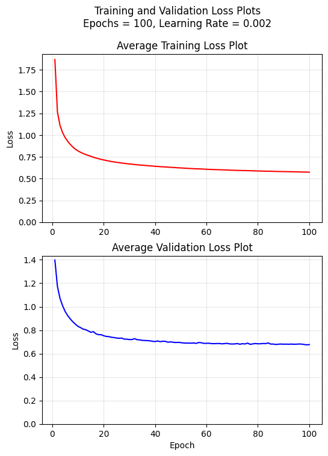
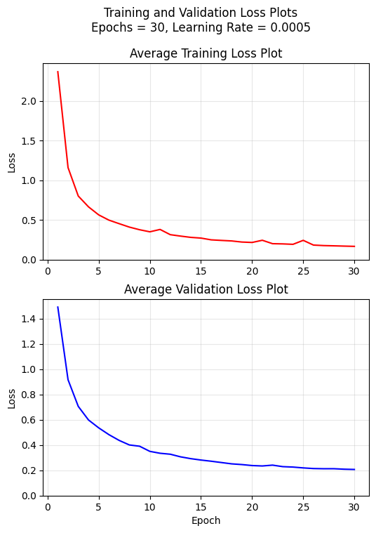
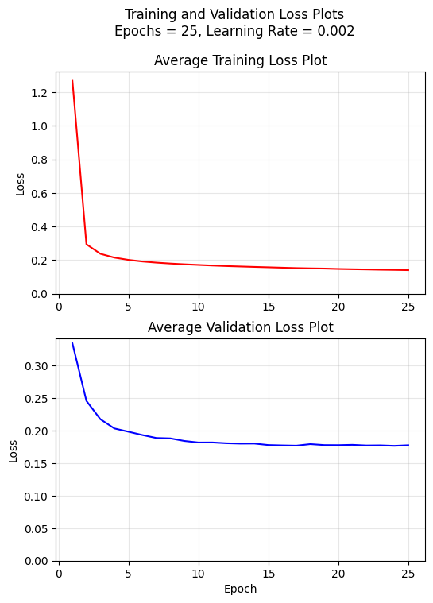

# Methodology:
The code refinement task has been explored using
1. A Simple LSTM (A Baseline Model)

Training and Validation Loss Plots for the LSTM:

2. An LSTM with Global Cross-Attention

3. A Seq2Seq Transformer

Training and Validation Loss Plots for the Transformer:

For the LSTMs, as well as the transformer architecture, the text sequences have first been tokenized using whitespace tokenization, and then encoded, providing float inputs to the models. The framework is from the "tokenizer" and "transformers" libraries. A raw tokenizer was first trained on the text data from the training dataset and then used to encode the text for the training, validation and testing datasets.

All the models have been trained using the PyTorch framework with the Adam optimizer, and using the Cross-Entropy Loss.
After training and validating the models, their training and validation losses have been plotted. The evaluation of the models has been done on the basis of the following two metrics:
1. Token-wise Accuracy
   
2. Sequence-wise (Exact-Match) Accuracy

On an important note, the token-wise and exact-match comparisons of the autoregressively generated fixed code sequences and the expected fixed code sequences has been done only for the non-padding tokens. That is to say, a padding mask has been applied to the sequences when calculating these accuracies, and hence, the performance of the models regarding generating tokens where padding tokens are expected, has not been taken into consideration.

# Architectural Choices:
## Simple LSTM
Both the encoder and decoder components of the model are unidirectional, single-layer LSTMs. An embedding dimension of 256, and hidden dimension of 128 have been used. This model was implemented with the intent of analyzing the performance of a very basic, minimalistic recurrent architecture. Greedy decoding has been used for autoregressive sequence generation.
## LSTM with Attention
The encoder component is a bidirectional, 2-layer LSTM with a dropout of 0.3 between the layers. The decoder component is a unidirectional, 2-layer LSTM, also with a dropout of 0.3 between the layers. A Multi-Head, Global Cross-Attention Block has been implemented after the decoder LSTM. The aim of this attention layer is to attempt to capture the long-term semantic information amongst tokens in longer sequences in a better fashion. It is a model with an embedding dimension of 256 and hidden dimension of 128, the same as the simple LSTM. 8 heads have been used in the Multi-Head Attention block. Greedy decoding has been used for autoregressive sequence generation.
## Seq2Seq Transformer
The architecture of the transformer is entirely derived from the original encoder-decoder transformer architecture introduced in the "Attention Is All You Need" paper. Multi-Head Self-Attention in both the encoder and deocder, along with Multi-Head Cross Attention in the decoder, have been implemented. A key-value cache for the self-attention in the decoder has been implemented which gets updated with each generated token. A key-value cache for the cross-attention in the decoder has also been implemented as a separate method within the transformer, which is calculated once after the encoding step is completed. ReLU activation functions have been used in the Fully-Connected Layers of both the encoder and decoder blocks. A 4-layer, 8-head, 128-dimensional model has been implemented. Greedy decoding has been used for autoregressive sequence generation.

# Ablations and Experiments:
## 1. Attention vs No-Attention in the LSTM:
The performance of the LSTM with attention is seen to be much better than that of the simple model, which can be seen from the evaluation metrics table. There is also a clear difference in the quality of the code, which can be seen in the qualitative outputs section.

Training and Validation Loss Plots for the LSTM with Attention:

Comparing these loss plots to those of the simple LSTM model, it can be seen that the attention-based model converged much faster and in a much sharper manner (100 epochs for the simple model vs 25 epochs for the attention-based model). This can be attributed to the fact that the multi-layer, multi-head attention blocks allow the model to rapidly learn the large-scale semantics in the buggy vs fixed code sequences. This is something that takes the simple model multiple epochs to learn, since it does not have any mechanism to firmly connect pieces of information across various tokens in the sequence, apart from the simple unidirectional flow of hidden states and cell states. The increased number of layers in the encoder and decoder LSTMs, along with the dropout of 0.3, also help the attention-based model to generalize better.

## 2. Representation:
In the LSTMs, a larger embedding dimension size, and in all the models, a larger hidden dimension size was seen to improve the long-term convergence and accuracy of the models, however, a very large size could lead to very slow computational efficiency and overfitting. A large batch size and large hidden dimension sizes could also prove to be massive compuutational hurdles, especially in the attention blocks. This is due to the fact that creating massive Q/K/V matrices and performing matrix multiplications on them requires the allocation of a lot of memory and is also computationally heavy. Therefore, striking the right balance between the model's data representation quality and the computational load for training and evaluation is necessary. It was noticed that the training time per epoch for the transformer model could increase to more than 4 times for a drop in batch size from 256 to 32 or 16.

# Evaluation Metrics:
| Model | Test Token-level Accuracy | Test Exact-Match Accuracy |
| :--- | :--- | :--- |
| Simple LSTM | 28.85 % | 0.03 % |
| LSTM with Attention | 60.01 % | 2.43 % |
| Seq2Seq Transformer | 56.37 % | 1.57 % |

# Qualitative Outputs:
The following is the peice of buggy code in the first entry of the test dataset:

public java . lang . String METHOD_1 ( ) { if ( ( METHOD_2 ( ) ) && ( METHOD_3 ( VAR_1 . METHOD_4 ( ) ) ) ) { return VAR_2 . METHOD_4 ( ) ; } else if ( METHOD_3 ( VAR_3 . METHOD_5 ( ) . METHOD_6 ( ) ) ) { return VAR_3 . METHOD_5 ( ) . METHOD_6 ( ) ; } else { return VAR_4 . METHOD_4 ( ) ; } }

The following are the expected vs generated fixed code sequences corresponding to the same. These are only the parts of the fixed code up till the "SEP" special token:
## 1. Simple LSTM

Expected:

public java . lang . String METHOD_1 ( ) { if ( ( METHOD_2 ( ) ) && ( METHOD_3 ( VAR_1 . METHOD_4 ( ) ) ) ) { return VAR_1 . METHOD_4 ( ) ; } else if ( METHOD_3 ( VAR_3 . METHOD_5 ( ) . METHOD_6 ( ) ) ) { return VAR_3 . METHOD_5 ( ) . METHOD_6 ( ) ; } else { return VAR_4 . METHOD_4 ( ) ; } }

Model Output:

public java . lang . String METHOD_1 ( ) { if ( ( ( METHOD_2 ( ) ) != null ) && ( ! ( VAR_1 . METHOD_3 ( ) . METHOD_4 ( VAR_2 ) ) ) ) { return VAR_3 . METHOD_5 ( ) ; } else { return ( ( java . lang . String ) ( VAR_1 . METHOD_6 ( ) . METHOD_7 ( ) ) ) ; } if ( ( VAR_4 ) != null ) { return VAR_2 . METHOD_8 ( ) ; } }

## 2. LSTM with Attention

Expected:

public java . lang . String METHOD_1 ( ) { if ( ( METHOD_2 ( ) ) && ( METHOD_3 ( VAR_1 . METHOD_4 ( ) ) ) ) { return VAR_1 . METHOD_4 ( ) ; } else if ( METHOD_3 ( VAR_3 . METHOD_5 ( ) . METHOD_6 ( ) ) ) { return VAR_3 . METHOD_5 ( ) . METHOD_6 ( ) ; } else { return VAR_4 . METHOD_4 ( ) ; } }

Model Output:

public java . lang . String METHOD_1 ( ) { if ( ( METHOD_2 ( ) ) && ( METHOD_3 ( VAR_1 . METHOD_4 ( ) ) ) ) { return VAR_2 . METHOD_4 ( ) ; } else if ( METHOD_3 ( VAR_3 . METHOD_5 ( ) . METHOD_6 ( ) ) ) { return VAR_3 . METHOD_5 ( ) . METHOD_6 ( ) ; } else { return VAR_4 . METHOD_4 ( ) ; } }

## 3. Seq2Seq Transformer

Expected:

public java . lang . String METHOD_1 ( ) { if ( ( METHOD_2 ( ) ) && ( METHOD_3 ( VAR_1 . METHOD_4 ( ) ) ) ) { return VAR_1 . METHOD_4 ( ) ; } else if ( METHOD_3 ( VAR_3 . METHOD_5 ( ) . METHOD_6 ( ) ) ) { return VAR_3 . METHOD_5 ( ) . METHOD_6 ( ) ; } else { return VAR_4 . METHOD_4 ( ) ; } }

Model Output:

public java . lang . String METHOD_1 ( ) { if ( ( METHOD_2 ( ) ) && ( METHOD_3 ( VAR_1 . METHOD_4 ( ) ) ) ) { return VAR_2 . METHOD_4 ( ) ; } else if ( METHOD_3 ( VAR_3 . METHOD_5 ( ) ) ) { return VAR_3 . METHOD_5 ( ) . METHOD_6 ( ) ; } else { return VAR_4 . METHOD_4 ( ) ; } }
