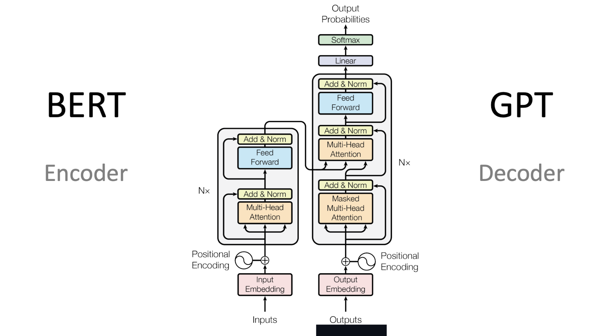

# Subtask-3: Poetry Generation --> Decoder-only Transformer

## Overview

This README explains two notebooks in the downloads folder:

- `Decoder_Only (2).ipynb` — a TensorFlow implementation of a decoder-only transformer trained on the `merve/poetry` dataset.
- `BaselineModels_3 (4).ipynb` — a PyTorch notebook that implements baseline sequence models including a bigram model, gMLP, vanilla RNN, and LSTM for the same poetry data.

---

## Purpose

The goal of these notebooks is to compare:

- simple baselines for next-token modeling (`bigram`, `RNN`, `LSTM`, `gMLP`)
- a modern autoregressive sequence model (`decoder-only transformer`)

Both notebooks are trained on the same poetry dataset, with the same preprocessing strategy and vocabulary conventions. This makes it easier to compare how recurrent models, gating models, and self-attention models behave on the same task.

---

## Dataset and Preprocessing

Both notebooks use the Hugging Face dataset `merve/poetry`.

Key steps:

- Add special sentence markers:
   - `<s>` at the beginning
   - `</s>` at the end
- Normalize the text:
   - replace Windows line breaks (`\r\n`) with spaces
   - convert to lowercase
   - add spaces around punctuation such as `, ; . ! ?`
   - collapse multiple whitespace characters into a single space

This creates a single token sequence over the entire dataset, then the models build sentence-level examples from that token stream.

---

## Tokenizer

Both notebooks define a simple custom tokenizer with four reserved tokens:

- `<PAD>` = 0
- `<UNK>` = 1
- `<s>` = 2
- `</s>` = 3

`Decoder_Only (2).ipynb` uses a capped vocabulary of `max_vocab=5000`. (only using the 5000 most common words, this was so that the model wouldn't waste time memorising random insignificant words)
`BaselineModels_3 (4).ipynb` builds the full vocabulary from all tokens in the dataset.

---

## Baseline Models in `BaselineModels_3 (4).ipynb`

### Bigram Model

- counts every adjacent token pair `(w1, w2)` across the corpus
- removes transitions from `</s>` to `<s>` so sentence boundaries are not joined
- samples the next word from the conditional distribution given the current word

This is a non-learned baseline that illustrates how much structure can be captured by local token transitions alone.

### gMLP

The gMLP model is a modern alternative to a transformer that uses spatial gating instead of full attention.
I used this because I didn't want to just implement a simple MLP model, has been done multiple times before.

Key components:

- `SGU` (Spatial Gating Unit)
- `gMLPBlock` with
  - LayerNorm
  - dense expansion
  - GELU activation
  - spatial gating
  - residual connection
- `gMLP` model with
  - token embedding
  - learned positional embeddings
  - stacked gMLP blocks
  - final layer normalization and output projection

The SGU splits the hidden representation into two halves: u and v. Then it applies a linear projection across the sequence dimension of v, allowing each position to gather information from all other positions. Finally it multiplies u * v, using the globally-informed v as a gate to modulate the local features in u which achieves cross-position communication without attention.

### LSTM

- embedding layer with padding support
- stacked LSTM layers
- dropout
- residual projection from embedding to LSTM outputs
- final linear projection to vocabulary logits

### Vanilla RNN

- embedding layer
- vanilla `nn.RNN`
- linear projection to vocabulary logits

This model is smaller and more constrained than the LSTM, and therefore serves as a useful comparison for the transformer.

---
**For Methodology and Architecture, I referred to this diagram a lot:** 

## Decoder-Only Transformer 

#### Token Embedding

The model starts with an embedding layer that converts token IDs to dense vectors of size `d_model`.

#### Positional Encoding

Transformers are position-agnostic by default because they process every token in parallel, so the notebook adds a `PositionalEncoding` layer using sine and cosine functions.

#### Causal Masking

The mask is computed as:

- `1 - tf.linalg.band_part(tf.ones((seq_len, seq_len)), -1, 0)`

This produces a mask with ones above the diagonal, which is then added to attention scores.
When the mask is applied, future positions receive large negative logits and are effectively ignored by softmax.

#### Multi-Head Self-Attention

The `MultiHeadAttention` layer performs the core transformer operation.
Using multiple heads allows the model to attend to different aspects of prior history in parallel.

#### Decoder Block

- multi-head attention
- dropout
- residual connection + layer normalization
- two-layer MLP (`ff1`, `ff2`) with ReLU activation
- another residual connection + layer normalization

This mirrors the standard transformer decoder block, but only with the decoder stack, since there is no encoder.

#### Full Transformer Model

The `DecoderTransformer` model contains:

- token embedding
- positional encoding
- dropout
- a stack of `DecoderBlock`
- final layer normalization
- final dense projection to vocabulary logits

During the forward pass:

1. embed the input tokens, add positional encoding, apply dropout
2. process through each decoder block with the causal mask
3. normalize and project to logits
   
This produces logits for every position, and the loss compares each predicted token against the true next token.

**Since I had reduced the effective tokens to just 5000 instead of the initial 12000+, I decided to go with a relatively smaller model, which is why the values of d_model is small and ff_dim is also only d_model * 2, not 4 like in the original paper.**

---

## Training Setup

### Autoregressive next-token learning

The model is trained to predict token `t+1` from tokens `0..t`.

For each training example:

- input: `[<s>, token_1, token_2, ..., token_{n-1}]`
- target: `[token_1, token_2, ..., token_{n-1}, </s>]`

(standard autoregressive training objective used by decoder-only architectures)

### Gradient clipping

Gradients are clipped by global norm to `1.0` to stabilize training.
This is especially helpful for deep sequence models, where unbounded gradients can cause training instability.

---

## Evaluation and Metrics

I used a **token-level accuracy** score for next-token prediction. The gMLP appeared to perform the best out of all three models, reaching an accuracy of almost 90% whereas the LSTM and RNN stayed around 25%.

---

## Generation / Demo

### Decoder-only transformer generation

`Decoder_Only (2).ipynb` shows it generating text greedily from a prompt

### Baseline model generation

`BaselineModels_3 (4).ipynb` also shows **greedy decoding** for:

- gMLP
- RNN
- LSTM

and compares their generated 'poems'.
Out of all 3 poems, the gMLP one was the most coherent one, and it seemed like it was able to choose words correctly. However, on checking perplexity for the model, which should be around 300-700 for a model trained on this type of data, it showed a very high value like 14000. This ofcourse is a flaw of the dataset as well as the sampling used for this notebook. This is why the decision to use top 5000 tokens was made for the Transformer. 

---

## Visualizations in the Transformer Notebook

`Decoder_Only (2).ipynb` includes two interpretability visualizations:

- attention heatmap for a user-provided phrase
- top predicted token probabilities for the next token

These help illustrate what the model is attending to and what it believes are the most likely next words.

---

## Decoder-Only Transformer's Significance

The decoder-only transformer differs from the baseline models in several important ways:

- no recurrence: it processes the entire input sequence with self-attention rather than step-by-step recurrence
- causal masking: it only sees past tokens, which matches the autoregressive generation task
- parallel computation: training can process all positions in a sequence simultaneously
- long-range context: attention can directly connect distant tokens without passing through a recurrent state
- flexible representation: multi-head attention lets the model learn multiple ways to compare past tokens

This architecture is the foundation for GPT-style language models, and the notebook shows a compact version of that idea using only a few decoder blocks.

---
## Key Ablations and Observations:

1. I experimented a lot with adding attention mechanisms, and different types of attention mechanisms: Additive, Multiplicative, Dot product, Single-head, Multi-head, Self-attention and finally causal(masked) self-attention. I figured that multi-head + causal self would be the best for an autoregressive model like this one.
   - Obviously, adding attention increased the understanding of context and the model was able to make more informed decisions. This is the role that SGU plays in the gMLP, making it perform very well. 
   - I observed that multi-head was very good at understanding context better since it can attend to multiple aspects simultaneously as compared to single-head.
   - I also observed that Additive attention was better for Seq2Seq models since it solves the bottleneck issue by computing a dynamic context vector instead of just a fixed one.
     
2. Residual Connections:
   - Instead of learning a full transformation, the layer only needs to learn what to add to the input, which is much easier.
   - It also creates a direct highway for gradients to flow backwards through the network without passing through every layer which prevents vanishing gradients.

3. Temperature based decoding:
   - I implemented Temperature-based decoding, then moved to a simpler model of greedy and top-k sampling later.
   - Temperature divides the logits before softmax: a value below 1.0 sharpens the distribution making the model more confident and repetitive, while above 1.0 flattens it making predictions more random and creative
   - This approach proves to be very helpful for poetry-based tasks, since we need a healthy balance of coherence and variety.

4. Stylistic Decisions and Vocabulary:
   - At first I was just considering all the tokens separately as they came, as in the words separated by space. Then, I decided to separate the punctuations as well.
   - This actually hurt the model and led to collapse very quickly since it was just predicting commas very often, because they were very common throughout the data
   - The collapse of the model occurred many times, because the dataset was very large in the sense that there were a lot of words, but they did not occur enough times for the model to learn them. Some words were a lot more frequent and more than 70% of the words only occurred 1 time, or less than 2 times throughout the data.

---
## Issues:
1. The dataset and the vast expanse of vocabulary that comes with it is actually a major issue. Even with vocabulary reduced to the 5000 most frequent tokens to simplify the learning problem, the Transformer failed to converge meaningfully. This suggests the fundamental bottleneck is dataset size, which is consistent with the known data-hungry nature of attention-based architectures.
   
2. Though the model is relatively small, it still takes a while to process. This can be seen by the time it takes for each epoch to run - about 26 seconds each. I tried to optimize this as much as I could, but the time constraint was still hard to get through. Training the model takes a while.

---
## LLM Usage:
- Implementation of Counter in order to use most common tokens
- Understanding syntax shifts between pytorch and tensorflow - I wanted to use both for this project, which is why the 2 notebooks use different ones
- Understanding tensor shapes when data goes through causal mask

