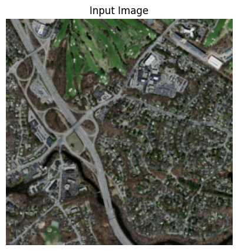
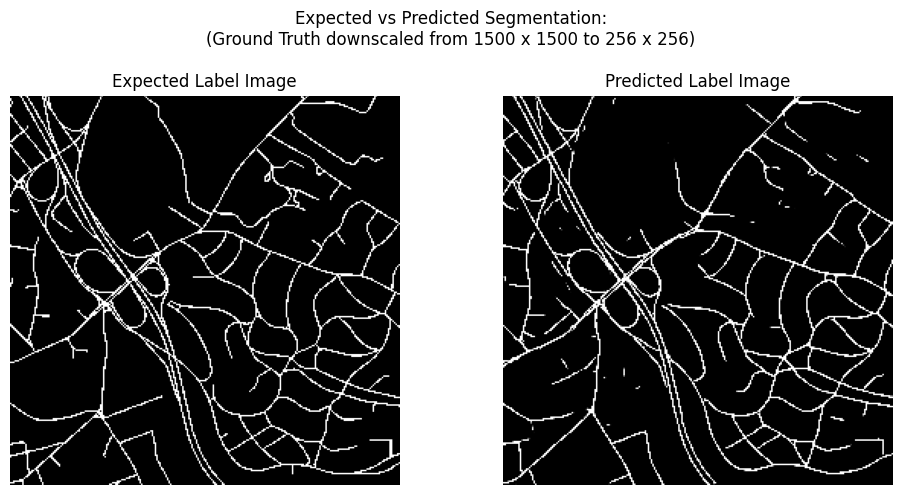
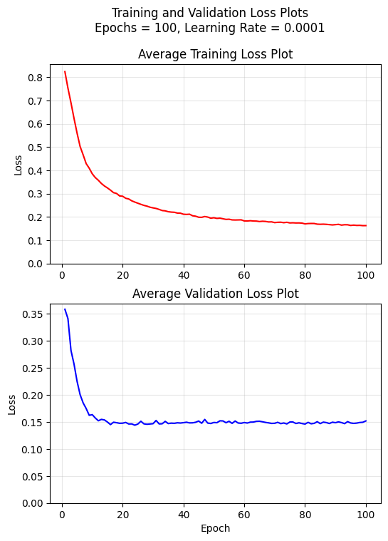

# Methodology:
The road segmentation task has been explored on the Massachusetts Roads Dataset, using
1. A UNet (A Baseline Model)

2. An Attention UNet

Both the models were trained for 100 epochs with a learning rate of 0.0001.

For both the models, the images have first been converted to their RGB values for the input set and grayscale values for the label mask, and then downscaled from their original resolution of 1500 x 1500 to that of 256 x 256. The framework for this is from the PIL library. The reason for the downscaling of the images was in order to consume less RAM during training and inference and to make the model architecture more compact.

Both the models have been trained using the PyTorch framework with the Adam optimizer, and using the Dice Loss. The Dice Loss function from the Segmentation Models Pytorch library was used for implementing the same. After training and validating the models, their training and validation losses have been plotted. The evaluation of the models has been done on the basis of the following two metrics:
1. IoU
   
2. Dice Coefficient

# Architectural Choices:
## UNet
A heavy class imbalance was seen in the road vs non-road classes in the label masks for the segmentation throughout the dataset. When evaluated over a batch of the first 100 images in the training set, it was seen that the net percentages of the road vs non-road classes were 4.89 % vs 95.11 % respectively. In order to effectively handle the training of the model over this highly imbalanced data, Dice Loss was chosen as the criterion. While the original UNet architecture was designed to take images with a resolution of 572 x 572 as input, with 5 blocks each in both the contracting and expanding paths, since the resolution in our case is much smaller (256 x 256), only 4 blocks were implemented in this model for both paths.
## Attention UNet
The reason behind chosing to compare the baseline to an Attention UNet was to see how well the addition of the additive attention gate component translates towards improving the quality of the model for this particular task of binary image segmentation in a highly imbalanced dataset. Similar to the baseline model, this model was also trained using Dice Loss and had 4 blocks in both the contracting and expanding paths.

# Evaluation Metrics:
| Model | Test IoU | Test Dice Coefficient |
| :--- | :--- | :--- |
| UNet | 0.5490 | 0.7088 |
| Attention UNet | 0.5430 | 0.7038 |

# Qualitative Outputs:
The following is a sample image from the test dataset:

and here is its corresponding ground-truth binary segmentation mask, compared with the models' outputs for the segmentation mask:
## 1. UNet

Though the model understands the basic high-level structure of the expected mask, it can be seen struggling with the low-level details in the roads, such as small diversions and sections with multiple trees clustered close to the roads. It also seems to generate multiple small "islands" of road-labelled pixels where there are supposed to be none, or vey close to where there are thin diversions. It can also be seen to be unable to completely connect the peices of many long, thin roads through-and-through.

## 2. Attention UNet

Qualitatively, the output of the Attention UNet model is much similar to that of the baseline UNet. It can be seen that the issues of struggling with low-level details and the inability to completely connect small roads persist. One improvement which can be observed here, compared to the baseline, is that the Attention UNet generated very few false "islands" of road labels.

# Observations and Conclusion:
Both the models have done well on generalizing to the high-level structure of the roads, but face difficulties when it comes to pin-point pixel-wise accuracy in more detailed spaces.

Training and Validation Loss Plots for the UNet:

Training and Validation Loss Plots for the Attenion UNet:

From the above loss plots, it is clearly visible that both the models behaved almost identically during training and convergence. On a dataset-wide basis too, both the IoU and the Dice Coefficients of both the moels are almost identical. These facts, along with the high qualitative similarity in their inference patterns (as seen in the previous section), indicate that the inferential behaviour has not significantly changed with the introduction of the additive attention mechanism.

All-in-all, these models have done fairly well on the segmentation task, with a wide room for improvement in highly detailed sections of roads. A clear ceiling exists for this particular task when it comes to the maximum inference quality of the UNet architecture type, as can be seen by the flatline in the validation losses of both the models. Breaking this ceiling will require more robust and adaptable architectures.
