## 1. Abstract
This report contains my attempts at implementing fine-tuning of Denoising Diffusion Probabilistic Models (DDPM), and the experiments and ablations conducted. This will be done through the `diffusers` library from huggingface for weight fetching and fine-tuning.

## 2. Working Principle
Diffusion models are essentially adjustable Markov chains, trained to predict the augmented noise over a clean image, thus letting them gradually "clean" noise from an image. This lets them "generate" images (or audio) from random noise, in several timesteps. This iterative nature of the paradigm lends itself the high-quality generation it is known for.

They're named after the physical process of diffusion — since the forward process iteratively destroys the input image until it is random noise, which is similar to the tendency of gas molecules to move around or "diffuse", destroying their order.

DDPMs operate by learning two separate joint distributions:

**1. Forward Process (Diffusion Process)**

This is fixed to a Markov chain that gradually adds Gaussian noise to the data according to a variance schedule (or noise schedule) $\beta_1, ...., \beta_T$; as given below:

$$q(x_{1:T}|x_0) := \prod_{t=1}^N q(x_t|x_{t-1})$$

where $q(x_t|x_{t-1}) := \mathcal{N}(x_t; \sqrt{1-\beta_t})$

One main strength in the forward process of DDPMs is that it is a mathematically fixed Markov chain, letting us sample any future $x_t$ from $x_0$ using the following expression:

$$q(x_t | x_0) = \mathcal{N}(x_t;\ \sqrt{\bar{\alpha}_t}\ x_0,\ (1 - \bar{\alpha}_t)\mathbf{I})$$

where $\bar{\alpha}_t = \prod_{s=1}^{t} (1 - \beta_s)$, which is a cumulative measure of how much the original image survives the noise. It starts out at $1$ in the beginning, and approaches $0$ near timestep $T$, depending on the noise schedule used.

**2. Reverse Process (Denoising Process)**

Unlike the forward process, the reverse process is learned. Starting from pure Gaussian noise $x_T \sim \mathcal{N}(0, \mathbf{I})$, the model learns to iteratively denoise back to a clean image $x_0$ by approximating the true reverse posterior:

$$p_\theta(x_{0:T}) := p(x_T) \prod_{t=1}^{T} p_\theta(x_{t-1}|x_t)$$

where each reverse step is modelled as a Gaussian:

$$p_\theta(x_{t-1}|x_t) := \mathcal{N}(x_{t-1};\ \mu_\theta(x_t, t),\ \sigma_t^2 \mathbf{I})$$

It is intractable to try and directly maximize the log likelihood of the reverse process, so we instead optimize the Evidence Lower Bound (ELBO) for tractability:

$$\mathbb{E}[-\log p_\theta(x_0)] \leq \mathbb{E}_q\left[-\log\frac{p_\theta(x_{0:T})}{q(x_{1:T}|x_0)}\right] = \mathbb{E}_q\left[-\log p(x_T) - \sum_{t \geq 1} \log \frac{p_\theta(x_{t-1}|x_t)}{q(x_t|x_{t-1})}\right] =: L \quad (1)$$

> *The above inequality is derived by applying Jensen's Inequality on $-\log(p_\theta(x_0))$ since $\log$ is a concave function, and then expanding the expectation term with respect to our forward posterior $q$.*

The per-timestep terms in the summation in $L$ involve a KL divergence between the learned reverse step $p_\theta(x_{t-1}|x_t)$ and the true reverse posterior $q(x_{t-1}|x_t, x_0)$. This posterior is intractable without $x_0$, but conditioning on it yields a closed-form Gaussian:

$$q(x_{t-1} | x_t, x_0) = \mathcal{N}(x_{t-1};\ \tilde{\mu}_t(x_t, x_0),\ \tilde{\beta}_t \mathbf{I})$$

Since both distributions are Gaussian, the KL reduces to a comparison of their means, giving the per-timestep loss:

$$L_t \propto \left\| \tilde{\mu}_t(x_t, x_0) - \mu_\theta(x_t, t) \right\|^2$$

To make this practical, we apply the reparameterization for sampling from the forward process at arbitrary timestep $t$:

$$x_t = \sqrt{\bar{\alpha}_t}\ x_0 + \sqrt{1 - \bar{\alpha}_t}\ \epsilon, \quad \epsilon \sim \mathcal{N}(0, \mathbf{I}) \quad (2)$$

Using $(2)$, we can express $x_0$ in terms of $x_t$ and $\epsilon$, and substitute into $\tilde{\mu}_t$. This shows that matching means is equivalent to predicting the noise $\epsilon$ directly. Ho et al. further simplify by dropping the timestep-dependent weighting terms from $L_t$, arriving at the final training objective:

$$L_{\text{simple}} = \mathbb{E}_{t,\ x_0,\ \epsilon}\left[\left\| \epsilon - \epsilon_\theta\!\left(\sqrt{\bar{\alpha}_t}\ x_0 + \sqrt{1-\bar{\alpha}_t}\ \epsilon,\ t\right) \right\|^2\right]$$

In practice, this means sampling a random timestep $t$, adding noise to a clean training image according to $(2)$, and training the U-Net $\epsilon_\theta$ to recover that noise via MSE loss, similar to Monte Carlo sampling. Over all the epochs and batches, we get a pretty good approximation for the intractable expectation value.

## 3. Data Exploration

I will only be considering four classes from the CIFAR-10 dataset — `airplane (0)`, `cat (3)`, `dog (5)`, and `ship (8)`. This was done to narrow down the unconditioned generation's range, and to make fine-tuning faster.

<table>
<tr>
<td align="center"><b>Airplane (class_id=0)</b></td>
<td align="center"><b>Cat (class_id=3)</b></td>
</tr>
<tr>
<td align="center">Channel-wise Mean : [129.3547 138.3002 147.4069]</td>
<td align="center">Channel-wise Mean : [119.3822 109.9827 100.5724]</td>
</tr>
<tr>
<td align="center">Channel-wise Std : [19.9432 18.3537 20.9079]</td>
<td align="center">Channel-wise Std : [17.9297 17.2813 18.2303]</td>
</tr>
<tr>
<td>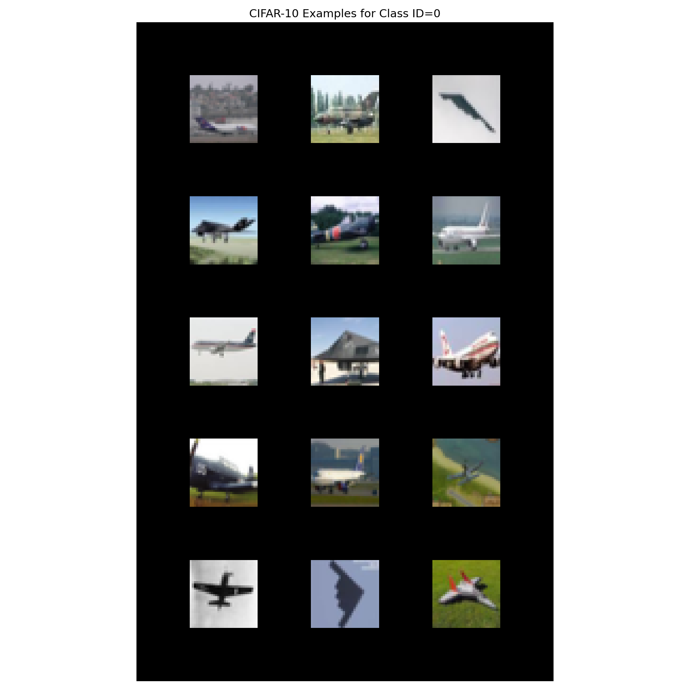</td>
<td>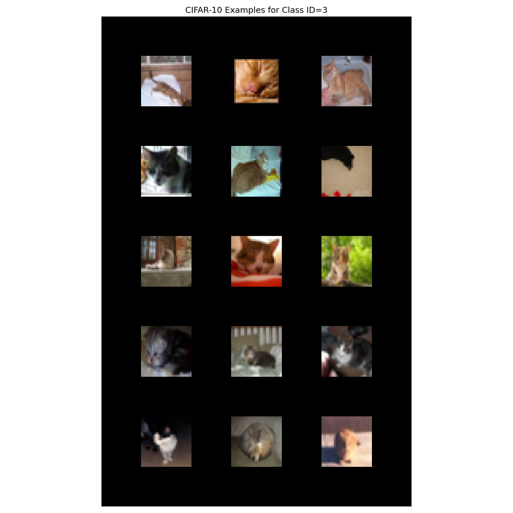</td>
</tr>
<tr>
<td align="center"><b>Dog (class_id=5)</b></td>
<td align="center"><b>Ship (class_id=8)</b></td>
</tr>
<tr>
<td align="center">Channel-wise Mean : [123.3255 114.3091 101.6388]</td>
<td align="center">Channel-wise Mean : [110.4862 117.8042 124.4699]</td>
</tr>
<tr>
<td align="center">Channel-wise Std : [15.8791 15.0282 16.2804]</td>
<td align="center">Channel-wise Std : [18.9371 18.3923 19.5358]</td>
</tr>
<tr>
<td>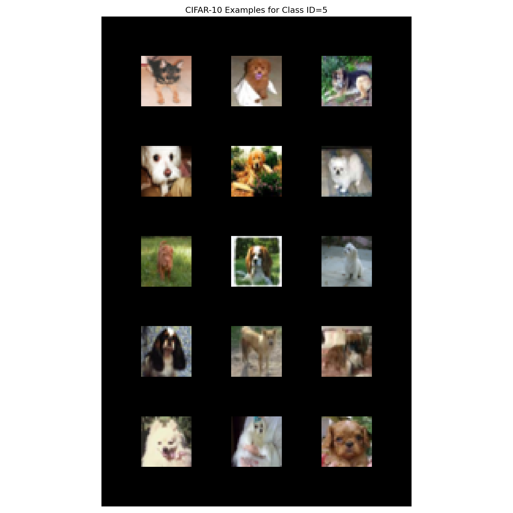</td>
<td>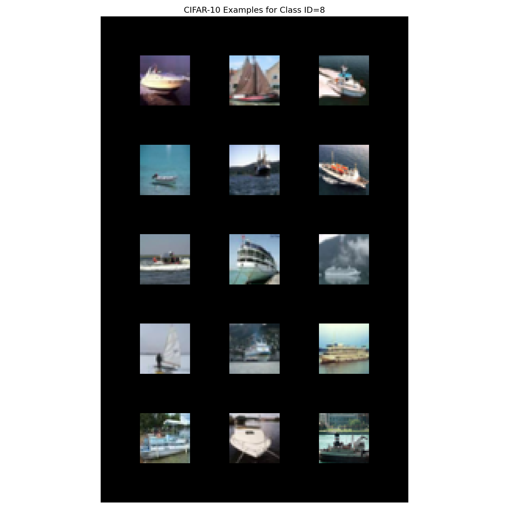</td>
</tr>
</table>

Image characteristics indicate that the individual channels differ about the same as each other, for a given class. From the limited samples above, we can see that the CIFAR-10 dataset provides real-world samples at several different angles, perspectives, and class specialisations (like dog and cat breeds, airplane and ship models).

## 4. Methodology

For this task, I will be using a pre-trained DDPM model [johnowhitaker/ddpm-butterflies-32px](https://huggingface.co/johnowhitaker/ddpm-butterflies-32px/tree/main), pre-trained on the Butterflies dataset, for fine-tuning to the CIFAR-10 dataset.

Data was first pre-processed so that pixel values remained in the $(-1,1)$ range. They were then saved as NumPy binary files `.npy`. In the Dataset subclass, similar to in Subtask-1, I implemented lazy-loading in the Dataset, leveraging this feature from how `.npy` files are loaded.

Training was carried out while using gradient accumulation. Since using higher batch sizes (>32 in my case) caused OOM errors, I followed the official HuggingFace documentation to implement gradient accumulation for an `effective batch size = 64`. I have documented my experiments with this in the ablations section.

For generation and evaluation during inference, I created `evaluate.py` that generates and also evaluates the generations using the Testing split of CIFAR-10.

I considered two different metrics to evaluate the diversity and quality of my generated samples:

### 4.1 Fréchet Inception Distance (FID)

FID compares the mean and standard deviation of the deepest layer in Inception v3 — a CNN which has 2048 dimensions in its last pooling layer. The idea is that instead of comparing image pairs pixel-to-pixel, the Inception v3 CNN can extract the most important features, drastically bringing down the number of parameters being compared while enriching the features and discarding redundancies.

For two image feature distributions (real and generated) having means and covariances $(\mu_r, \Sigma_r)$ and $(\mu_g, \Sigma_g)$, FID is calculated as:

$$FID = \|\mu_r - \mu_g\|^2 + \text{Tr}\left(\Sigma_r + \Sigma_g - 2\sqrt{\Sigma_r \Sigma_g}\right)$$

A lower FID score is desirable, with 0 being the ideal meaning the generated images match perfectly with the real samples. A higher FID score is a sign of lack of diversity and poorer quality compared to reality.

However, this method is very computationally expensive, since statistically stable FID scores require thousands of samples. In fact, the [original FID paper](https://arxiv.org/abs/1706.08500) used 50,000 samples, and other sources suggest using a minimum of 10,000. To speed up inference reliably, I decided on using an alternative.

### 4.2 Kernel Inception Distance (KID)

Instead of relying on Fréchet Distance between statistical measures of extracted CNN features, we can find the squared Maximum Mean Discrepancy (MMD) between the real and generated images. We can think of the images as two distributions. Intuitively, we can gauge how different the "distributions" are by imagining them as objects in some higher-dimensional space (specifically, a function vector space). MMD is basically a measure of the distance between the centres of mass of these objects. It is calculated as such for continuous distributions:

$$MMD^{2}(R,G) = \sup_{\|f\| \leq 1} \left(\mathbb{E}_{X \sim R}[f(X)] - \mathbb{E}_{Y \sim G}[f(Y)]\right)^{2}$$

where $R$ = Real image distribution, $G$ = Generated image distribution.

However, since our images are sampled and not continuous, we have to resort to approximations. For KID, we use a polynomial kernel function $k$ over many subsets of the extracted Inception v3 features to find the squared MMD.

This method is significantly easier to compute and can be used for a very small number of samples. For my purposes, I have chosen to use KID over FID, using 128 samples evaluated over subsets of 50 at a time.

## 5. Baseline Fine-Tuning

Firstly, here are the samples generated from the model pre-trained on the butterflies dataset.

For my baseline fine-tuning, I have chosen the following training hyper-parameters. Note that they will be changed for experimentation and ablations:

| Hyperparameter | Value |
|---|---|
| Maximum epochs | 20 |
| Learning rate | 1e-5 |
| Batch size | 32 (effective 64 with grad accum of 2) |
| Validation patience | 6 |
| Training scheduler timesteps | 500 |
| Noise schedule | Squared Cosine (default start/end) |

Upon evaluation, these are my generated images and KID metrics, along with the loss history curve.

**KID Score: 0.0922 | KID Std: 0.0096**

<table>
<tr>
<td align="center"><b>Fine-Tuning Loss History</b></td>
<td align="center"><b>Generated Samples</b></td>
</tr>
<tr>
<td></td>
<td rowspan="3"></td>
</tr>
<tr>
<td align="center"><b>Intermediate Samples</b></td>
</tr>
<tr>
<td></td>
</tr>
</table>

## 6. Improvement Experiments

### 6.1 Noise Schedule

Four different noise schedules can be employed in the diffusers library: Linear, Scaled Linear, Squared Cosine, and Sigmoid.

From my findings, all four schedules didn't show changes that were too significant, but Sigmoid and the Linear schedules produced the most appealing results. All iterations suffered from the same failure mode — distortions and unstructured regions.

<table>
<tr>
<td align="center"><b>Schedule</b></td>
<td align="center"><b>Loss History</b></td>
<td align="center"><b>Generated Samples</b></td>
<td align="center"><b>Intermediate Samples</b></td>
<td align="center"><b>KID Score</b></td>
<td align="center"><b>KID Std</b></td>
</tr>
<tr>
<td align="center"><b>Linear</b></td>
<td>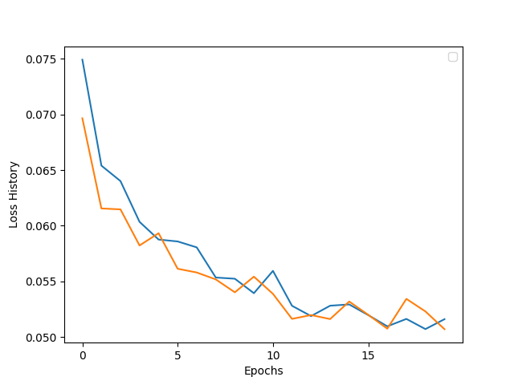</td>
<td></td>
<td></td>
<td align="center">0.0897</td>
<td align="center">0.0081</td>
</tr>
<tr>
<td align="center"><b>Scaled Linear</b></td>
<td>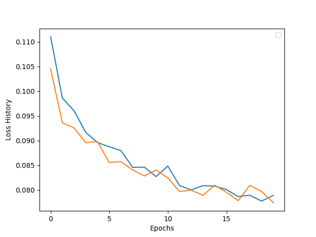</td>
<td></td>
<td></td>
<td align="center">0.0875</td>
<td align="center">0.0081</td>
</tr>
<tr>
<td align="center"><b>Squared Cosine (Baseline)</b></td>
<td></td>
<td></td>
<td></td>
<td align="center">0.0922</td>
<td align="center">0.0096</td>
</tr>
<tr>
<td align="center"><b>Sigmoid</b></td>
<td>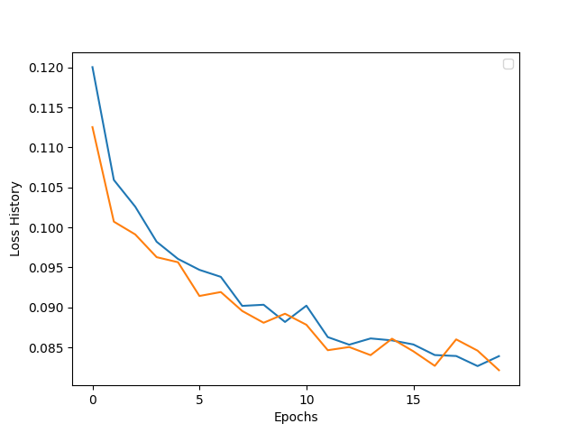</td>
<td></td>
<td></td>
<td align="center">0.0882</td>
<td align="center">0.0084</td>
</tr>
</table>

### 6.2 Training Timesteps

Varying the timesteps used while training also helped produce more significant variations. 200 timesteps seemed to produce the most coherent results. It is likely that higher timesteps suffered from the same issue — any mistakes made in the earlier timesteps got amplified in later steps.

<table>
<tr>
<td align="center"><b>Training Timesteps</b></td>
<td align="center"><b>Loss History</b></td>
<td align="center"><b>Generated Samples</b></td>
<td align="center"><b>Intermediate Samples</b></td>
<td align="center"><b>KID Score</b></td>
<td align="center"><b>KID Std</b></td>
</tr>
<tr>
<td align="center"><b>50</b></td>
<td>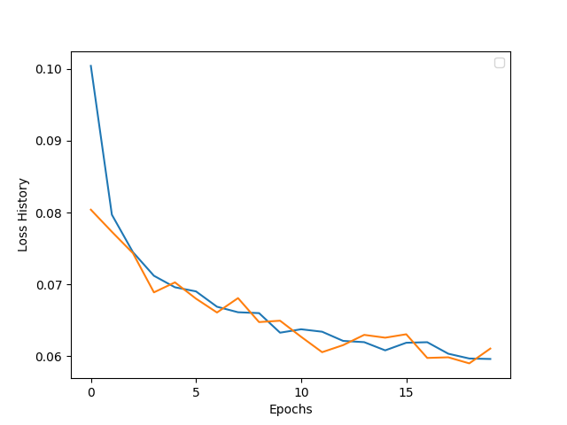</td>
<td>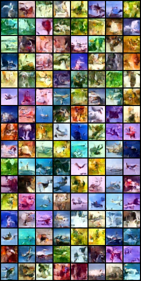</td>
<td>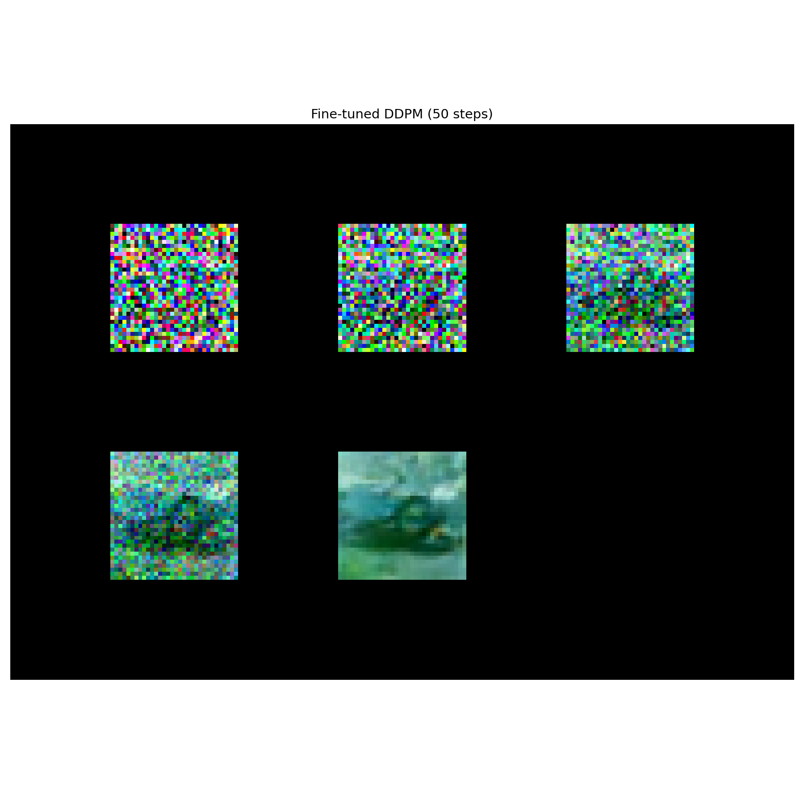</td>
<td align="center">0.0817</td>
<td align="center">0.0082</td>
</tr>
<tr>
<td align="center"><b>200</b></td>
<td>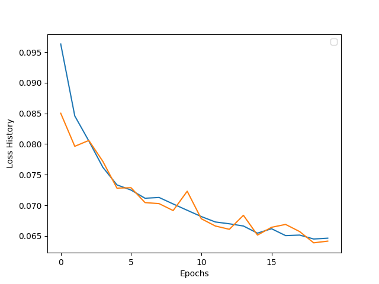</td>
<td>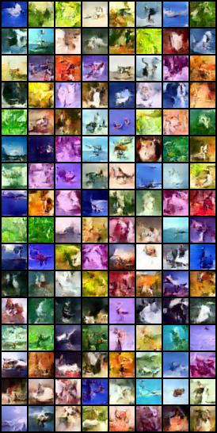</td>
<td>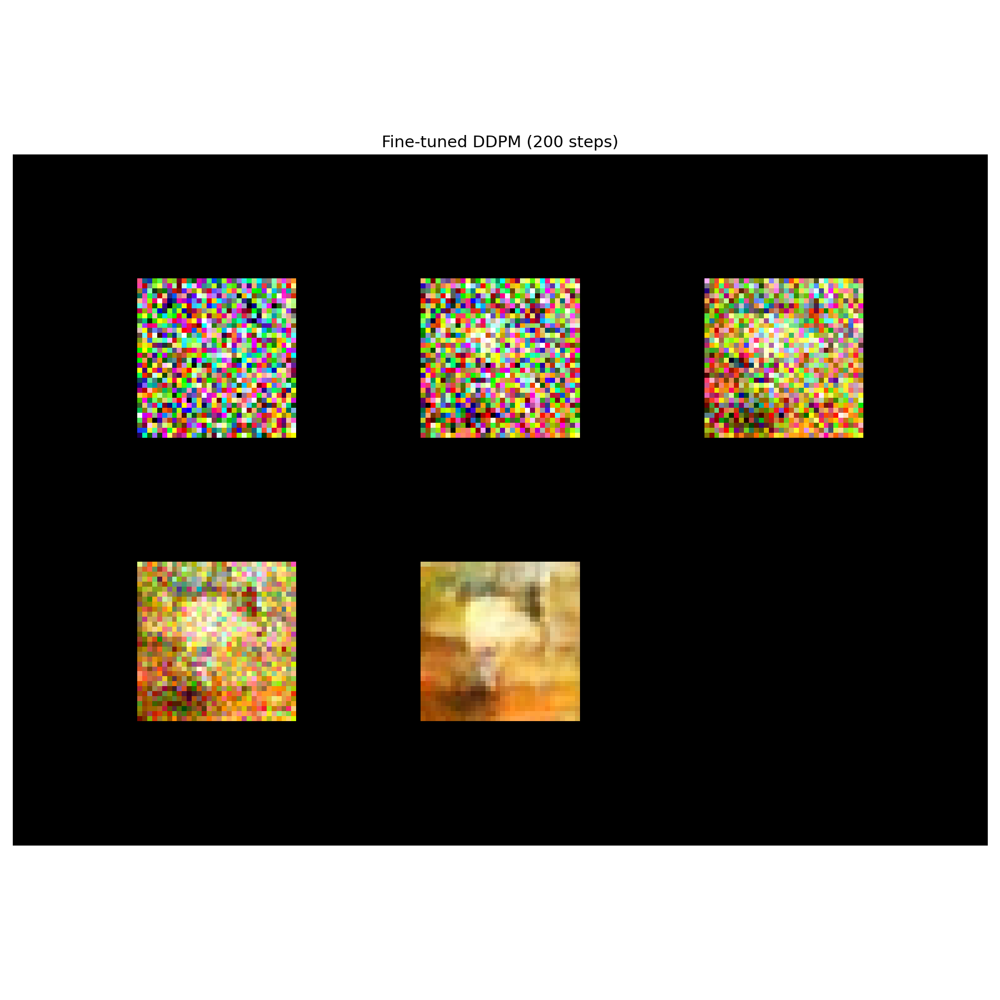</td>
<td align="center">0.0767</td>
<td align="center">0.0077</td>
</tr>
<tr>
<td align="center"><b>500 (Baseline)</b></td>
<td></td>
<td></td>
<td></td>
<td align="center">0.0922</td>
<td align="center">0.0096</td>
</tr>
<tr>
<td align="center"><b>1000</b></td>
<td>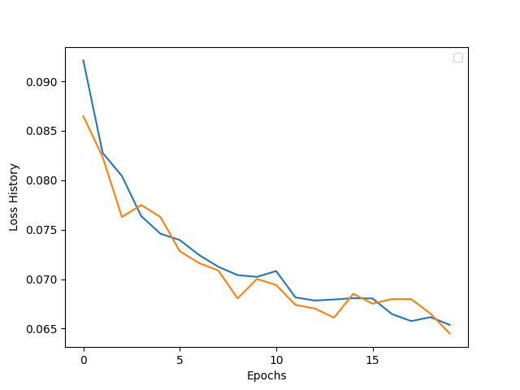</td>
<td>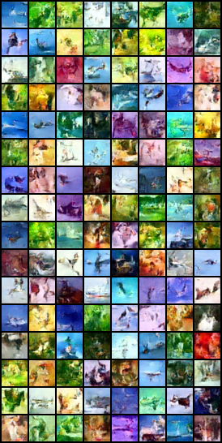</td>
<td>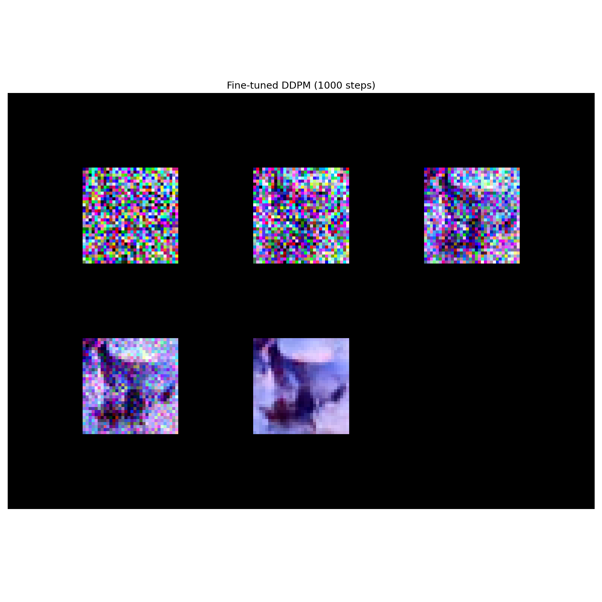</td>
<td align="center">0.0996</td>
<td align="center">0.0100</td>
</tr>
</table>

### 6.3 U-Net Variations

I tried implementing dropouts to see if fine-tuning would go about differently. While the metrics did not change much, dropouts might have helped produce less noisy outputs. It could be that since dropouts forced the U-Net to reduce over-dependence on the same features, it helped with the denoising process.

<table>
<tr>
<td align="center"><b>Variation Type</b></td>
<td align="center"><b>Loss History</b></td>
<td align="center"><b>Generated Samples</b></td>
<td align="center"><b>Intermediate Samples</b></td>
<td align="center"><b>KID Score</b></td>
<td align="center"><b>KID Std</b></td>
</tr>
<tr>
<td align="center"><b>Baseline</b></td>
<td></td>
<td></td>
<td></td>
<td align="center">0.0922</td>
<td align="center">0.0096</td>
</tr>
<tr>
<td align="center"><b>Dropout (0.3)</b></td>
<td></td>
<td></td>
<td></td>
<td align="center">0.0931</td>
<td align="center">0.0103</td>
</tr>
<tr>
<td align="center"><b>Dropout (0.6)</b></td>
<td></td>
<td></td>
<td></td>
<td align="center">0.0930</td>
<td align="center">0.0102</td>
</tr>
</table>

## 7. Ablation Studies

### 7.1 Optimization Axis

#### 7.1.1 Learning Rate

Varying the learning rate helped in understanding how aggressively the fine-tuning could be carried out without ruining the pre-trained model's generalisation. Lr = 1e-4 produced significantly smoother and more coherent outputs, while Lr = 1e-6 on the other end produced much noisier output.

<table>
<tr>
<td align="center"><b>Learning Rate</b></td>
<td align="center"><b>Loss History</b></td>
<td align="center"><b>Generated Samples</b></td>
<td align="center"><b>Intermediate Samples</b></td>
<td align="center"><b>KID Score</b></td>
<td align="center"><b>KID Std</b></td>
</tr>
<tr>
<td align="center"><b>1e-4</b></td>
<td>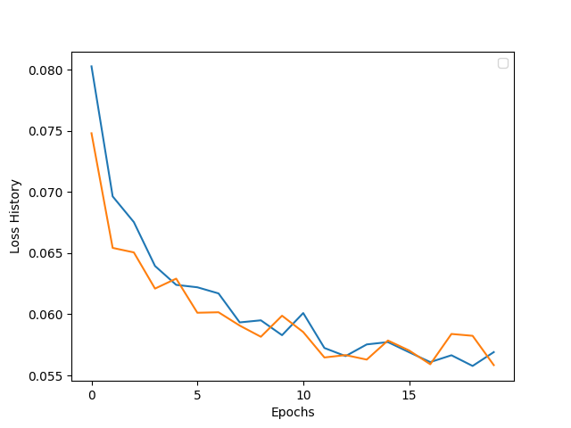</td>
<td></td>
<td></td>
<td align="center">0.0613</td>
<td align="center">0.0074</td>
</tr>
<tr>
<td align="center"><b>1e-5 (Baseline)</b></td>
<td></td>
<td></td>
<td></td>
<td align="center">0.0922</td>
<td align="center">0.0096</td>
</tr>
<tr>
<td align="center"><b>1e-6</b></td>
<td>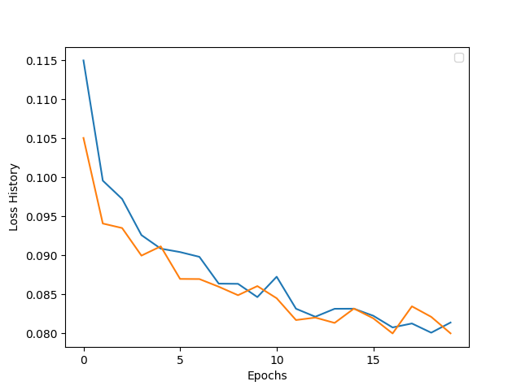</td>
<td></td>
<td></td>
<td align="center">0.2244</td>
<td align="center">0.0125</td>
</tr>
</table>

#### 7.1.2 Batch Size and Gradient Accumulation

Due to device limitations, I was forced to use gradient accumulation. While in theory it simulates larger batch sizes, I wanted to observe how it would impact inference for the same effective batch size. Aggressive gradient accumulation hurts the model's diversity and quality, as indicated from the scores and std measures.

<table>
<tr>
<td align="center"><b>Batch Size, Grad Accum</b></td>
<td align="center"><b>Loss History</b></td>
<td align="center"><b>Generated Samples</b></td>
<td align="center"><b>Intermediate Samples</b></td>
<td align="center"><b>KID Score</b></td>
<td align="center"><b>KID Std</b></td>
</tr>
<tr>
<td align="center"><b>32, 2 (Baseline)</b></td>
<td></td>
<td></td>
<td></td>
<td align="center">0.0922</td>
<td align="center">0.0096</td>
</tr>
<tr>
<td align="center"><b>16, 4</b></td>
<td>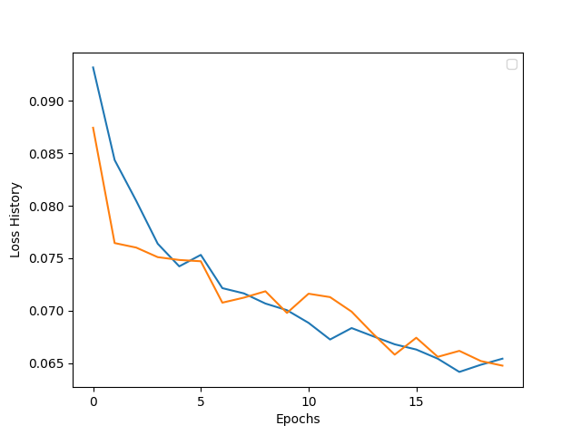</td>
<td></td>
<td></td>
<td align="center">0.1092</td>
<td align="center">0.0113</td>
</tr>
<tr>
<td align="center"><b>8, 8</b></td>
<td>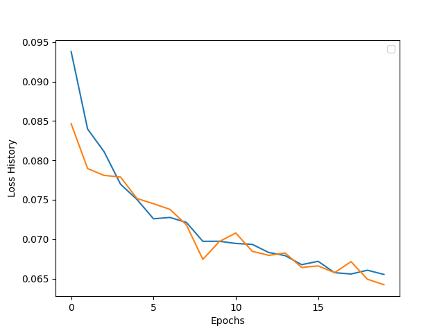</td>
<td></td>
<td></td>
<td align="center">0.1029</td>
<td align="center">0.0112</td>
</tr>
</table>

### 7.2 Generation Axis

#### 7.2.1 Temperature

Temperature-based generation was added by multiplying the initial noise by a temperature factor. It is interesting to see how the intermediate sample for the same initial noise seed changed between baseline and higher temperature.

<table>
<tr>
<td align="center"><b>Temperature</b></td>
<td align="center"><b>Generated Samples</b></td>
<td align="center"><b>Intermediate Samples</b></td>
<td align="center"><b>KID Score</b></td>
<td align="center"><b>KID Std</b></td>
</tr>
<tr>
<td align="center"><b>1 (Baseline)</b></td>
<td></td>
<td></td>
<td align="center">0.0922</td>
<td align="center">0.0096</td>
</tr>
<tr>
<td align="center"><b>5</b></td>
<td>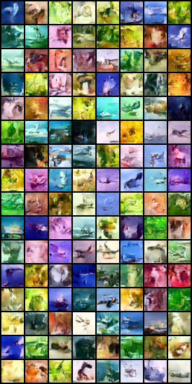</td>
<td>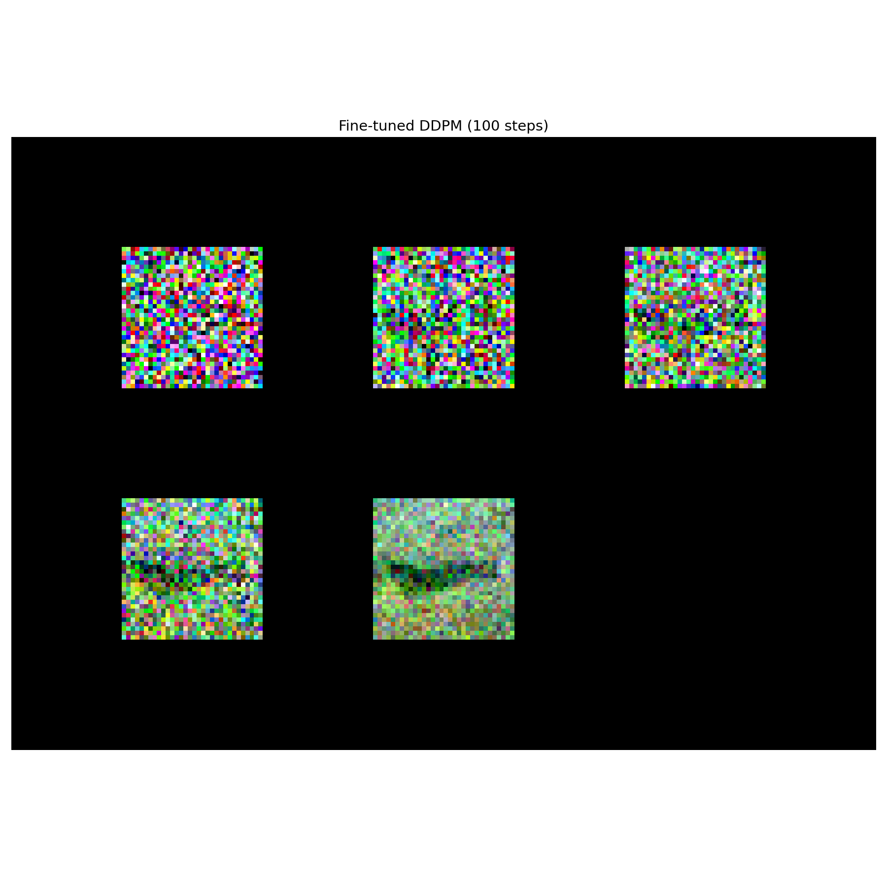</td>
<td align="center">0.0810</td>
<td align="center">0.0085</td>
</tr>
<tr>
<td align="center"><b>0.5</b></td>
<td>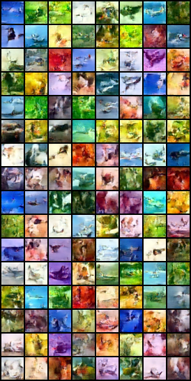</td>
<td>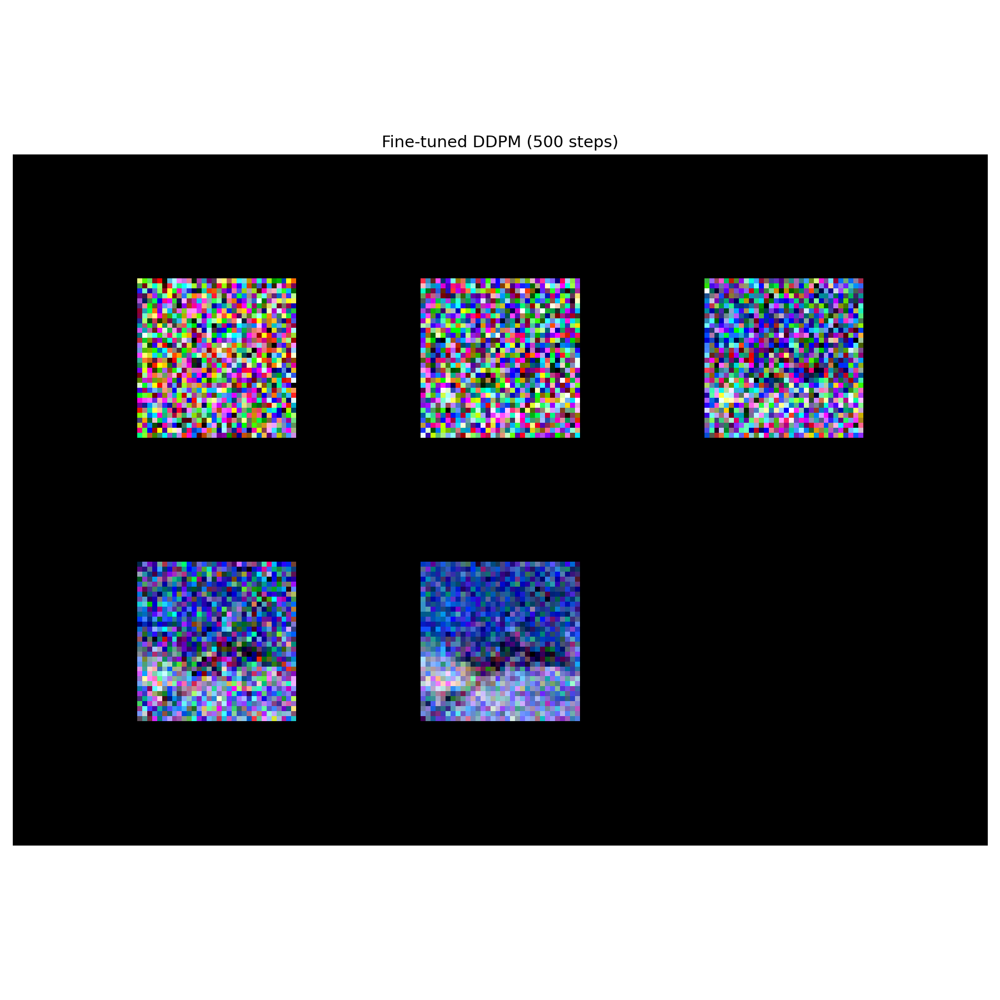</td>
<td align="center">0.0922</td>
<td align="center">0.0096</td>
</tr>
</table>

#### 7.2.2 Schedulers and Sampling Strategies

This is a combination of both schedulers and sampling strategies. The main problem with using the regular DDPM Scheduler is that it is fundamentally non-deterministic and Markovian. Each step depends on the step before it, and there is some randomness built into it. This requires the pipeline to run several inference steps before acceptable generations are produced.

DDIM (Denoising Diffusion Implicit Models) circumvents this issue by implementing two things:

1. It is inherently non-Markovian, which allows it to skip time-steps similar to the diffusion process, making generation faster.
2. It is also deterministic — the same initial noise will always produce the same generated output.

Below we can see that with just 20 inference steps, it is able to generate something almost on par with the DDPM scheduler.

<table>
<tr>
<td align="center"><b>Scheduler</b></td>
<td align="center"><b>Generated Samples</b></td>
<td align="center"><b>Intermediate Samples</b></td>
<td align="center"><b>KID Score</b></td>
<td align="center"><b>KID Std</b></td>
</tr>
<tr>
<td align="center"><b>DDPM (Baseline, 500 steps)</b></td>
<td></td>
<td></td>
<td align="center">0.0922</td>
<td align="center">0.0096</td>
</tr>
<tr>
<td align="center"><b>DDIM (20 steps)</b></td>
<td>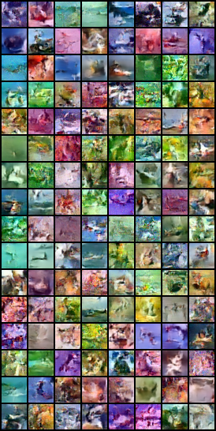</td>
<td>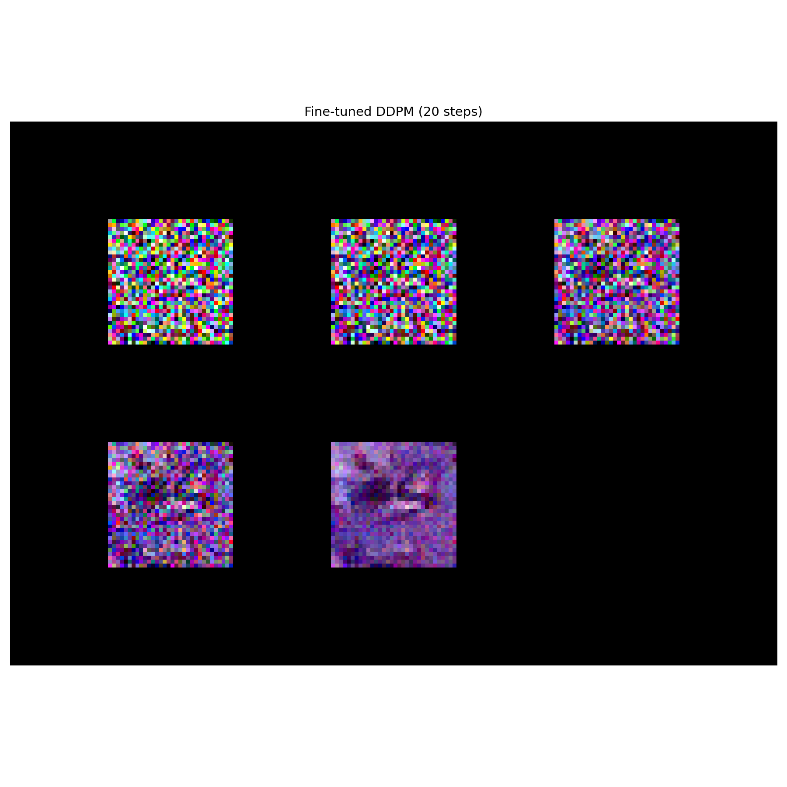</td>
<td align="center">0.1185</td>
<td align="center">0.0140</td>
</tr>
</table>

It does have its own shortcomings. The same deterministic property makes it prone to a particular failure mode — where it just repeats highly similar patterns across all generations, as we can observe for Timesteps = 20, 100, and 500. This is an important hyperparameter to tune during inference time.

<table>
<tr>
<td></td>
<td></td>
<td></td>
</tr>
<tr>
<td align="center">20 steps</td>
<td align="center">100 steps</td>
<td align="center">500 steps</td>
</tr>
</table>

## 8. Conclusion

This report explored the fine-tuning of a pretrained DDPM on a custom CIFAR-10 class subset, investigating both optimization and generation axes through a series of ablation studies.

On the optimization side, learning rate proved to be the most impactful hyperparameter. A higher learning rate of 1e-4 achieved the best KID score of 0.0613, while an excessively low rate of 1e-6 caused the model to underfit, scoring 0.2244. Batch size and gradient accumulation showed comparatively smaller effects, with all configurations producing similar KID scores in the 0.10 range, suggesting the effective batch size matters less than learning rate for this fine-tuning setup.

On the generation side, temperature scaling and scheduler choice both produced interesting findings. A moderate temperature of 5 marginally improved over the baseline, while extreme temperatures unsurprisingly degraded output quality. The switch from DDPM to DDIM demonstrated a compelling quality-speed tradeoff, achieving near-comparable generation quality at a fraction of the inference steps, showing that DDIM is a practical improvement over the standard Markovian sampling approach.

Overall, the fine-tuning pipeline successfully shifted the model's generative distribution toward the target class subset, with the loss curves and KID metrics confirming meaningful learning across all configurations. Key limitations include the small training subset, constrained epoch budget, and the relatively high absolute KID scores compared to published benchmarks — all of which are expected given the scope of this experiment.

## 9. Potential Improvements

Future improvements that could be added on top of this implementation:

1. Classifier-Free Guidance, for conditioning image generation on class labels
2. A hybrid model that combines the concepts of "latent space" and "diffusion" (e.g. Latent Diffusion Models)
3. Addition of modern SOTA samplers (UniPC, F-Scheduler) for even faster inference
