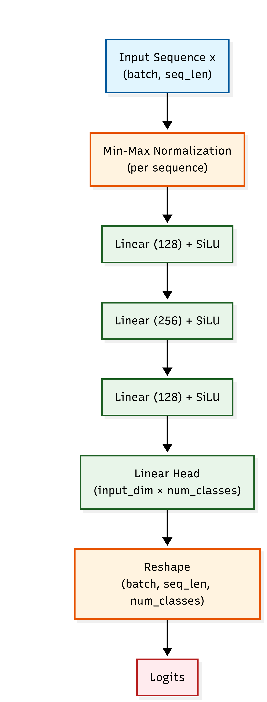
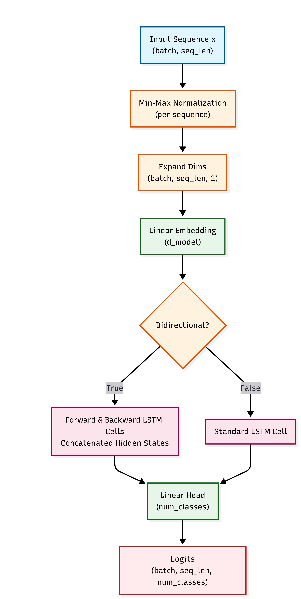

# Subtask 1 - Encoder-Only Transformers for Relational Reasoning

## Repository Structure

```text
Task1/Subtask1/
├── Models/                     # Contains saved model checkpoints (Transformer, MLP, LSTM)
├── Output/                     # Attention heatmaps and visualizations
├── Demo.py                     # Streamlit app for Transformer inference visualization
├── Transformer.py              # Implementation of Transformer components (RoPE, MHSA, FFN)
├── Subtask1.ipynb              # Jupyter notebook with data loading, training loops, and evaluation
├── Subtask1_EDA.ipynb          # Jupyter notebook with basic EDA
├── ranking_dataset.csv         # Synthetic dataset for the Array Element Ranking task
└── README.md                   # This file
```

## Usage Instructions

### Training and Evaluation
The full training pipeline and baseline comparisons are implemented in `Subtask1.ipynb`. 
Run the notebook sequentially to:
1. Load the synthetic dataset (`ranking_dataset.csv`).
2. Train the baseline models (MLP, LSTM).
3. Train the Transformer model (`DigitRanker`).
4. Evaluate the models and generate attention heatmaps.

### Inference & Visualization Demo
To launch the interactive Streamlit demo for the Transformer model:
```bash
streamlit run Demo.py
```
The web interface allows you to input an arbitrary sequence of 10 integers. It will output the predicted ranks and display a heatmap of the multi-head attention weights, letting you observe the model's internal routing logic.

## Analysis

### Transformer vs. Baselines
The goal of this task is to predict the (stable) relative sorted rank of each integer in a sequence.

**Performance Results:**
| Model | Test Token Accuracy | Test Exact Sequence Accuracy |
| --- | --- | --- |
| Transformer (DigitRanker) | 0.9843 | 0.8730 |
| MLP Baseline (MLPRanker) | 0.5843 | 0.0090 |
| LSTM Baseline (LSTMRanker) | 0.6800 | 0.0210 |

**Comparison:**
- **MLP Baseline:** The MLP model achieves poor accuracy. It converts the input sequence into a float vector and then passes it through dense neural network layers. It lacks the built-in pairwise comparison mechanism of the Transformer.
- **LSTM Baseline:** The LSTM performs slightly better than the MLP but still has very low accuracy. LSTMs struggle with global relational reasoning because they must compress all previous context into a single hidden vector, making precise all-to-all comparisons difficult.

- **Transformer:** The Transformer greatly outperforms both baselines. Its bidirectional multi-head self-attention mechanism enables every token to simultaneously attend to and compare itself against every other token in the sequence. This unbottlenecked, global context view perfectly aligns with the mathematical requirements of sequence ranking.

### Multi-Headed Attention Matrices
By extracting and visualizing the attention weights from the `DigitRanker` architecture, we can see how the model implicitly learns to sort:
- **Pairwise Comparisons:** To determine its rank, an element essentially needs to count how many other elements are smaller than it. The attention heatmaps reveal that tokens learn to selectively attend to elements that satisfy these relative magnitude checks (e.g., attending strictly to larger or smaller numbers). 

- **Head Specialization:** The multi-head mechanism allows different heads to specialize. As per the visualisation, you can see that some heads act as min-max finders strongly attending to either the largest or the smallest element in the sequence, while other heads may focus on finding the second largest or second smallest elements and so on. (Although visualisation suggests head specialisation isn't absolute or to this degree)


- **Global Context Representation:** Because attention computes direct dot-products between all token pairs, the relational distances between numbers are captured in a single step. The representation of the numerical values (via learned embeddings) allows the $Q$ and $K$ projections to generate high attention scores when the numerical relationship is relevant to the rank calculation.

### Model Architecture
Here is a flow chart describing all three models' architectures:

### MLP Baseline

<div style="text-align: center;">


</div>

### LSTM Baseline

<div style="text-align: center;">


</div>

### Transformer Model

<div style="text-align: center;">


</div>


### Experimentation Results

-  


- **Residual Attention** : I also considered using `x+attn_out` as the input for the FFNN, instead of the normal `attn_out`. It yieleded much worse results when done on the reported best architecture, so I tried to run another optuna study on it. Naturally, I found out that when using residual attention, the model converged on a set of hyperparameters that included more layers(4) and less heads (6), This model yielded comparable performance to my final model. But for interpretability reasons, I decided to leave residual attention out of the picture.


- **Learnable Embeddings** : EDA showed that the data disrtribution itself contained only integeres from 0 to 999, meaning a learnable embedding matrix with a vocabulary of 1000 was possible, but considering that this task shouldn't be limited to range, I decided to simply cast the integers to float values, normalise and scale to d_model using a  Dense NN layer instead. Thanks to sequence wide min-max Normalisation, this meant that the model can comfortablably handle sequences where the integers are of arbitrary sizes. 


- **Postional Embeddings**:  Experimentation showed that Positional Embedding for this tasks were not very useful, and learned absolute positional encodings actually resulted in worse accuracy. RoPE didn't yield significantly better results, but a slight increase in accuracy was observed. While stable relative sorted ranking does require original positions for it's task, the deficiency in data samples (only 429 out of 10,000 data samples contained even 1 duplicate element) meant that the model could never learn to use positional encoding specifically for dealing with duplicate elements. (Oversampling might help solve this issue, but I'm not quite sure).

- **Optimal Parameters**: The optimal parameters were found using a short fine-tuning study done using optuna. The parameters were  
```
{"num_layers": 2, "num_heads": 16, "d_k": 4, "learning_rate": 0.0036534068309100557}
```

- **Optimizer Details**: An AdamW optimizer with weight decay 1e-4 and a cosine decay rate schedule was used for training. The model was trained for 200 epochs with a patience of 10 (for EarlyStopping).


## Note:

### Models Review:

This task is mostly supposed to be an experiment to understand how attention works, and it's highly impractical to ever use this model over sorting algorithms. However experimentation reveals why attention is so powerful for globabl reasoning tasks.


### Note on LLM usage:

Aside from research, and using the free github copilot's code autocomplete feature, I have used LLMs to generate code templates for README and Demo files, and comments for some other files. It was also used (in mermaid.live) to generate the flow charts for architectures
