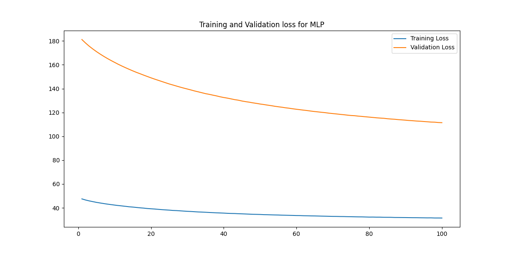
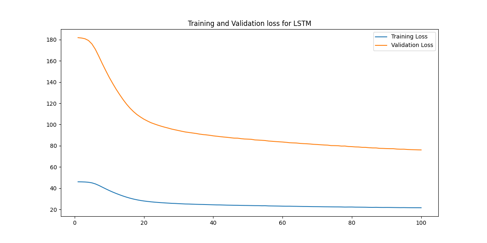
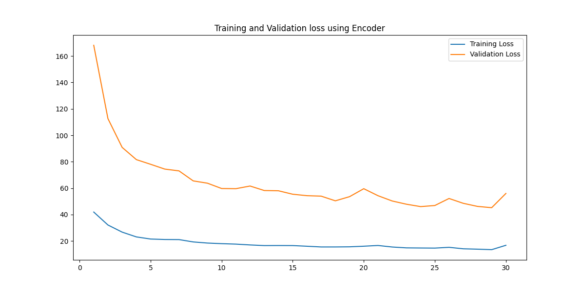
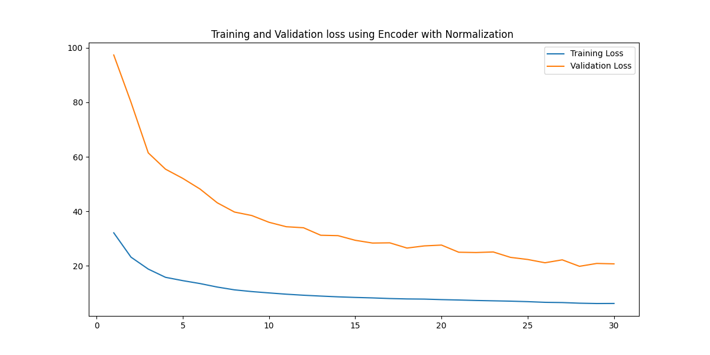
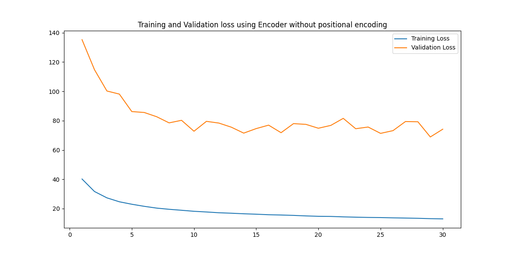
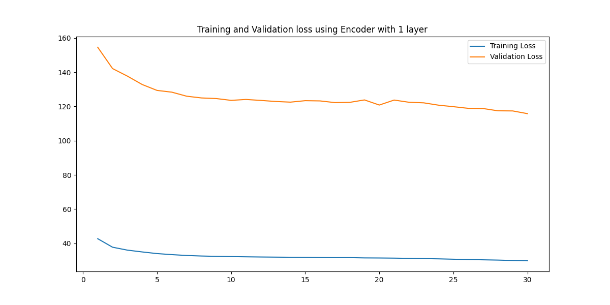
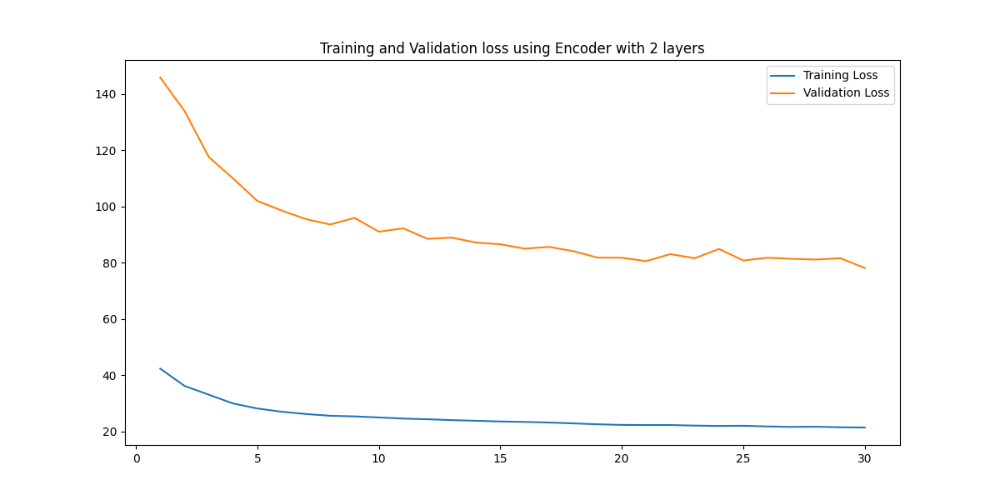
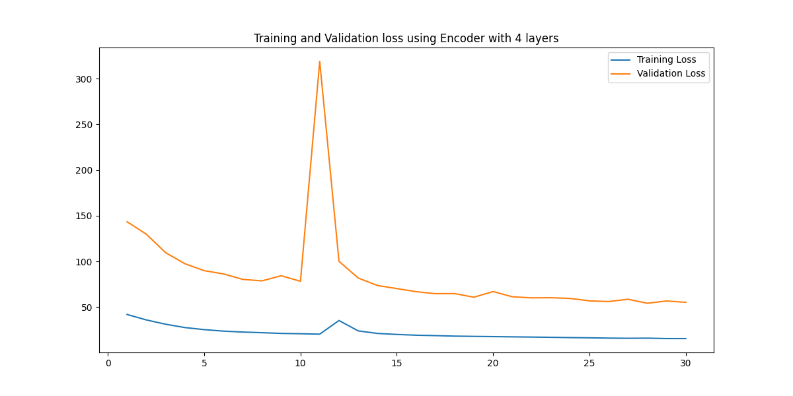

# Encoder Only Transformer
In this task, I was required to build a encoder only transformer with the main intent of ranking elements of a given input array.
This task has been implemented using baseline MLP model and bidirectional LSTM model and the final main encoder only transformer model. 
The model has been experimented with respect to the number of layers used, by including and excluding positional encodings, by using normalized and raw data and the accuracy and losses have been calculated analysed. Various values of learning rate, dimensions of model and feed forward layer and the number of heads have been experimented with as well.

# Baseline Model 
I build two baseline models to compare them with the final model and set a basic standard of performance
1. MLP model
2. Bidirectional LSTM model

## MLP Model
### Architecture
The MLP model used 2 Linear layers, each followed by a BatchNorm layer, Dropout layer and a ReLU function. After that a final linear layer was implemented for output. The dimension of hidden layer was chosen to be 64.
The training involed the usage of Cross Entropy Loss function as the loss function and Adam Optimizer as the optimizer with learning rate as 10^-4 and weight decay 10^-5.

Epochs = 100

### Observations 
There was a smooth decreasing graph for the training and validation loss showing progress in learning and evaluation 

There is still a huge gap between the training and validation loss showing signs of little overfitting.

## Bidirectional LSTM model
### Architecture 
The LSTM model used the lstm layer with hidden dimension as 128, dropout as 0.3. The fully connected layer had 3 linear layers and 2 followed by ReLU function for non-linearity. The learning rate chosen for the Adam optimization step is 10^-4 with weight decay as 10^-5. Cross Entropy Loss was the loss function.

Epochs = 100

### Observation
There was a smooth decreasing graph for the training and validation loss which showed better convergence than the MLP loss curves.

Although the gap reduced to a certain extent but it was still present between training and validation loss indicating some overfitting.

# Encoder Only Transformer
### Architecture
I implemented the encoder from scratch on the basis of the "Attention is all you need" research paper.
The implementation included:
1. The scaled-dot product function
2. The positional encoding function 
3. Multihead Attention Class
4. Feed Forward Layer

Parameters chosen: 
- dimension of model = 1024
- dimension of feed forward layer = 4096
- number of head = 8
- number of layers = 4
- learning rate for optimizer = 10^-4

Switched the model and other tensors to device 'cuda' wherever possible 

Epochs = 30

### Observations
The loss was lesser than the previous baseline models and the covergence was better although some spikes can be seen here and there.

About the similar gap (validation loss ~= 4 times the training loss) but the range was a bit shorter than the previos model.

# Evaluation Metric
All the models were evaluated on Token Wise Accuracy for a testing set which was 0.1 times the original dataset provided for the task. 
Out-Of-Distribution training using a small dataset of 5 examples.

## For MLP:
- Token Wise Accuracy : 49.68
- Out-Of-Distribution Token Wise Accuracy: 34.00

## For LSTM
- Token Wise Accuracy : 57.30
- Out-Of-Distribution Token Wise Accuracy: 46.00

## For Encoder
- Token Wise Accuracy : 67.86
- Out-Of-Distribution Token Wise Accuracy: 74.00

The encoder outperforms both the baseline models.

# Experimentation
I tried to see how the model performs when these things happen:
- Normalization to the numbers to be ranked
- No positional encoding in Encoder
- Changing the number of layers of encoder 
The loss and the predicion accuracy of all three scenarios were calculated and compared

1. Normalization 

The graph seemed to be smoother than the previous graphs, but the performance of the model degraded with only 21 percent token wise accuracy on the testing dataset (0.1 times the original dataset)

2. NO positional encoding

Although worse than the original model, the encoder model beat the baseline models with an accuracy of 63 percent. The difference between the validation and trianing loss is quite huge in this case.

3. Changing the number of layers 
I changed the number of layers to 1, 2 and 4 for experimentation

- With 1 layer 

-With 2 layers

-With 4 layers

As the number of layers increased, so does the convergence of the graphs implying that the increase in layers helps the model to get more information and refine what it already has for better learning.
The accuracies of the model increased in the same order:
4 layer > 2 layer > 1 layer
68.92 > 55.88 > 39.81

# Conclusion 
Switching to the encoder model is definitely a better idea as it performed better than the baseline models even though it was trained for only 30 epochs while the baseline models were trained for 100 epochs each.