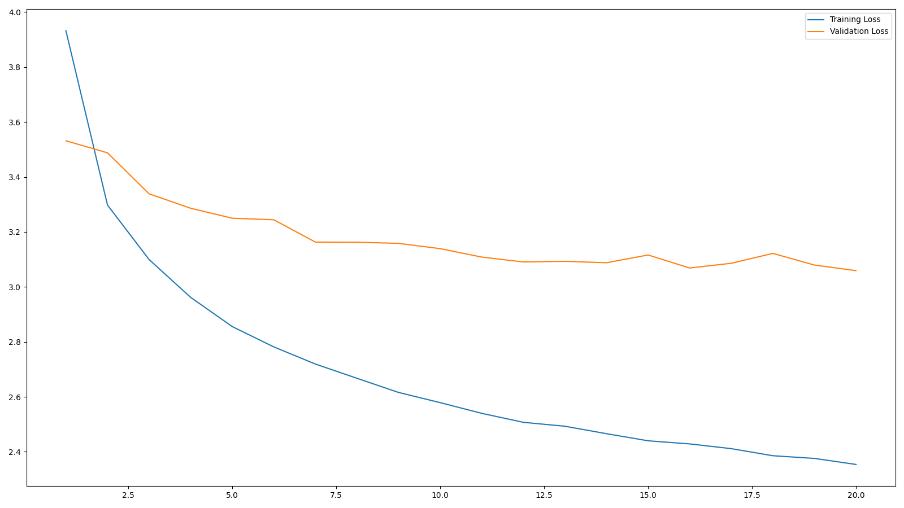
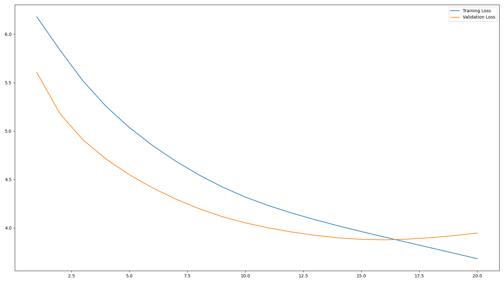

# Transformer
In this task, I was required to build a transformer from scratch along with baseline models to compare the performance to. The main goal of the task was to fix a buggy code using the help of this model.

This task was implemented using the Encoder-LSTM and Decoder-LSTM as the baseline transformer and then the main Transformer

I experimented with the number of layers, the dimension of the model, the dimension of the feed forward layer, dropouts. I will do more experimentation of this task in different manners.

### Preprocessing
Before proceeding in the architectures, I tokenized the code given using the collections library. I then added padding to make all the input codes of a certain same length. Start of sentence and End of sentence tokens were also added.

# Baseline Model
I build a baseline models to compare them with the final model and set a basic standard of performance
1. Encoder Decoder LSTM model 

### Architecture
The Encoder: It used an embedding layer, a bidirectional LSTM layer, and a fully connected layer.
All the parameters used will be discussed below
The Decoder: It used an embedding layer, a unidirectional LSTM layer, and a fully connected layer.
The embedding dimension and the dimension of the hidden layer in both the encoder and decoder are 128 and 256 respectively.
The number of layers in Encoder is 3, while in Decoder is 1.
The Seq2Seq : It combines the result of encoder and decoder. 
It gave the input to the encoder to get the hidden and cell state which was then passed through the decoder. The decoder predicted one token at a time with an involved teacher forcing ratio factor which keep in check the model doesnt completely work on the wrong inputs.
I kept the teacher_forcing_ratio at 0.5

The learning rate for the Adam Optimizer was kept at 10^-4 with weight decay as 10^-5. The loss function is Cross Entropy Loss which ignore the first index "<sos>" .

Implemented use of 'cuda' wherever feasible.

### Observations
Choosing the values for dimension was a bit challening as most of the choices resulted in the validation loss increasing with each epoch, but techinically it should decrease. When managed to find a optimal value for dimensions and learning rate, the graph for the loss functions looked something like this:

The graph showed huge gap between the losses indicating overfitting.

# Transformer

### Architecture
The following layers were implemented:
1) Positional Encoding
2) Multihead Attention (involing self and cross attention both, if no context is given then it behaves as self, otherwise cross attention)
3) Feed forward layer
4) Encoder Layer (using the above layers)
5) Decoder Layer (using the above layers)
6) Transformer layer (combining both the layers and using masking for it)

Positional encoding and feed forward layer are the same as that in the first Subtask

Multihead attention used two more attributes in the forward function, which was mask and context.

Both the encoder and decoder layer are combined in the transformer layer. Sequence is applied with padding mask and target with padding and causal mask to prevent the model to cheat and look at the next word which its supposed to predict.
Then embedding and positional encoding is applied on it.
Then it was passed through encoders and decoders layers.

The learning rate for Adam Optimizer was 10^-5 and the weight decay was 10^-6. The loss function is Cross Entropy Function.
 
Parameters:
1. dimension of model = 64
2. dimension of feed forward layer = 128
3. number of head = 4
4. number of layers = 2
5. dropout = 0.7

### Observations
Here again choosing the values were a bit challenging due to the same issue to increasing validation loss 

A rather smooth graph is obtained with high losses so the model can't be trusted for decent outputs.

# Evaluation Metric
All the models were evaluated on Token Wise Accuracy for a testing set which was 0.1 times the original dataset provided for the task. 
BLEU - 1, BLEU - 2, BLEU - 3 scores were also taken into consideration.

The tranformer unfortunately performed horribly, worse than the baseline model, few changes have to made to its structure.

### For Encoder Decoder LSTM Transformer
BLEU-1: 0.6052
BLEU-2: 0.4693
BLEU-4: 0.2841
Token Wise Accuracy: 23.15%

### For transformer
BLEU-1: 0.3627
BLEU-2: 0.1974
BLEU-4: 0.0467
#BLEU SCORE 
Token Wise Accuracy : 11.89%

# Conclusion 
Upon more experimentation, I shall find more ways to improve the transformer. The performance of the transfomer uptil now was very poor and choosing the baseline model over it would be a better choice.