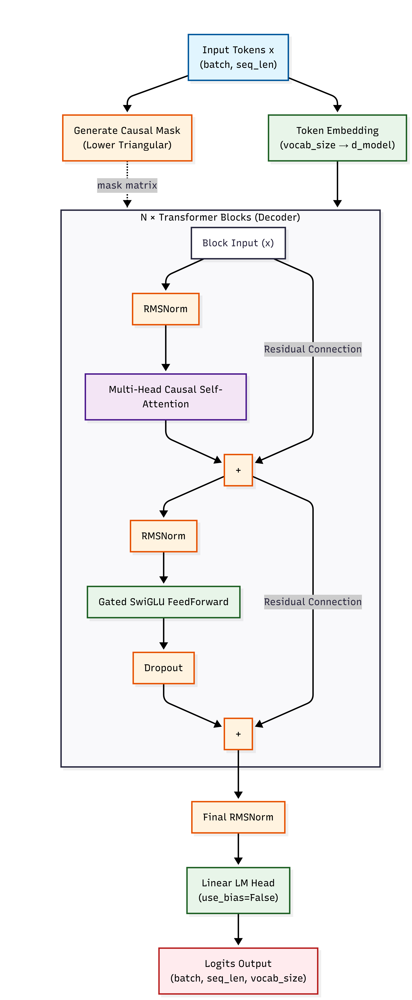

# picoGPT: Transformer-based Language model for  Poetry Generation

'This folder contains the implementation for Subtask 3. It features `picoGPT`, a custom JAX/Flax decoder-only Transformer built to autoregressively generate poetry conditioned on  metadata (Author, Era, Type, and Title) and optional initial context. The project includes a statistical $N$-gram baseline for perplexity validation and an interactive Streamlit UI for generation.

## Architecture Overview

* **picoGPT (Decoder-Only Transformer):** Implemented natively in JAX, Flax `nnx`, and optax+orbax for training and model saving. Features Rotary Position Embeddings (RoPE), Multi-Head Self-Attention, Standard Feed forward neural network, and dropout layers.
* **Statistical Baseline:** An $N$-gram Markov chain built with (`collections.Counter`) hashing and NumPy memory striding. It establishes the mathematical perplexity floor( of around 2k).

* **Tokenization:** A custom C++ Byte-Pair Encoding (BPE) tokenizer bound to Python via `pybind11`.

* **Data Pipeline:** While there are Datasetsource and loader classes, built in `grain`, I've chosen to simply load the entire dataset to VRAM to prevent data-loading bottlenecks. The metadata and actual context are merged and given as context to my model

* **Inference Engine:** Features Top-K sampling, temperature scaling, and a structural repetition penalty to suppress deterministic looping during generation.

## Repository Structure

* `dataset.py`: Contains `TextSource` and dataloader logic, handling the mapping of raw poetry text and metadata into JAX-compatible integer arrays. (Currently not used).
* `models.py`: JAX/Flax module definitions containing the core `picoGPT` architecture, `TransformerBlock`, `MHSA` and `RoPE`.
* `training.py`: JIT-compiled optimization steps (`train_step`, `validation_step`), masked cross-entropy loss calculations (`optax.softmax_cross_entropy_with_integer_labels`), and standard early stopping logic.
* `Inference.py`: Contains the XLA-compiled `generate_step` and the Python-side `generate_poem` wrapper, implementing sliding-window autoregressive decoding with repetition penalties.
* `baseline.py`: The stateless $N$-Gram Markov model implementation.
* `Demo.py`: A Streamlit application providing a user-friendly GUI 
to run the model.
* `bpe_tokenizer`: Compiled shared object binary for the custom C++ BPE tokenizer.
* `Subtask3.ipynb`: The primary execution notebook for establishing data loaders, compiling the XLA graphs, and running the optimization loops.
* `poetry.csv`: The primary dataset containing the raw poems and their associated metadata.
* `Saved_Models`: Contains the states of picoGPT and the tokenizer saved post training.
* `Custom_Tokenizers`: Contains the source code for the custom BPE tokenizer, as well as a simpler regex based tokenizer that isn't currently used.


## Prerequisites

Ensure a CUDA-compatible environment with the following dependencies installed:

* JAX / JAXlib
* Flax (specifically utilizing the `nnx` API)
* Optax
* Grain (`grain.python`)
* Streamlit
* Orbax Checkpoint (`orbax.checkpoint`)


If you need to recompile the custom tokenizer, also install
* pybind11
* C++17 compliant compiler
* cereal

## Execution Instructions

1. **Model Training & Baseline Evaluation:**
Execute `Subtask3.ipynb` to instantiate the dataset loaders, compile the models into VRAM, and initiate the training loops. This notebook also contains the execution logic for the $N$-gram baseline to benchmark the transformer's validation perplexity.
2. **Launch Interactive UI:**
Ensure the trained `picoGPT` checkpoint is saved in `Saved_Models/picoGPT` and the tokenizer binary is in `Saved_Models/Tokenizer.bin`.
Run the Streamlit application using the absolute path to bypass working directory I/O conflicts:
```bash
streamlit run /path/to/Demo.py

```
---

*Developed by Aneesh Shastri*

## Architecture and Autoregressive generation
The following flowcharts explain the architecture of the model, as well as pipeline to autoregressively generate poems using this model. 

### Poem generation pipeline

<div style="text-align: center;">


</div>

### Single token generation step

<div style="text-align: center;">


</div>

### Underlying Transformer Model

<div style="text-align: center;">


</div>


## Models Review:

Clearly, the model hallucinates nonsense at this stage. While you can see a hint of overall style, or find some relation to the poem you're describing, the model does generate utter gibberish both semantically and grammatically.

Without using pre-trained models or some form of transfer-learning, this is the best you can do with this extremely small dataset.

While the $N$-gram model does generate more coherent words, it completely makes up random words and phrases that in the end give it a much worse perplexity score than my transformer model.

My model achieved a perplexity of around ~130 in the test dataset, while the bigram model suffered a perplexity of around ~997.

While there was no fine-tuning run done, I did personally run 2-3 loops to find a set of hyperparameters that I'd think would best work. You may be able to achieve a perplexity of upto 50-70 if you fine tune the model properly, but at that stage, the model would still likely just output gibberish.

I used the standard AdamW optimizer with a Cosine rate decay scheduler, along with a custom early stopping implementation. 

## Note on LLM usage:

Aside from research, and using the free github copilot's code autocomplete feature, I have used LLMs to generate code templates for README and Demo files, and comments for some other files. LLMS were used to generate flowcharts using mermaid.live.