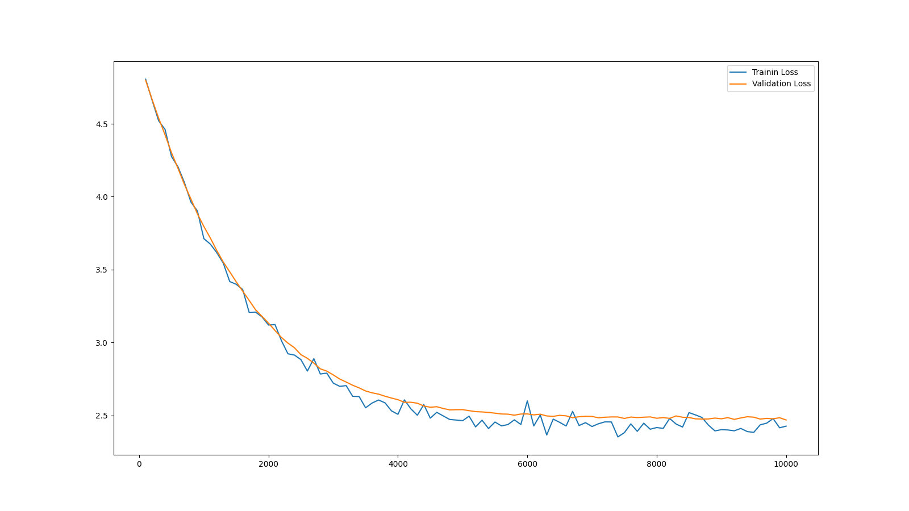
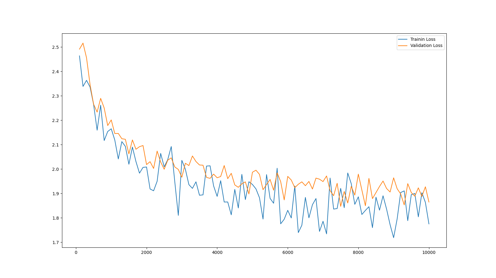
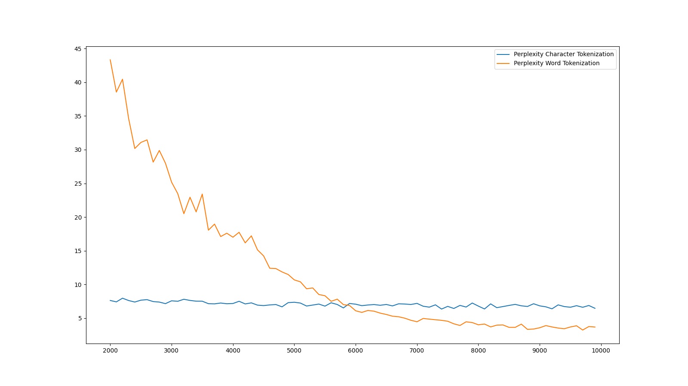

# Decoder Only Transformer
We were required to build a poetry generator using the decoder only transformer and a baseline model as a standard.
The dataset used of the task is the huggingface poetry dataset by merve (https://huggingface.co/datasets/merve/poetry) 

## Models used
1) Bigram Model
2) Decoder Only Transformer

## Basic Approach
I joined all the poems into one text variable. Each poem were separated by dashes with two spaces on either side. This was done to ensure that the model understands the end of one poem and start of another.
Tokenization was done mainly by two methods- Character level tokenization and Word level tokenization.

## Model description
### 1) Bigram Model 
The bigram model has an embedding layer, a forward function which returns the logits and loss in predicting the next token, and a next function which generates the next token based on multimonial function which calculates the weighted probability of each word.
Training included using Adam optimizer with learning rate set to 1e-4 and weight decay set as 1e-5. The loss function for training is Cross Entropy Loss Function.

### 2) Decoder Only Transformer
The basic structure of the decoder only transformer followed similar to the encoder only transformer.
- Scaled Dot Product
- Positional Encoding
- Masked Self Attention class
- Feed Forward Network
- Causal Mask
The main decoder class had the initialization of these layers, a forward function which applied causal mask and iterated through the layers, and a generate function to generate the next token.

## Parameters 
          |           | Decoder Only Transformer |
          |Dimension of Model | 512|
          |Dimension of Feed Forward Network | 1024|
          |Number of layers| 2 |
          |Number of head| 8 |
          |Length of Sequence| 64 |

## Evaluation 
1) Bigram Model 
The Bigram model had a perplexity score of about 11.80 on a validation set at the end of training.

Poem generated without any context by the Bigram model:

BGVZA!
 ss  myQZlinthethed, ceramVawillstheet wl whererath Knonorey slye, ingorrouselat  rpe,  ingrerelllle fthopero t.
H{
C}cefeh1.
Thdswat ss tolont gQUnNon J4I po st illlyereale t[(pre idBup]ESKm, hin  witht adowe d stek----- 2Mineaidllithind ralchofKx
I, e,
Rresce os  ano co6.
AGWeyere d so

Which are purely garbage words!

2) Decoder Only Transformer 
This model had a perplexity score of about 6.45 on a validation set at the end of training.

Poem generated without any context:

Happt which Be her and was fisther times,
He whose paire dread sets must thip!

-------------------- 
And her bream affte of Calrabe are.
I love is 

This had actual words although the sentences made no sense.

## Experimentation 

### Word based tokenization 
I tried word based tokenization as well along with character based. The perplexity score of word based tokenization was around 3.67, which was better than character based.

Poem generated :
" from Body of people, without dislike or later, When, tramping homeward through infusion of those kings whom that I moment. The neighbour expectation, wear the deep vermilion in the light before just I the rose; was fallen around the before the lack, Single nature's double blood flaking sapphire, like a first a shell Upon the horizon's dawning rim, Far, far scream. Tortoise in extremis. Why were all love was the only pretty pleasures have not only fear lest they have harbour'd since their love to me. seem all the way to whom Sorrow named his Ordinary of loves mighty race, Clad all the Sprite doth the parts, skilled piper on the pot. ------------ When that first I was little tiny boy, Saying: You would emigrate to make my head, And on every easy bound. You walked about thy bed, Being sense ob feah, You can show you in me, who saw me, Let me, With that, so evil consort, their gate, Tryin' to dawn. His fattie waves that fertile slime outwell, And overflow each plaine and the golden hair was a Christall streame do stand, Threat'ning with willows, cool, with an looks (nought saying) do overflow each line, Of orien"

Some part of it made a bit sense rather than being random words. So this method was overall better than the previous method of tokenization.

### Top-k generation 
I also tried using the top-k method for generated of next token in the sequence.

Poem generated : 
" from her chamber floor. Two gentle wit, And, being proud. Nathlesse doe raine, That from another self may have ye have your heart is your little ye the comming of your heart that ye shall all you have wept. All ready forth to you triumph yet; because you hold me, Ef only you up to me, Ef only you with me, line, O, April shoure, so far, Our beauties force our power to witta-woo! name. Were gone out hung 'twixt two cities Down to advance their state Were gone out hung 'twixt her like twinkling stars and me. And whilst our souls negotiate there, We like sepulchral statues lay; All day, And the rising rivers half-deterrent Pull on the rising rivers half-deterrent Pull on the paddle as on every corner of the foam, breathed on the foam, breathed on the paddle as the blade To druggist, barber and now is Charing Cross; It is a dead scene forever now. Yet she is the wood-gods love to take heede. Pan strive for her to the comely clothing Therefore farewell; go with a beast deceives; Many your good, and is a weak through the disaray, And beautiful, her dead mouth with the iron against Time wears her head Most goodly wel sheaves; That soone in her youthful age snow pity win, and much amazde, To come dancing from hence, There is a great crowd And a shadows of the shadows Of light. A crowd of endles wo; And from the shadows Like a man, Rhythmic ellipses lead into dusky lands; Like a rooster banters. Greet naivelyyet intrepidly New soothings, new amazements That cornets introduce at least they cornets introduce at a little while, After the tempest her eyelids close; And when a dower his burning throne, Where she thought longer, And blossomed"

This method helped to give randomness to the word selection and less words are repeated in the generated sequence.

### Prompting
Tried generating short poems with some prompts.
1) Prompt : "love is"
   Poem : love is chasteness, pain nor age had infinite, if one another rage, And yet, suppose some other new thoughts can more. 
2) Prompt : "being the best"
   Poem : being the best language and the rain, A brook! If these once may give revel Beyond revelries of sleep, Yes, crumbs of sleep,
3) Prompt : "thy majesty"
   Poem : thy majesty and thriftless praise. How much thou leftst them, thy flame, Death, Thou shalt hear, And think that is sung no

   ----------------------------------------------------------------------------------------------------------------------

