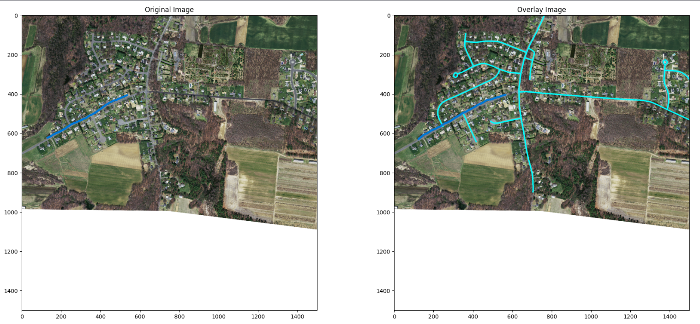
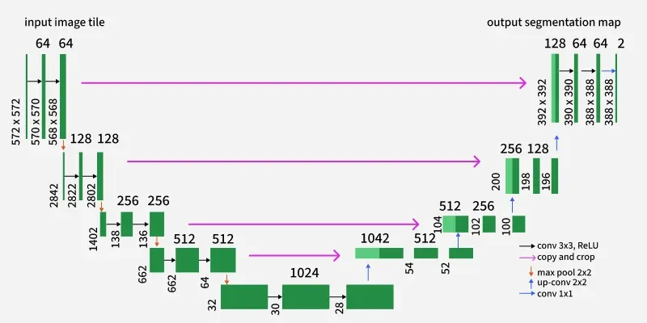
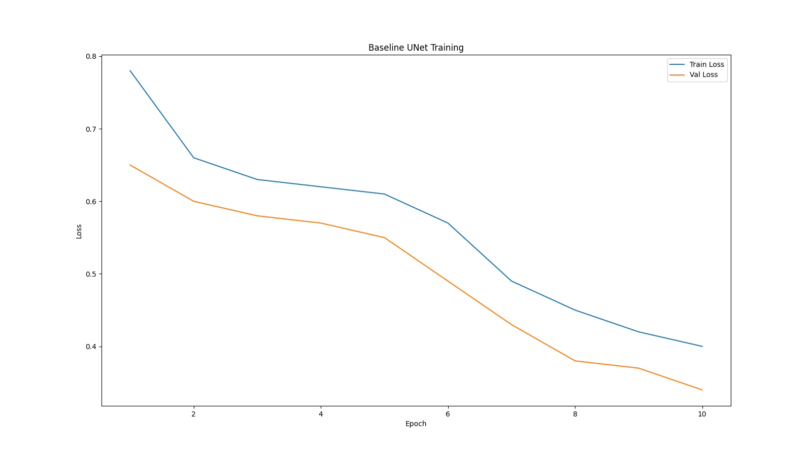
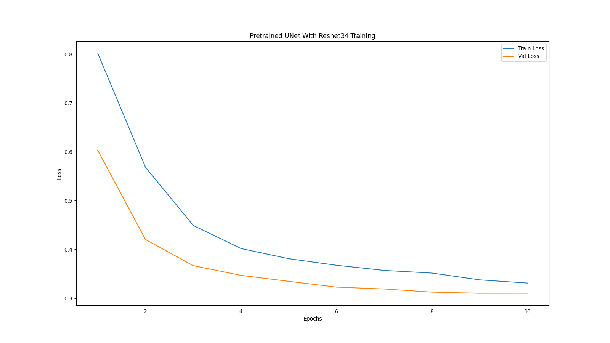
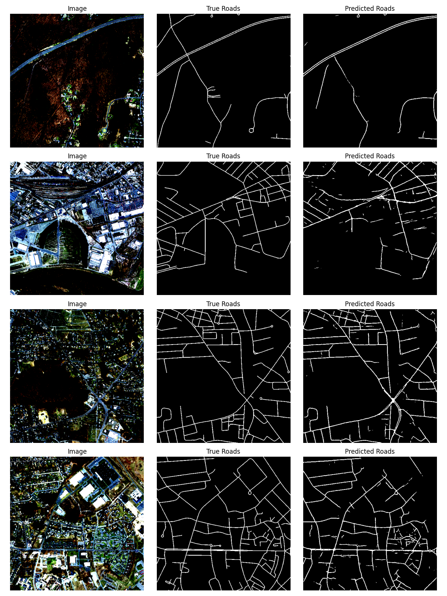
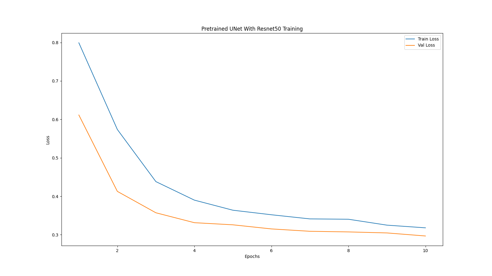
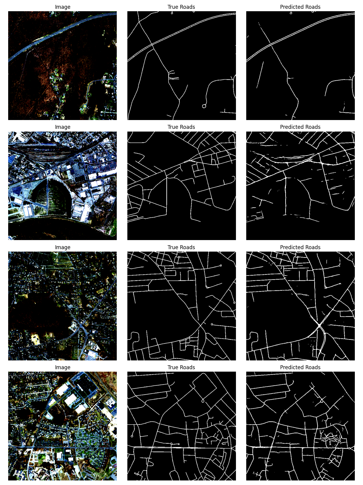
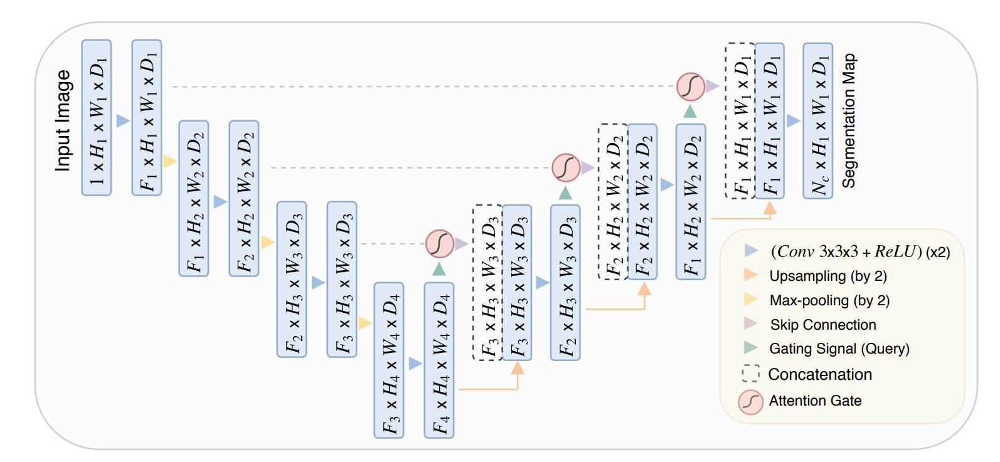
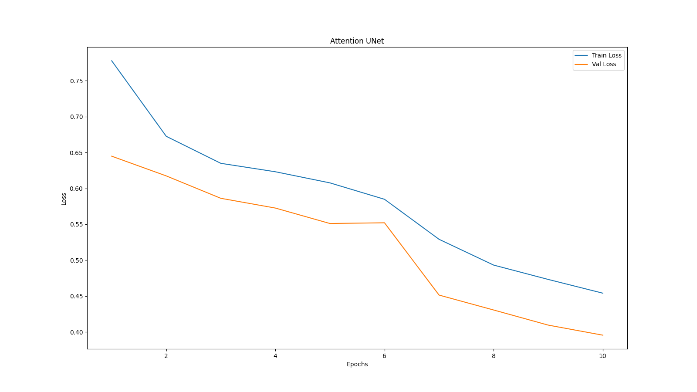

### Task overview:
We are required to build an U-net model which can segment the roads in the satellite imagery using the Massachusetts road dataset. The aim of this task is to understand the working of U-net and it's architecture along with experimenting with different variations of it.

#### Different implementations
1) Baseline U-Net
2) Pretrained U-Net with encoder as Resnet34
3) Pretrained U-Net with encoder as Resnet50
4) Attention U-Net

#### Data Observations
1) Class imbalance: In the segmented image, black pixels on average constituted about 95 percent of the total pixels on the image, and the rest 5 percent were the white segmented road pixels. This means that during evaluation, we can't rely on pixel accuracy to be the sole metric, since if the image was fully black, the accuracy would still be around 95 percent.

2) Padding: No padding was necessary as all the images are of the same size (1500x1500 pixels) 

3) Visual Analysis: It could be seen that the images are almost accurate but do have a few hallucinations.

In the first image we can see that this road is not labelled

Similarly in the second image the top left corner is marked as a road but in reality there is no road.
A few more imperfections can also been seen in the other examples.

#### Important Note: For all the models, I have used normalized images of size 512x512 for training due to hardware issue. Each model is trained on the Dice Loss Function, with 10 epochs and learning rate as 1e-4 and weight decay as 1e-5.

#### Observations and Evaluations
#### 1) Baseline U-Net 
The architecture of the U-Net baseline model is the same as in the research paper

The training and validation loss after 10 epochs:

The predictions of the baseline model:

Pixel_Accuracy = 96.67%
IOU Score = 0.511
The IOU Score is decent but it could be better. This score represents that the model is learning.

#### 2) Pretrained with encoder Resnet34
The training and validation loss after 10 epochs:

The predictions of the pretrained with resnet34 encoder model:

Pixel_Accuracy = 97.26%
IOU Score = 0.560
This performed better than the Baseline model, considering low number of training epochs, it will out-do the baseline model significantly with more epochs for both the models.

#### 3) Pretrained with encoder Resnet50
The training and validation loss after 10 epochs:

The predictions of the pretrained with resnet50 encoder model:

Pixel_Accuracy = 97.36%
IOU Score = 0.573
This performed better than the Baseline model and the pretrained with resnet34 models considering low number of training epochs, it will out-do the baseline model significantly with more epochs for all the models.

#### 4) Attention U-Net
The architecture of the model is the same as in the research papers

The training and validation loss after 10 epochs:

The prediction of the attention model:

Pixel_Accuracy = 96.27%
IOU Score = 0.459
A drop in the IOU score is seen but this is mostly due to the fact that attention models generally have more parameters to train, so a higher number of epochs are needed for the model to converge better.

