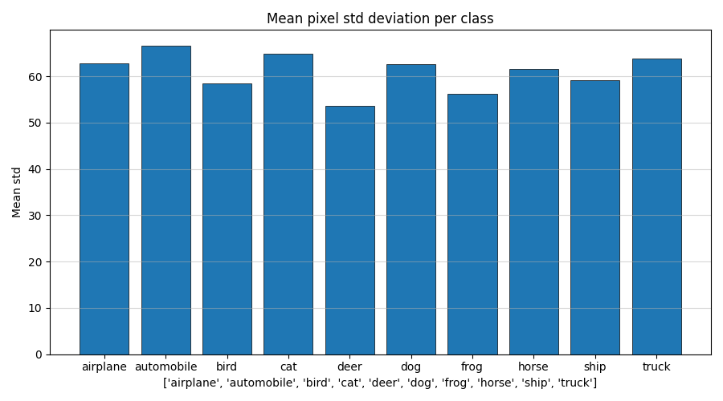
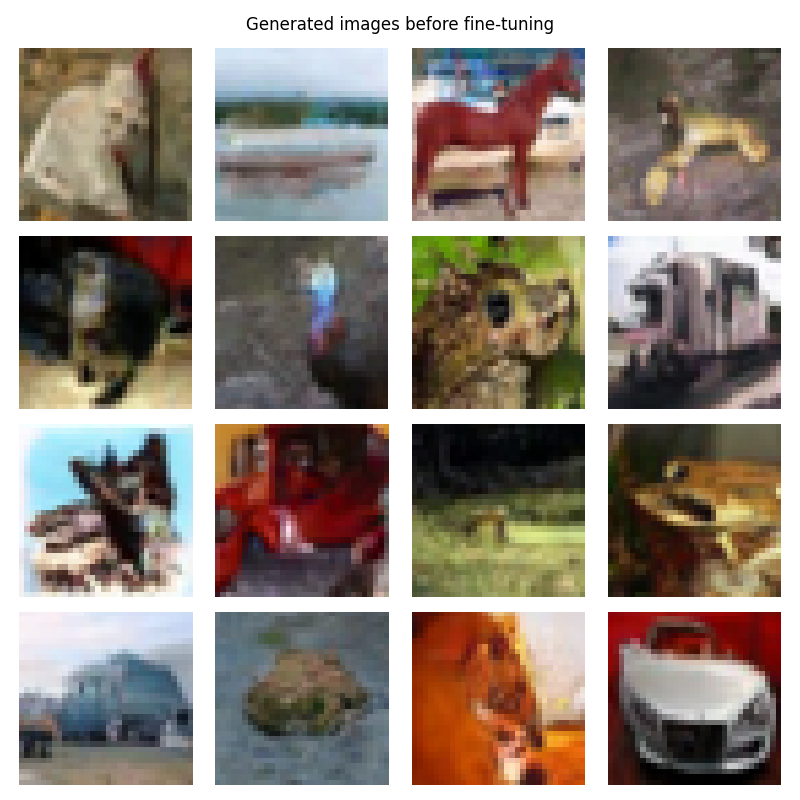
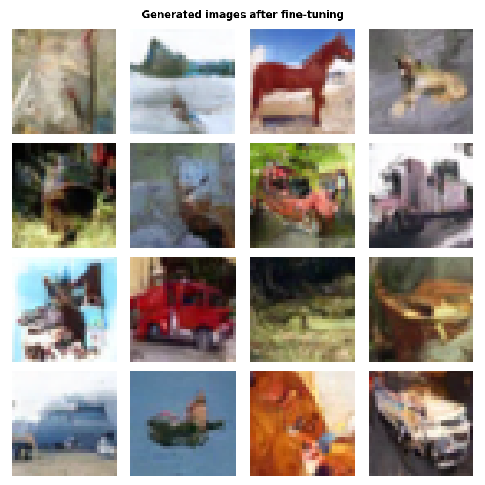
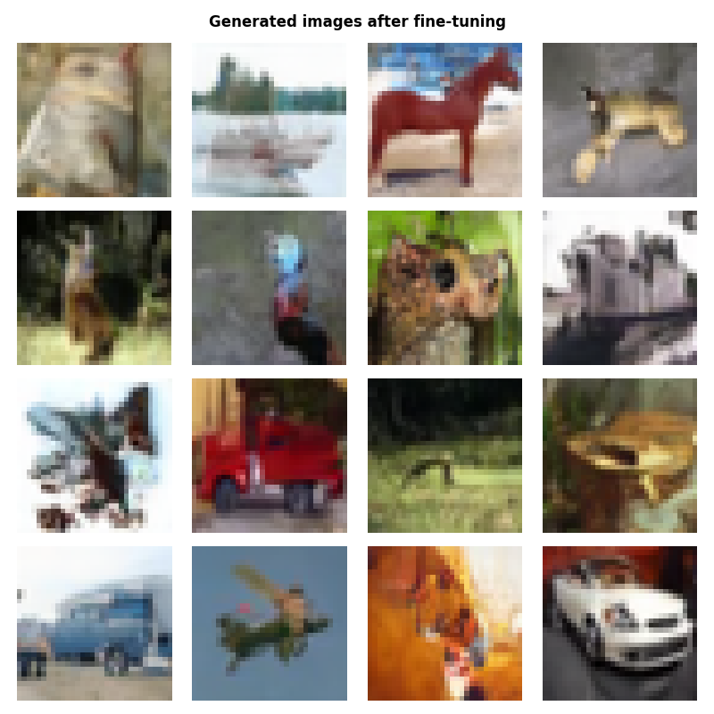
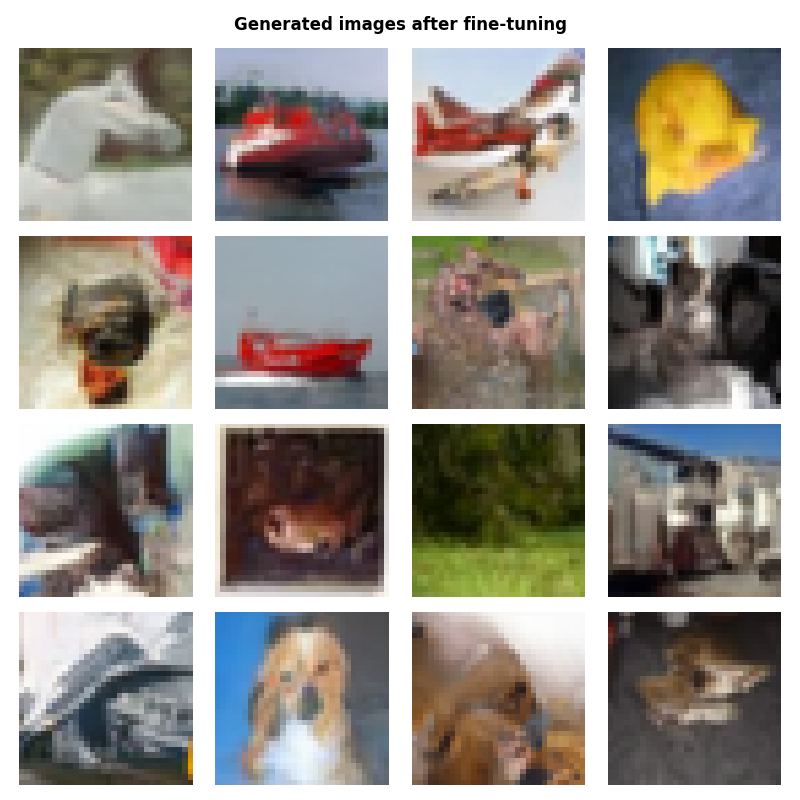
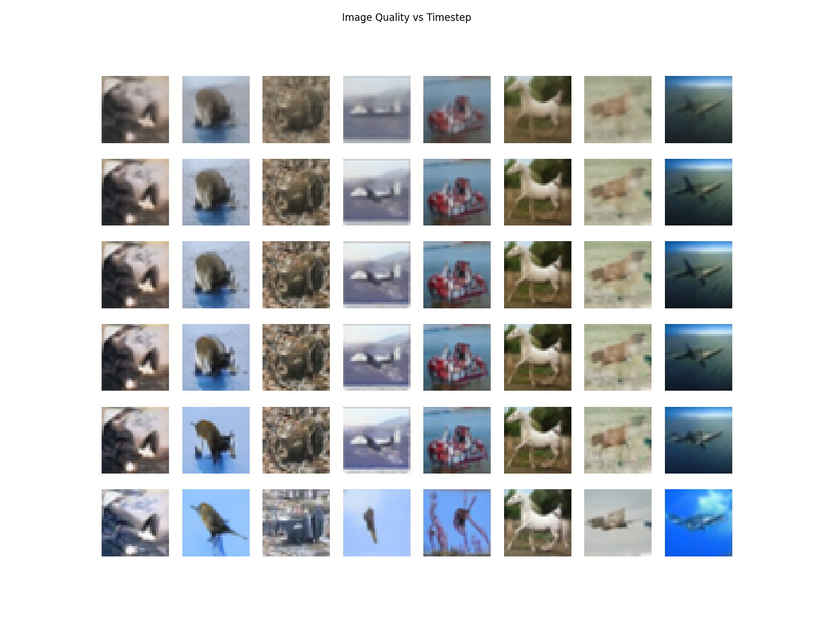
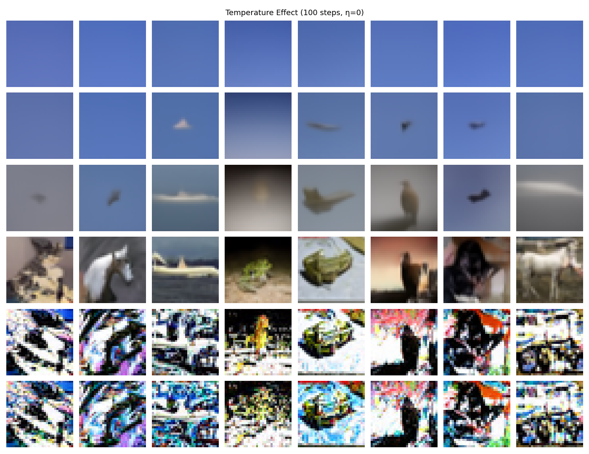

## Task overview:
We are required to use a pretrained Diffusion model for image generating before and after fine-tuning on the cifar-10 dataset

### Different implementations
1) Baseline Pretrained Diffusion model
2) Pretrained models with variations

### Data observations 
The dataset combined over the different batches have 50000 image samples.
The images samples have the following classes of objects present :

['airplane', 'automobile', 'bird', 'cat', 'deer', 'dog', 'frog', 'horse', 'ship', 'truck']

So the entire dataset is spread over various objects from these classes.

#### 1) Class size
Each class contributes the same (5000) number of images to the combined dataset. Therefore, for fine-tuning we can take the entire dataset without much bias.

#### 2) Image resolution
The shape of the initial combined dataset is (50000,3072), since there are 3 channels (red, green and blue) the shape can also be written as (50000,3,32,32) giving the image resolution to be 32x32.

#### 3) Intra-class variation

Higher variation usually means there is difference between the objects of the same cateogry. It mostly arises due to the fact that there are different species of the same animal, different models of the same type of automobile, and possibly different types of sport in the world, but are labelled as the same maybe dogs, cars or olympic games.

### Models 
The pretrained models used in this task is the pretrained unet and scheduler on the cifar-10 dataset.
All the models which were fine-tuned were done for 10 epochs and keeping the learning rate as 1e-5 and teh batch size for the training and validation dataset as 32. 
#### 1) Pretrained without finetuning 
I used the diffusers library to import Unet2dModel and DDPMSScheduler which I then used to import a Unet model and a scheduler already trained on the cifar-10 dataset. The images generated by that model before further fine tuning are:

#### 2) Pretrained with finetuning
I initialzed a Dataset class and DataLoader to build by dataset for training and validation with batch size 32. The images generated by the model are:

#### 3) Pretrained Unet with linear scheduler 
I used a linear scheduler with timesteps 1000. Here are the images generated by it:

#### 4) Pretrained Unet with cosine scheduler 
I used a cosine scheduler with timesteps 1000. Here are the images generated by it:

*Findings*
All the images were generated by keeping seed as 42.
The loss during training was more or less constant which is not unusual for pretrained models. 
The images for pretrained with and without finetuning are similar but the images generated by the fine-tuned model are slightly sharper, although the difference is not significant.
The linear and cosine schedulers used for generating images can be seen to generate very different images from one another despite the fact that a random seed was used. This is because the pretrained model used linear scheduler, so when we are denoising, the model is somewhat calibrated for the linear scheduler but not for the cosine scheduler.

#### Seeing the difference in image quality when the timesteps are varied 
I chose the timesteps as 10, 25, 50, 100, 200 and 1000 to check the quality of the images produced.
Here is the direct comparison of 8 images for these timesteps mentioned.

We can see the clarity of the images increase with an increase in timesteps.

#### Seeing the difference in the images when temperature variations are added 
The temperature values are chose are as follows 0.3, 0.5, 0.7, 1.0, 1.3 and 1.6.
1.0 is the standard Gaussian noise.
Temperature is basically the randomess in the starting point of the reverse process.

If the temperature is too low, the initial noise has low variance, almost close to zero. Model starts with something completely blank and starts to denoise it, but there is not enough data for a proper structure
If the temperature is too high, the initial noise has too much variance, the denoising process gets overwhelmed. It produces a lot of distortions.

