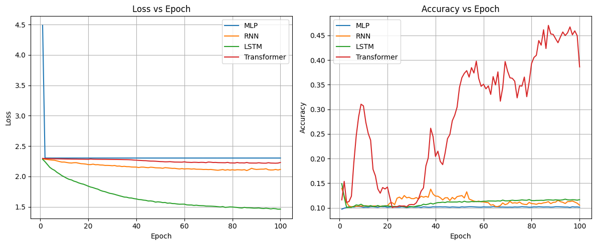
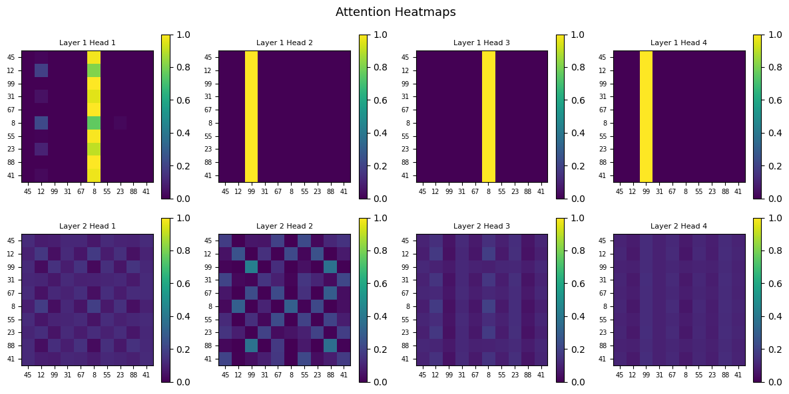
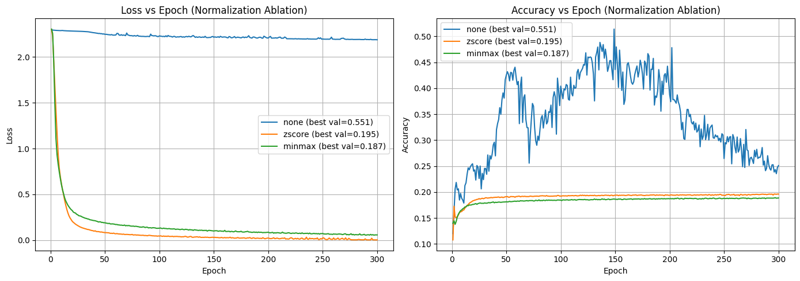
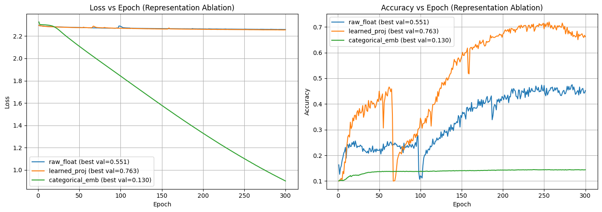
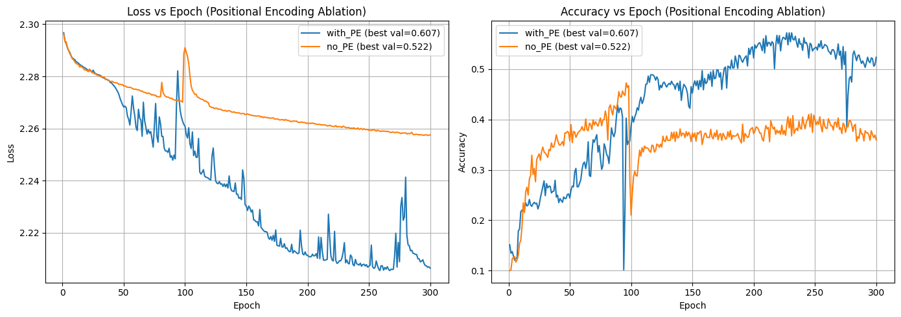
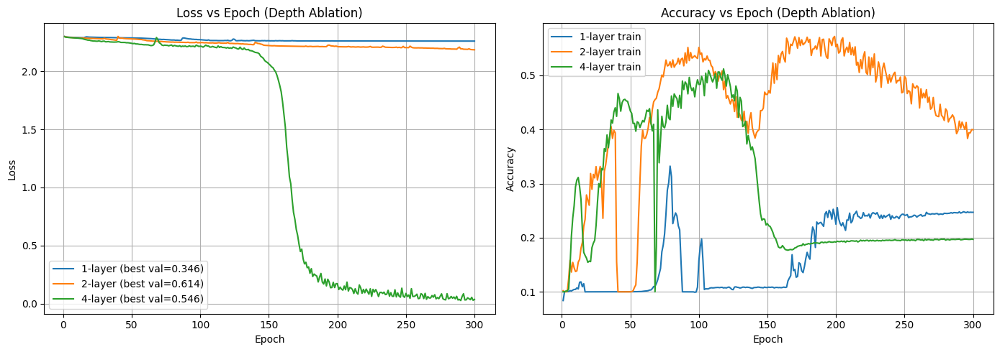

# Subtask 1 - Encoder-Only Transformers for Relational Reasoning
## Report

---

## 1. Problem Statement

The task is to predict the relative sorted rank of each element in a sequence of integers. For example, given `[45, 12, 99, 31]`, the correct output is `[2, 0, 3, 1]`, since 12 is the smallest (rank 0) and 99 is the largest (rank 3).

This is at its core a **global relational reasoning** task. Determining the rank of any element requires comparing it against every other element in the sequence simultaneously. This property makes it an ideal benchmark for studying how different architectures handle global context.

---

## 2. Dataset

The dataset used had sequences of 10 integers each labeled with their corresponding ranks. The dataset was split 80/10/10 into train, validation, and test sets. The input values fall within a fixed numerical range, which has important implications for out-of-distribution generalization as discussed later.

---

## 3. Methodology

The experiment followed a progressive workflow:

1. Establish simple baselines (MLP, RNN, LSTM) to understand why ranking is difficult for traditional models
2. Implement an encoder-only transformer from scratch using low-level PyTorch primitives
3. Analyze attention patterns through visualization
4. Conduct ablation studies on normalization, input representation, positional encoding, and model depth

The primary focus throughout was on understanding **why** models behave the way they do, not just optimizing metrics.

---

## 4. Baseline Models

Three baseline architectures were implemented and trained for 100 epochs.

### MLP
Flattens the entire input sequence into a single vector and processes it through fully connected layers. Output is reshaped to `(batch_size, seq_len, seq_len)`, one rank distribution per token.

### RNN
Processes each token sequentially, left-to-right, passing a hidden state between steps. Each timestep's hidden state is projected to rank logits.

### LSTM
Same sequential structure as RNN but with gating mechanisms (input, forget, output gates) that allow more selective retention of earlier information.

### Results

| Model | Val Accuracy | Parameters | Time/Epoch |
|-------|-------------|------------|------------|
| MLP   | 9.6%        | 30,820     | 0.41s      |
| RNN   | 10.2%       | 18,058     | 0.43s      |
| LSTM  | 11.7%       | 68,362     | 0.46s      |



All three models plateau near 10%, which is essentially **random guessing** on our 10-class problem. This is not a capacity issue, rather an architectural one. None of these models can form global comparisons across the full sequence, which is a prerequisite for ranking.

**Sequential processing** - MLP processes all tokens simultaneously as a flat vector, while RNN and LSTM process one token at a time left-to-right, accumulating a hidden state. The transformer processes all tokens in parallel through self-attention, with no notion of order unless positional encodings are added.

**Long-range reasoning** - RNN and LSTM struggle with long-range dependencies. Information from early tokens gets diluted by the time the model reaches the last token. The transformer has no such limitation, since every token attends directly to every other token in a single step, regardless of distance.

**Parallelism** - MLP and transformer are fully parallelizable. RNN and LSTM must process tokens sequentially, making them slower to train and harder to scale.

**Convergence** - MLP and RNN converged extremely early, hitting a performance ceiling imposed by their architecture. Once the models learn trivial positional biases, the gradients become too small to drive meaningful learning since neither architecture can form the cross-token comparisons needed to improve further.

**Computational efficiency** - The MLP is the fastest despite having more parameters than the RNN, since it uses only matrix multiplications with no sequential dependencies, allowing full parallelization. The LSTM is the slowest due to its four gating operations per timestep.

---

## 5. Encoder-Only Transformer

### Architecture

The transformer was implemented from scratch using PyTorch primitives. The architecture follows a BERT-style encoder design:

```
Input (batch, seq_len)
  → Input Projection: Linear(1, d_model) + ReLU
  → Positional Encoding (sinusoidal, non-trainable)
  → N × Encoder Block:
      ├─ Multi-Head Self-Attention
      ├─ Add & LayerNorm
      ├─ Feed-Forward Network (Linear → ReLU → Linear)
      └─ Add & LayerNorm
  → Classification Head: Linear(d_model, seq_len)
  → Rank logits (batch, seq_len, seq_len)
```

**Key parameters:**
- `d_model = 64` - hidden dimension per token
- `num_heads = 4` - parallel attention heads, so $d_k = d_{model} / num_{heads} = 16$
- `d_ffn = 128` - feed-forward hidden dimension
- `num_layers = 2` - encoder depth

**Attention mechanism:**

$$\text{Attention}(Q, K, V) = \text{softmax}\left(\frac{QK^T}{\sqrt{d_k}}\right)V$$

Multi-head attention was implemented using batched matrix multiplication rather than sequential loops over heads. All heads are computed simultaneously by projecting to `d_model` and then splitting.

**Input projection** - since inputs are scalars, not token embeddings, each number is projected from dimension 1 to `d_model` via a learned linear layer with ReLU. This is discussed further in the representation ablation.

**Training configuration:** Adam optimizer, lr=0.0001, `ReduceLROnPlateau` scheduler with patience=20, best checkpoint saved based on validation accuracy.

### Transformer vs Baselines

The transformer pulls clearly ahead of all three baselines, reaching ~45% accuracy within 100 epochs and still climbing. The gap demonstrates that bidirectional self-attention — which allows every token to directly compare itself against every other token — is fundamentally better suited to ranking than sequential or flat architectures.

---

## 6. Attention Visualization

Attention weights were extracted and visualized for the input `[45, 12, 99, 31, 67, 8, 55, 23, 88, 41]`.



In an attention heatmap, **columns** represent the tokens being attended to (keys) and **rows** represent the tokens doing the attending (queries). A bright column under token X means every token is strongly attending to X.

**Layer 1 - Anchor identification:** All four heads show a bright column under tokens `8` (minimum) and `99` (maximum). Every token in the sequence is attending heavily to the extreme values. This can be interpreted as the model asking *"what is the smallest and largest value?"* before doing anything else.

**Layer 2 - Structured comparison:** The heads diversify significantly:
- **Head 1 & 4** - uniform attention across all tokens, a global survey of the sequence
- **Head 2** - checkerboard-like pattern indicating selective pairwise comparisons between specific tokens
- **Head 3** - block-like structure suggesting grouping by value range

This two-stage behavior mirrors how humans rank: first identify the extremes, then compare everything else relative to them. The model independently discovered this strategy from training data alone, which is a remarkable behavior.

---

## 7. Out-of-Distribution Testing

The trained model was tested on sequences outside the training distribution.

| Sequence Type   | Token Accuracy |
|----------------|---------------|
| Already sorted  | 20%           |
| Reverse sorted  | 10%           |
| Large values    | 90%           |
| All same        | 0%            |
| Negatives       | 10%           |
| Decimals        | 10%           |

**Robustness** - The model fails significantly on OOD sequences. The only partial exception is large values (50%), likely because the relative ordering pattern is similar to training data even if the scale differs.

**Failure modes** - The model tends predict the same rank for most tokens (all 9s, all 4s, etc.). This is a lazy solution where the model defaults to a "safe" prediction when it encounters unfamiliar input distributions.

**Attention behavior** - The layer 1 anchor-finding mechanism breaks for OOD inputs. Even if attention correctly identifies the minimum and maximum of a negative sequence, the classification head, trained only on positive integer ranges, doesn't know how to map those anchors to ranks.

**Generalization** - The model learned to rank within the specific range of training data, not the underlying comparison operation in a general sense. This directly motivates the normalization ablation.

---

## 8. Ablation Studies

### 8.1 Normalization

Three normalization strategies were compared: no normalization, z-score, and min-max.



| Normalization | Best Val Accuracy |
|--------------|------------------|
| None         | 55.1%            |
| Z-score      | 19.5%            |
| Min-max      | 18.7%            |

**`norm=none` performs best**, which seems counterintuitive but makes sense: the training data was generated in a fixed range, so raw values already carry meaningful magnitude information the model learned to use.

**Z-score and min-max fail badly**, yielding accuracies around 19%. This is because upon normalization, the input values directly give away the relative order. The smallest number always maps to roughly the same normalized value, so the model takes a shortcut. Instead of learning to compare tokens via attention, it learns to map each normalized value directly to a rank, essentially memorizing a lookup table.

This explains the unusual loss behavior. Cross-entropy loss is:

$$L = -\sum_{i} y_i \log(\hat{p}_i)$$

Without normalization, the model is uncertain and spreads probability equally across 10 ranks, so $\hat{p}_i = \frac{1}{10} = 0.1$ for all $i$, giving $L = -\log(0.1) = 2.302$, which closely matches observations.

With normalization, the model becomes extremely confident in its memorized predictions, so $\hat{p}_i \approx 0.99$, giving $L = -\log(0.99) \approx 0.01$. Loss collapses but accuracy doesn't improve, because the model is confident yet wrong on anything outside its memorized range.

This highlights an important distinction: **loss measures confidence, not correctness** which we will be recalling in the coming sections.

---

### 8.2 Input Representation

Three input representations were compared to investigate whether the model treats numbers as mathematically related or as unrelated symbols.



| Representation    | Best Val Accuracy |
|------------------|------------------|
| Raw float         | 55.1%            |
| Learned projection| 76.3%            |
| Categorical emb   | 13.0%            |

**Learned projection (76.3%)** - A two-layer projection with ReLU gives the model enough capacity to map each scalar into a rich representation before attention begins. The non-linearity allows it to encode magnitude in a more expressive way, giving attention more to work with.

**Raw float (55.1%)** - A single linear projection preserves magnitude information but has limited capacity to transform each scalar into a rich enough representation.

**Categorical embedding (13%)** - Treating each integer as a discrete symbol completely destroys ranking ability. The model has no notion that 6 > 5, they are as unrelated as two random words. The flat accuracy curve shows it never learned anything meaningful. The steeply falling loss is the same confidence-without-correctness phenomenon as the normalization ablation.

The key insight: **input representation is arguably more important than the attention architecture itself**. A richer projection gave a 21 percentage point improvement over raw floats.

---

### 8.3 Positional Encoding

The model was trained with and without sinusoidal positional encodings.



| Configuration | Best Val Accuracy |
|--------------|------------------|
| With PE      | 60.7%            |
| Without PE   | 52.2%            |

**The model can still rank without positional encodings**, and performs reasonably well (52.2%). This makes sense: the rank of a number is determined entirely by its magnitude relative to others, not by where it sits in the sequence. Positional encoding answers *"where am I?"* but ranking only requires *"how large am I compared to everyone else?"*

**Why does with PE slightly outperform no PE?** The training data has minor positional correlations. Certain positions tend to have slightly higher or lower values on average due to the generation process. The model with PE exploits these spurious correlations as a weak additional signal. In a perfectly uniform dataset they would perform identically.

---

### 8.4 Depth Experiments

Transformers with 1, 2, and 4 encoder layers were compared.



| Depth   | Best Val Accuracy | Parameters |
|---------|------------------|------------|
| 1-layer | 34.6%            | ~33K       |
| 2-layer | 61.4%            | ~58K       |
| 4-layer | 54.6%            | ~107K      |

**Convergence** - 1-layer and 2-layer converge smoothly. 4-layer converges aggressively (loss drops to ~0.05 by epoch 200) but this is the confidence-without-correctness phenomenon again — it memorized training patterns rather than learning to generalize.

**Expressiveness** - 2-layer hits the sweet spot. 1-layer is underexpressive: a single round of attention can identify min/max anchors (as seen in the heatmaps) but lacks a second layer to translate those anchors into actual intermediate ranks. 2-layer uses layer 1 for anchor identification and layer 2 for structured pairwise comparisons.

**Overfitting** - 4-layer clearly overfits: loss near zero but val accuracy only 54.6%. The dataset is not complex enough to justify that many parameters. 1-layer and 2-layer show no significant overfitting as their capacity matches the task.

**Attention structure** - The two-stage behavior observed in the heatmaps (anchor identification in layer 1, pairwise comparison in layer 2) explains why 2 layers is optimal. 1 layer can only do one stage and 4 layers adds redundant computations that lead to overfitting.

---

## 9. Evaluation Metrics

| Metric | Description |
|--------|-------------|
| Token-level accuracy | Fraction of individual rank predictions that are correct |
| Validation accuracy | Token accuracy on held-out validation set |
| Loss | Cross-entropy loss between predicted rank distribution and true rank |

The best model (learned projection, 2-layer transformer) achieved **76.3% validation accuracy**, compared to the best baseline (LSTM) at **11.7%** - a gap of over 64 percentage points.

---

## 10. Conclusions and Observations

**1. Architecture matters fundamentally for relational reasoning.** MLP, RNN, and LSTM all plateau at ~10%, essentially random, because none can perform global cross-token comparisons. The transformer's self-attention mechanism directly solves this by allowing every token to attend to every other token simultaneously.

**2. The model discovers human-like ranking strategies.** Without any explicit supervision, the transformer learned a two-stage approach: layer 1 identifies global anchors (minimum and maximum), while layer 2 performs structured pairwise comparisons to assign intermediate ranks. This emergent behavior was revealed through attention visualization.

**3. Input representation is as important as architecture.** The difference between raw float and learned projection inputs (55% vs 76%) was larger than the difference between many architectural choices. How numbers are encoded before entering the attention mechanism critically determines whether the model can reason about their relative magnitudes.

**4. Loss measures confidence, not correctness.** Both normalization and categorical embedding experiments demonstrated that a model can achieve near-zero loss while remaining at random-accuracy levels. This happens when the model becomes very confident in wrong memorized patterns. Always track accuracy alongside loss.

**5. Positional encoding is irrelevant for order-invariant tasks.** The rank of a value depends only on its magnitude, not its position. The model works nearly as well without positional encodings, unlike NLP tasks where position carries essential meaning.

**6. Depth has a sweet spot.** For this task, 2 layers is optimal, deep enough to implement the two-stage anchor-then-compare strategy, but shallow enough to avoid overfitting. Adding more layers adds capacity without adding useful inductive structure for this problem.

**7. OOD generalization is a fundamental limitation.** The model fails on negatives, decimals, and very large values because it learned value-range-specific patterns rather than a general comparison operation. This is an inherent limitation of training on fixed-range synthetic data without explicit scale invariance.

---

**Note: This report was generated with the assistance of LLMs. The raw remarks from the notebook were provided to an LLM, which was tasked with formulating them into a neat, structured report. Areas where LLM assistance was utilized are marked with "(LLM-inspired)".**