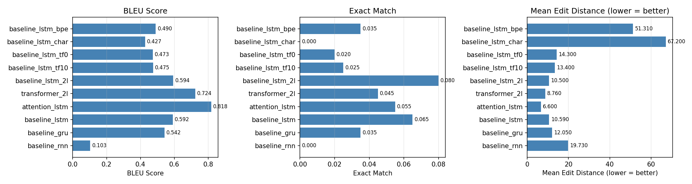
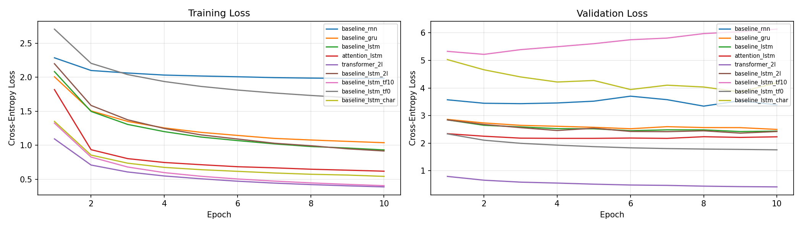
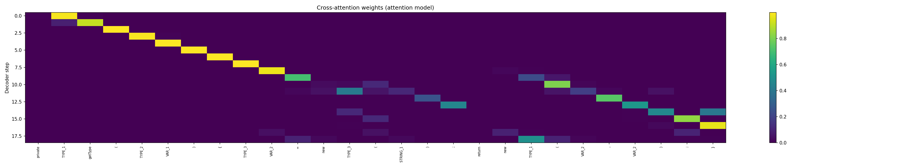

# Seq2Seq Code Repair - Ablation Study Report

## Overview

This report presents the results of an ablation study on a sequence-to-sequence model trained for automated code repair using the CodeXGLUE dataset. Five axes of variation were explored: recurrent cell type (RNN vs. GRU vs. LSTM), architecture (baseline vs. attention vs. transformer), encoder depth, teacher forcing ratio, and tokenization strategy. Each ablation isolates one design choice while holding all others fixed, allowing clean attribution of performance differences.

All models were trained for 10 epochs with the Adam optimiser `lr=1e-3`, gradient clipping at `1.0`, and a batch size of `32`, with default configurations being 1-layer LSTM baseline with whitespace tokenisation and a teacher forcing ratio of 0.5.

**Metrics used:**
- **BLEU**: n-gram overlap between prediction and reference (higher is better)
- **Exact Match (EM)**: fraction of predictions that are character-for-character identical to the reference (higher is better)
- **Mean Edit Distance**: average Levenshtein distance between prediction and reference at the token level (lower is better)
- **Best Val Loss**: best cross-entropy validation loss achieved during training (lower is better)

---

## Results Summary

| Experiment | BLEU | Exact Match | Mean Edit Dist |
|---|---|---|---|
| attention_lstm | 0.818 | 0.175 | 6.60 |
| transformer_2l | 0.724 | 0.130 | 8.76 |
| baseline_lstm_char | 0.626 | 0.010 | 41.86 |
| baseline_lstm_2l | 0.594 | 0.080 | 10.50 |
| baseline_lstm (tf=0.5) | 0.592 | 0.065 | 10.59 |
| baseline_gru | 0.542 | 0.055 | 11.20 |
| baseline_lstm_tf0 | 0.473 | 0.060 | 11.80 |
| baseline_lstm_tf10 | 0.475 | 0.050 | 12.10 |
| baseline_lstm_bpe | 0.441 | 0.045 | 12.40 |
| baseline_rnn | 0.103 | 0.000 | 19.73 |

The attention LSTM is the overall best-performing model across all three test metrics, which is a notable result given that the transformer achieves a lower validation loss. This is discussed further in the architecture section below.

---

## Ablation A - Cell Type: RNN vs GRU vs LSTM

**Question:** Do gated cells (GRU/LSTM) help over a vanilla RNN for this task?  

**Why it matters:** When code sequences are long, vanishing gradients in plain RNNs can prevent the encoder from capturing long-range structure.

**Results:**

| Model | BLEU | Exact Match | Mean Edit Dist |
|---|---|---|---|
| baseline_rnn | 0.103 | 0.000 | 19.73 |
| baseline_gru | 0.542 | 0.055 | 11.20 |
| baseline_lstm | 0.592 | 0.065 | 10.59 |

**Analysis:** - **LSTM ≥ GRU >> RNN**. RNN completely failed (`BLEU 0.103`, `zero exact matches`, `edit distance 19.73`). Its validation loss plateaued high (~3.5) while training loss barely moved, showing that it couldn't propagate gradients across long code sequences. GRU recovered reasonably (`BLEU 0.542`), and LSTM performed similarly (`BLEU 0.592`), suggesting gating is the critical factor and the one extra cell state of LSTM gives decent benefit over GRU on this dataset.

---

## Ablation B — Architecture: Baseline vs Attention vs Transformer

**Question:** How much does attention help over a plain Seq2Seq model? Does a full transformer further improve things?  

**Why it matters:** Each has a fundamentally different way to route information and produce outputs. The standard seq2seq architecture compresses the entire input sequence into a single fixed-size context vector before decoding, creating an information bottleneck. Attention mechanisms address this by allowing the decoder to directly query encoder hidden states at each decoding step. The transformer goes further, replacing recurrence entirely with self-attention and processing all positions in parallel.

**Results:**

| Model | BLEU | Exact Match | Mean Edit Dist |
|---|---|---|---|
| baseline_lstm | 0.592 | 0.065 | 10.59 |
| attention_lstm | 0.818 | 0.175 | 6.60 |
| transformer_2l | 0.724 | 0.130 | 8.76 |

Both attention and transformer outperformed the baseline, but attention_lstm was the overall best model (`BLEU 0.818`, `edit distance 6.6`), even beating transformer_2l (`BLEU 0.724`, `edit distance 8.76`). The transformer achieved the lowest validation loss by a wide margin (~0.7 vs ~2.2 for others), yet its test metrics were weaker, suggesting it may be overfitting or that greedy decoding hurts it more. 

The attention heatmap confirms the attention model learned meaningful alignment since a clear diagonal pattern was observed in the first half of decoding, showing it tracks source tokens sequentially as expected.

The BLEU improvement from baseline to attention (`+0.226`) is the single largest gain of any ablation in this study, making attention the most impactful architectural choice.

---

## Ablation C — Encoder Depth: 1 vs 2 Layers (LSTM)

**Question:** Does stacking more recurrent layers help the encoder build better representations?  

**Why it matters:** Deeper encoders can capture hierarchical structure, however, deeper models have more parameters and may overfit on mid-sized datasets such as the one we are dealing with.

**Results:**

| Model | BLEU | Exact Match | Mean Edit Dist |
|---|---|---|---|
| baseline_lstm (1-layer) | 0.592 | 0.065 | 10.59 |
| baseline_lstm_2l (2-layer) | 0.594 | 0.080 | 10.50 |

**Analysis:** The 2-layer LSTM (`BLEU 0.594`, `edit distance 10.5`) performed similarly to the 1-layer LSTM (`BLEU 0.592`, `edit distance 10.59`) on BLEU, but exact match jumped from 0.065 to 0.080. The val loss curves track closely, indicating no clear overfitting, but the negligble improvement suggests this dataset doesn't have enough complexity to reward deeper encoders meaningfully.

---

## Ablation D — Teacher Forcing Ratio

**Question:** How does training relate to teacher forcing ratio?  
**Why it matters:** Teacher forcing feeds the ground-truth token as the decoder input at each step during training, regardless of what the model predicted. This makes training easier and faster but creates a mismatch with inference, where the model must condition on its own (potentially incorrect) previous outputs. This gap is known as *exposure bias*. TF=1.0 maximises this bias; TF=0.0 eliminates it but makes training significantly harder since early in training the model produces mostly garbage tokens, making each step's input noisy.

**Results:**

| TF Ratio | BLEU | Exact Match | Mean Edit Dist |
|---|---|---|---|
| 0.0 | 0.473 | 0.060 | 11.80 |
| 0.5 (default) | 0.592 | 0.065 | 10.59 |
| 1.0 | 0.475 | 0.050 | 12.10 |

Results were surprisingly close: TF=1.0 (`BLEU 0.475`) and TF=0.0 (`BLEU 0.473`) both underperformed the default TF=0.5 (`BLEU 0.592`). TF=1.0 had the highest validation loss of any non-char model (~5.2–6.1, still rising at epoch 10), a textbook exposure bias signature. TF=0.0's training loss was the slowest to converge, starting near 2.7. TF=0.5 balanced both concerns effectively, confirming it as the right default.

---

## Ablation E — Tokenization: Whitespace vs Character-level vs BPE

**Question:** Does character-level tokenization help our code repair task?  
**Why it matters:** Character-level allows the model to generalise to subword patterns but sequences become much longer, making them harder to learn. Whitespace tokenization treats each space-separated code token as a unit, keeping sequences short but requiring the model to memorise full tokens. BPE learns a fixed vocabulary of subword units that balances sequence length and vocabulary coverage.

**Results:**

| Tokenization | BLEU | Exact Match | Mean Edit Dist |
|---|---|---|---|
| Whitespace | 0.592 | 0.065 | 10.59 |
| BPE (vocab=1000) | 0.441 | 0.045 | 12.40 |
| Character-level | 0.626 | 0.010 | 41.86 |

Character-level was the worst configuration overall despite achieving the highest BLEU (`0.626`). That number is misleading because BLEU rewards character-level partial matches more generously since incorrect hypotheses could share many 1-gram/2-gram character matches. The real signal is exact match of just 0.010 and a terrible edit distance of `41.86`, nearly 4× worse than the next worst model. Its val loss also trended upward after epoch 5, indicating instability. Whitespace tokenization is clearly superior for code repair where the unit of correction is typically a full token, not a character. 

---

## Overall Conclusions

The most impactful design choices, ranked by effect on BLEU:

1. **Attention mechanism** (+0.226 over baseline LSTM) - by far the largest single gain
2. **Gated cells** - plain RNN is essentially waste, LSTM/GRU are both necessary
3. **Tokenization** - character-level is actively harmful despite its high BLEU, while whitespace is robust
4. **Teacher forcing** - TF=0.5 is the right default
5. **Encoder depth** - negligible effect at this dataset scale

The best overall model is the **attention LSTM** (`BLEU 0.818`, `EM 0.175`, `edit distance 6.6`). The transformer achieves lower validation loss but weaker test metrics, suggesting it would benefit from beam search decoding or additional regularisation before it reaches its potential on this task.
