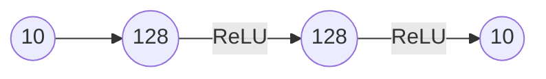
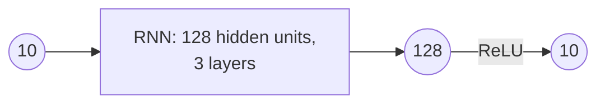
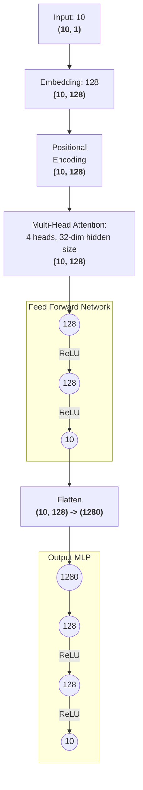

# Report: Ranking Model Comparison

## Overview
This report evaluates three deep learning models for learning to rank arrays of 10 numbers: MLP, RNN, and Transformer-based models.

## Dataset
- Input: 10 numerical features
- Output: Ranking of those 10 features (0-9)
- Split: 60% train, 20% validation, 20% test
- Batch size: 32

## Models

In all my models, I've treated this as a regression problem, in which I'm asking the model to predict an array of 10 numbers which represents the **relative size** of each element in the array, and then perform an argsort on those values to get the ranks that the model is trying to predict. For example, if the model predicts values [0.1, 0.5, 0.3] then I interpret this as the model predicting ranks [0, 2, 1] instead of [0, 1, 0].

This solves the problem of the model having to learn to predict exact ranks, which is a much harder problem, and allows the model to learn to predict relative sizes instead, which is more in line with how ranking problems are typically solved in practice. This also allows the model to forego the problem of repeating ranks, which is a problem.

### 1. Multi-Layer Perceptron (MLP)
**Architecture:**

**Results:**
- Test Loss: 0.6853
- Average Accuracy: **66.7%**
- Percent correctly ranked: **12.35%**

### 2. Recurrent Neural Network (RNN)
**Architecture:**

**Results:**
- Test Loss: 0.2831
- Average Accuracy: **76.9250%**
- Percent correctly ranked: **15.25%**

### 3. Transformer-based Model
**Architecture:**

**Results:**
- Test Loss: 0.4206
- Average Accuracy: **78.1750%**
- Percent correctly ranked: **28.85%**

## Inference
All three models show significant improvement over random guessing (which would yield an average accuracy of 10% and a percent correctly ranked of ~0%). The Transformer-based model outperforms both the MLP and RNN models in terms of average accuracy and percent correctly ranked, indicating that it is better at capturing the relationships between the input features for ranking purposes. The MLP performs the worst, likely due to its inability to capture sequential dependencies in the data, while the RNN performs better than the MLP but still falls short of the Transformer-based model's performance.

Although the difference in average accuracy between the RNN and Transformer-based model is relatively small, the significant increase in percent correctly ranked suggests that the Transformer-based model is much better at learning the underlying ranking structure of the data. This could be attributed to the self-attention mechanism in Transformers, which allows them to capture long-range dependencies and interactions between features more effectively than RNNs.