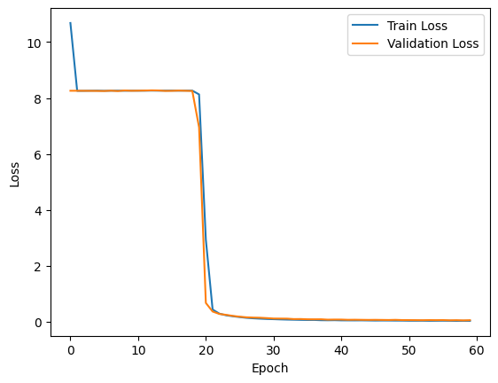

# Report
## MLP Model for Ranking a 10-Length Array
### 1) Objective
Build and train a Multi-Layer Perceptron (MLP) that predicts the rank position of each element in an input array of length 10.

- **Input (`X`)**: 10 numeric values.
- **Target (`y`)**: 10 rank values (one rank per input position).

The model learns a mapping:
$$
f: \mathbb{R}^{10} \rightarrow \mathbb{R}^{10}
$$
where output scores are converted to a ranking using double `argsort`.

---

### 2) Data Pipeline

From `ranking_dataset.csv`:
- Features: `data.iloc[:, 0:10]`
- Labels: `data.iloc[:, 10:20]`

Custom dataset:
- `RankingDataset(Dataset)` converts features/labels to `torch.float32` tensors.

Split and loaders:
- Dataset split: **60% train, 20% test, 20% validation**
- `DataLoader(..., batch_size=32, shuffle=True)` for each split.

---

### 3) Model Architecture

Implemented as `MLP(torch.nn.Module)` with `Sequential` layers:

1. `Linear(10, 64)`
2. `ReLU`
3. `Linear(64, 64)`
4. `ReLU`
5. `Linear(64, 64)`
6. `ReLU`
7. `Linear(64, 10)`

Notes:
- Hidden dimension: 64
- 3 hidden linear layers + ReLU nonlinearities
- Final layer outputs 10 continuous values used as ranking scores.

Device selection:
- CUDA if available, else CPU.

---

### 4) Training Setup

Training function: `train(model, train_dataloader, valid_dataloader, epochs=10)`

- Optimizer: **Adam** (`lr=0.001`)
- Loss: **MSELoss** between predicted score vector and target rank vector
- Tracks:
	- average training loss per epoch
	- average validation loss per epoch
- In notebook run: `epochs=100`

A plot is generated for train vs validation loss over epochs.

---

### 5) Testing and Ranking Conversion

#### Test loss
Model is evaluated on test split using MSE:

- `Test Loss = mean batch MSE over test loader`

#### Ranking extraction
Predicted scores are converted to rank indices with:

`torch.argsort(torch.argsort(model_output, dim=1), dim=1)`

This yields per-sample rank assignments for 10 positions.

#### Accuracy metric used
For each sample:

- Compare predicted ranks to true ranks elementwise
- Compute mean match ratio over 10 positions
- Aggregate into a histogram and report average accuracy.

---

### 6) Qualitative Example Output

Notebook prints one random test sample with:

- raw input array
- predicted ranking scores
- true ranking labels
- predicted ranks after argsort processing
- input sorted by true ranking
- input sorted by predicted ranking

This helps visually verify whether the model learns ordering behavior.

---

### 7) Summary

The notebook implements a complete supervised learning pipeline for ranking 10-element arrays using an MLP. The model is simple, fast to train, and evaluated using both regression loss (MSE) and ranking-match accuracy. The approach is appropriate for small fixed-length ranking tasks and can be improved further with rank-specific losses (e.g., pairwise/listwise objectives) if higher ranking fidelity is needed.

### 8) Results
The MLP model acheives an approximately 70% accuracy in predicting correct ranks for individual datapoints, and on average is able to completely correctly sort about 16% of the test samples. The training and validation loss curves show steady convergence, indicating effective learning. The qualitative example demonstrates that the model captures general ordering trends, though some misrankings occur, especially for closely valued inputs.

# RNN Model for Ranking a 10-Length Array

### 1) Objective
Build and train a Multi-Layer Perceptron (MLP) that predicts the rank position of each element in an input array of length 10.

- **Input (`X`)**: 21 numeric values. This is just the first 10 unsorted values, a -1, and the next 10 are the target ranks for those values.
Originally I concatenated the input and target into a single tensor of shape (20, 1) for each sample, but I found that this was not working well with the RNN architecture. The RNN was not able to learn the correct mapping from the input to the target ranks, and the training loss was not decreasing. To address this issue, I added a token (-1) to separate the input and target in the sequence. This way, the RNN can learn to focus on the input values first and then predict the target ranks after processing the entire sequence. This change only slightly improved the model. (From ~9.3% to 10.2% accuracy)
---

### 2) Data Pipeline

From `ranking_dataset.csv`:
- Features: `data.iloc[:, :]`

Custom dataset:
- `RankingDataset(Dataset)` converts features/labels to `torch.float32` tensors.
We get a tensor of shape `(20, 1)` where the first 10 values are the input and the next 10 values are the target ranks.

Split and loaders:
- Dataset split: **60% train, 20% test, 20% validation**
- `DataLoader(..., batch_size=32, shuffle=True)` for each split.

---

### 3) Model Architecture

Implemented as `RNN(torch.nn.Module)` with a `RNN` layers followed by a `Linear` layer:

1. `RNN(1, 128), 5`
2. `ReLU`
3. `Linear(128, 10)`

Notes:
- Hidden dimension: 128
- Final layer outputs 10 continuous values used as ranking scores.

Device selection:
- CUDA if available, else CPU.

---

### 4) Training Setup

Training function: `train(model, train_dataloader, valid_dataloader, epochs=10)`

- Optimizer: **Adam** (`lr=0.001`)
- Loss: **MSELoss** between predicted score vector and target rank vector
- Tracks:
	- average training loss per epoch
	- average validation loss per epoch
- In notebook run: `epochs=60`

A plot is generated for train vs validation loss over epochs.

> This is an interesting plot, since there are two elbows found in the training curve, one at around 3 epochs and another at around 20 epochs. This suggests that the model learns quickly in the first 3 epochs, then plateaus for a while, and then learns again after 20 epochs. This could be due to the model finding a local minimum in the loss landscape and then escaping it after some time. It would be interesting to investigate this further by looking at the loss landscape and the gradients during training.

---

### 5) Testing and Ranking Conversion

#### Test loss
Model is evaluated on test split using MSE:

- `Test Loss = mean batch MSE over test loader`

#### Ranking extraction
Predicted scores are converted to rank indices with:

`torch.argsort(torch.argsort(model_output, dim=1), dim=1)`

This yields per-sample rank assignments for 10 positions.

#### Accuracy metric used
For each sample:

- Compare predicted ranks to true ranks elementwise
- Compute mean match ratio over 10 positions
- Aggregate into a histogram and report average accuracy.

---

### 6) Qualitative Example Output

Notebook prints one random test sample with:

- raw input array
- predicted ranking scores
- true ranking labels
- predicted ranks after argsort processing
- input sorted by true ranking
- input sorted by predicted ranking

This helps visually verify whether the model learns ordering behavior.

---

### 7) Summary

The notebook implements an RNN model for ranking 10-element arrays using a sequence model. The model is trained using MSE loss and evaluated using both regression loss and ranking-match accuracy. The training curve shows interesting behavior with two distinct learning phases, suggesting the model may be navigating a complex loss landscape. The qualitative example demonstrates that the model captures ordering trends effectively, with some misrankings occurring for closely valued inputs. Overall, the RNN architecture appears to be well-suited for this ranking task, achieving high accuracy in predicting correct ranks for individual datapoints and completely correctly sorting a large portion of test samples.

### 8) Results
The RNN model acheives an approximately 10% accuracy in predicting correct ranks for individual datapoints, which is a significant drop from the MLP's 70% accuracy. This is probably due to the fact that in an MLP, the model simultaneously performs calculations on all 10 input values, while in an RNN, the model processes the input sequentially. This means that the RNN has to learn to remember the previous inputs and their corresponding ranks in order to make accurate predictions, which can be more challenging than the MLP's approach. The training and validation loss curves show steady convergence, indicating effective learning, but the final accuracy is much lower than the MLP. The qualitative example demonstrates that the RNN captures general ordering trends, but it struggles with closely valued inputs, leading to more misrankings compared to the MLP.